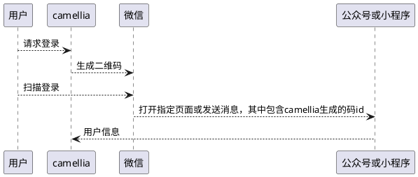

# 二维码登录原理

手机app扫码登录的原理是

* 后台api生成一个二维码图片，图片内容是手机扫码的落地页地址，地址通常会附加2个查询参数
    * 一个随机id，用来唯一识别当前展示的二维码
    * 一个过期时间(可选)，告诉落地页这个id还有多长时间有效
* 手机app/微信/支付宝扫描二维码，将手机app内置的浏览器导向落地页
* 落地页ui通过查询参数得到当前正在扫描的二维码id，并与后台api进行交互，将用户信息<font color=red>安全</font>的提交后台接口
* 接口将用户信息和id关系进行绑定并标记二维码已经被确认登录
* 登录页面轮询二维码的状态，发现已被扫描和确认后，使用二维码的id作为登录名向"/login"接口发起请求要求登录
* 认证服务器在登录过程中使用id取出登录用户完成登录验证

# QrCodeBasedAuthenticationService

这个认证服务将提交来的二维码id转交给`QrCodeService.getPrincipal`进行查询，这个方法要求返回一个已经扫描完二维码后确认登录的用户的可用登录名，比如ad域控账号，用户名，手机号等。
该登录名用于和UserService进行交互

# QrCodeService

二维码的核心服务类，支持

* 生成二维码
* 修改状态
* 查询登录的用户登录名

# QrCodeService.State

表达二维码的状态，包含

```java
public enum State {
    /**
     * 创建了
     */
    CREATED,
    /**
     * 扫描了
     */
    SCANNED,
    /**
     * 确认了
     */
    CONFIRMED,
    /**
     * 过期了
     */
    EXPIRED
}
```

以上几种状态

# QrCodeEndpoint

二维码服务的后台接口，支持以下几个api

```java

@AuthenticationServerRestController
public abstract class QrCodeEndpoint<C extends CreateQrCodeRequest> {
    private final QrCodeService<C> service;

    /**
     * 获取二维码的state
     *
     * @param code 编码
     * @return 二维码状态
     * @throws Exception 遇到问题
     */
    @GetMapping("/qrcode/{code}")
    public GetQrCodeStateResponse state(
            @Valid @PathVariable("code") @NotBlank String code
    ) throws Exception {

    }

    /**
     * 创建二维码
     *
     * @param request 请求
     * @return 二维码
     * @throws Exception 发生问题
     */
    @PostMapping("/qrcode")
    public QrCodeService.QrCodeDetails create(
            @RequestBody(required = false) @Valid @Nullable C request
    ) throws Exception {
    }

    /**
     * 验证请求是否有效，防止不是扫码发送的请求
     *
     * @param request 请求
     * @return 是否是合法请求
     * @throws Exception 发生问题
     */
    protected abstract boolean validateRequest(
            HttpServletRequest request
    ) throws Exception;

    /**
     * 扫描完毕
     *
     * @param request http请求
     * @param code    编码
     * @throws Exception 发生问题
     */
    @PostMapping("/qrcode/{code}:scan")
    public void scan(
            HttpServletRequest request,
            @Valid @PathVariable("code") @NotBlank String code
    ) throws Exception {

    }

    /**
     * 确认登录
     *
     * @param request http请求
     * @param code    二维码
     * @throws Exception 发生问题
     */
    @PostMapping("/qrcode/{code}:confirm")
    public void confirm(
            HttpServletRequest request,
            @Valid @PathVariable("code") @NotBlank String code
    ) throws Exception {

    }
}
```

这是一个抽象类，需要指定CreateQrCodeRequest的类型，引擎的CreateQrCodeRequest只有大小和颜色，子类可扩展参数属性。
validateRequest方法用来提供给开发人员检查当前接口的调用是否合法，其意义是如果作为app扫码的接口，确认登录的接口可能被其它第三方程序恶意调用从而填入任意用户信息。
因此在执行确定登录的逻辑前，手机app团队和接口开发应当协商好如何检查请求是否合法

# 微信扫描公众号二维码、小程序太阳码登录

首先这种登录的二维码生成是需要调用微信公众平台的接口，因此委托方需要具有公众开放平台的账号，且最好已经完成企业身份认证。



WeChatMiniProgramQrCodeAuthenticationServiceOption和WeChatMiniProgramQrCodeService用来保存小程序的ak/sk以及生成小程序太阳码。它的原理就是在
`WeChatMiniProgramQrCodeService.createImage`方法中调微信小程序的接口生成太阳码，并将太阳码的scene指定为二维码的code id
