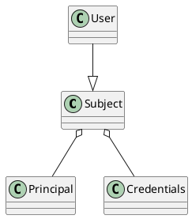

# 引言

本组件负责认证服务器的引擎实现

# 一览图

## 不同类型用户的认证需求

```plantuml
@startuml
!include https://plantuml.s3.cn-north-1.jdcloud-oss.com/C4_Container.puml

Person(最终用户, 最终用户) 
Person(企业员工, 企业员工) #green

System(网页端, 网页端, 浏览器) 
System(手机app, 手机app, 手机app) 

Boundary(登录服务, 认证服务, api) {
    System(认证服务引擎, 认证服务引擎, 引擎组件) #gray
}

System(网页端2, 网页端, 浏览器) #green
System(手机app2, 手机app, 手机app) #green

Boundary(登录服务2, 认证服务, api) {
    System(认证服务引擎2, 认证服务引擎, 引擎组件)
}

System(最终用户数据库, 最终用户数据库, 身份源)

System(企业员工数据库, 企业员工数据库, 身份源) #green

最终用户 --> 网页端
最终用户 --> 手机app

网页端 --> 登录服务
手机app --> 登录服务

登录服务 --> 最终用户数据库

企业员工 --> 网页端2
企业员工 --> 手机app2

网页端2 --> 登录服务2
手机app2 --> 登录服务2

登录服务2 --> 企业员工数据库

@enduml
```

上图首先简介了常见的C端用户与平台企业员工使用认证系统的例子。每一个认证服务都可以使用当前认证服务引擎进行开发，并分别连接最终用户的数据库和企业员工的数据库。

## 引擎内部结构

```plantuml
@startuml
!include https://plantuml.s3.cn-north-1.jdcloud-oss.com/C4_Container.puml


Boundary(认证服务引擎, 认证服务引擎, sdk) {
    Boundary(基本认证组件1, 基本认证组件) {
        System(认证组件1, 用户密码, 认证组件)
        System(认证组件2, 短信, 认证组件)
        System(认证组件3, 人脸, 认证组件)
    }
    Boundary(多因子认证1, 多因子认证组件) {
        System(多因子认证组件1, 短信, 认证组件)
        System(多因子认证组件2, 邮箱, 认证组件)
        System(多因子认证组件3, 动态密码, 认证组件)
    }
    System(事件监听器, 事件监听器, 监听器)
}

@enduml
```

打开引擎的内部，主要由事件监听器、多因子认证组件以及核心的基本认证组件构成，基本认证组件基于Spring
Security的功能完成用户登录凭据的校验；多因子认证组件则基于挑战与应答实现用户登录确认前的最终验证；
事件监听器负责监听认证主流程中发出的事件，并通过抛出异常的方式中断认证流程

# 登录名、登录凭据、主体与用户

在下文中，大量的会出现登录名、登录凭据、主体以及用户的概念。下图是这些概念在java类层面上的一个体现



## 主体: Subject

主体是代表即将认证的东西，可能是个客户端，可能是个用户，通常来说是数据库存储或接口读取出来的一个记录。

```java

@Getter
@Setter
@SuperBuilder
@NoArgsConstructor
public abstract class Subject implements Serializable,
        CredentialsContainer,
        GenericTraits.IdentifierTraits.Id<String>,
        GenericTraits.StatusTraits.LockFlag,
        GenericTraits.StatusTraits.EnableFlag {
    private static final long serialVersionUID = SerializationVersionNumber.version;
    /**
     * id
     */
    @NonNull
    private String id;
    /**
     * 登录凭据
     * <p>
     * 这个玩意有时候无法获得，比如ldap的登录就不会告诉你用户的密码，只是校验密码
     * <p>
     * 因此可以将登录凭据写成用户输入的那个
     */
    @Nullable
    @Singular
    private transient Collection<@NonNull Credentials> credentials;
    /**
     * 用户的所有可用登录名
     */
    @Singular
    @NonNull
    private Collection<@NonNull Principal> principals;
    /**
     * 被锁定
     */
    private boolean locked;
    /**
     * 激活状态
     */
    private boolean enabled;
    /**
     * 密码过期事件
     */
    @Nullable
    private Date credentialsExpiryDate;
    /**
     * 当前subject的过期时间
     */
    @Nullable
    private Date subjectExpiryDate;

    //其余的属性实现类自己添加

    /**
     * 由引擎负责调用，在不需要的时候擦除密码
     */
    @Override
    public final void eraseCredentials() {
        this.credentials = null;
    }
}
```

从类型定义上可以看到，主体包含了一组登录名(Principal)和一组登录凭据(Credentials)，对于哪种本身就从不需要用户名密码的系统，主体可以没有登录凭据。
此外主体有一些基本的属性，包含是否锁定，是否启用，主体的过期时间，登录凭据的过期时间。这些属性都是Spring
Security框架所需的，且也是认证系统常见的属性

## 登录名: Principal

`Principal`代表的是主体能够被用来登录使用的名称，如用户名、员工卡号、会员卡号、手机号等。不同的类型用这个类型的子类代表。

```java

@Getter
@Setter
@SuperBuilder
@NoArgsConstructor
@EqualsAndHashCode
public abstract class Principal implements
        java.security.Principal,
        Serializable,
        GenericTraits.LiteralTraits.Name {
    private static final long serialVersionUID = SerializationVersionNumber.version;
    /**
     * 名字
     */
    @NonNull
    private String name;
}
```

其中的主要属性是名称。引擎提供了一系列常用的登录名类型，比如`UsernamePrincipal`或者`MobilePhoneNumberPrincipal`等。
`Principal`实际上通过属性计算hash code，从而实现在`Collection`中通过"contains"可以判断是否包含当前登录名的实例

## 登录凭据: Credentials

`Credentials`代表主体能够使用或比对的登录凭据，比如密码，短信验证码等，同样不同的类型也需要使用子类来表达

```java

@SuperBuilder
@NoArgsConstructor
@EqualsAndHashCode
public abstract class Credentials {
}
```

已经预置的子类有`PasswordCredentials`，当然还有可能诸如证书序列号等多种多样可预先采集的登录凭据。

```java

@Getter
@Setter
@EqualsAndHashCode(callSuper = true)
@SuperBuilder
@NoArgsConstructor
public class PasswordCredentials extends Credentials implements SecurityTraits.SecretTraits.Password {
    /**
     * 密码
     */
    @NonNull
    private String password;
}
```

其中因为实现了equals方法，因此可以在两个`Credentials`对象间进行判等

## 用户: User

用户`User`是主体的一个类型

```java

@NoArgsConstructor
@Getter
@Setter
@SuperBuilder
public class User extends Subject implements
        GenericTraits.LiteralTraits.Name,
        AccountTraits.VisualTraits.Avatar {
    private static final long serialVersionUID = SerializationVersionNumber.version;
    /**
     * 任何形式的展示名称
     * <p>
     * 昵称，姓名随便
     */
    @NonNull
    private String name;
    /**
     * 任何形式的显示图标
     */
    @Nullable
    private String avatar;
}
```

除去主体的基本属性外，额外扩展了名字和头像。头像如果用户没有上传可能是空的，而名字一般不会是空的。

# OAuth2RequestingClient、RegisteredClient

在部分接口中会发现有类型为`OAuth2RequestingClient`的参数

`OAuth2RequestingClient`是指当前正在访问认证接口的客户端，其包含了最简的属性，主要是id、要求的授权方法和授权范围

`RegisteredClient`是Spring
Security使用个一个类，其含义是从客户端存储接口或设施读取出来的客户端的详细数据，包含了客户端的id、密码以及客户端被系统后台赋予的其它属性，比如能够使用的请求范围，能够使用的授权方法等。可以被理解为客户端的数据记录。

由于`RegisteredClient`要求必须引入授权服务器的组件才能使用，因此如果一个java接口的参数需要`RegisteredClient`
，原则上开发人员就需要引入认证服务器引擎组件而不是core才能访问到，core组件倾向于不引入整个spring security的oauth2授权服务器组件

# 认证流程涉及的核心接口

从开始认证流程到客户端调用oauth2的接口读取用户信息的过程中使用到的所有类均位于"
io.gardenerframework.camellia.authentication.server.main"程序包内

## 登录认证请求基本型: AuthenticationRequestParameter

```java
public abstract class AuthenticationRequestParameter {
    protected AuthenticationRequestParameter(HttpServletRequest request) {
    }

    /**
     * 执行参数验证
     *
     * @param validator 验证
     * @throws BadAuthenticationRequestParameterException 抛出错误参数异常
     */
    public void validate(@NonNull Validator validator) throws BadAuthenticationRequestParameterException {
        Set<ConstraintViolation<Object>> violations = validator.validate(this);
        if (!CollectionUtils.isEmpty(violations)) {
            throw new BadAuthenticationRequestParameterException(violations);
        }
    }
}
```

`AuthenticationRequestParameter`为登录认证请求提供了参数的基本型，其构造函数要求输入`HttpServletRequest`
，意思是告诉各个认证组件的开发人员从请求中直接解析参数。同时它提供了验证方法，要求输入javax的验证器，并在参数不合法的情况下抛出`BadAuthenticationRequestParameterException`
异常

## 用户认证服务接口: UserAuthenticationService

```java
public interface UserAuthenticationService {
    /**
     * 将http请求转为登录请求对象
     * <p>
     * 如果开发人员认为应当让登录页导向错误页面并定义错误的内容，抛出{@link AuthenticationException}
     * <p>
     * 其它类型的异常都将被解释为认证服务内部错误
     *
     * @param request http 请求
     * @param client  客户端
     * @param context 认证上下文，用于存储开发人员自定义的数据
     * @return 登录请求对象
     * @throws AuthenticationException 如果认为当前认证过程应当中断，则抛出异常，
     *                                 比如{@link BadAuthenticationRequestParameterException}来表示参数有问题
     */
    UserAuthenticationRequestToken convert(
            @NonNull HttpServletRequest request,
            @Nullable OAuth2RequestingClient client,
            @NonNull Map<String, Object> context
    ) throws AuthenticationException;

    /**
     * 执行认证
     *
     * @param authenticationRequest 页面发来的认证请求
     * @param client                请求客户端
     * @param user                  用户详情
     * @param context               认证上下文
     * @throws AuthenticationException 有问题抛异常
     */
    void authenticate(
            @NonNull UserAuthenticationRequestToken authenticationRequest,
            @Nullable OAuth2RequestingClient client,
            @NonNull User user,
            @NonNull Map<String, Object> context
    ) throws AuthenticationException;
}
```

用户认证服务是认证服务器的核心接口，它表达两个意图

* 将http请求转为用户认证请求
* 执行认证，如果没有抛出任何异常则认为认证通过

其中还有一个公共参数`Map<String, Object> context`，其贯穿1次认证接口的调用的生命周期，可以认为是request
scope的对象。其会在大部分认证请求处理过程中的接口和事件中出现。

## 用户认证请求: UserAuthenticationRequestToken

```java
public class UserAuthenticationRequestToken {
    /**
     * 用户登录的凭据
     * 可以是用户名
     * 可以是手机号
     * 或人脸id
     * 或别的什么东西
     */
    @NonNull
    private final Principal principal;
    /**
     * 提交的密码或其它登录信息
     * <p>
     * 密码等是不会被序列化的
     */
    @NonNull
    private final Credentials credentials;

    public UserAuthenticationRequestToken(@NonNull Principal principal) {
        this.principal = principal;
        //登录凭据设置为空
        this.credentials = new EmptyCredentials();
    }
}
```

`UserAuthenticationRequestToken`是`UserAuthenticationService`要求转换的登录认证请求，其实就是包含登录名和登录凭据。

如果用户登录时本身不需要登录凭据的提交(比如刷脸登)，那么引擎会使用`EmptyCredentials`而不是null

## 完成登录后: UserAuthenticatedAuthentication

```java
public class UserAuthenticatedAuthentication extends AbstractAuthenticationToken {
    /**
     * 完成认证的用户
     */
    @Getter
    private final User user;

    public UserAuthenticatedAuthentication(User user) {
        super(Collections.emptyList());
        super.setAuthenticated(true);
        this.user = user;
    }

    /**
     * 永远不会返回密码
     *
     * @return {@literal null}
     */
    @Override
    @Nullable
    public final Object getCredentials() {
        return null;
    }

    /**
     * 当前认证过的用户作为主体
     *
     * @return 用户主体
     */
    @Override
    public User getPrincipal() {
        return user;
    }

    /**
     * 当前登录用户的名称
     *
     * @return 当前认证用户的id
     */
    @Override
    public String getName() {
        return this.user.getId();
    }
}
```

`UserAuthenticatedAuthentication`代表已经通过了验证过程的用户，其是Spring Security引擎使用的数据。
经过验证后的信息中显著保存了被认证的用户，此外因为用户已经认证完成因此不会再给出任何登录凭据。最后，依照Spring
Security的约定，将用户的id作为识别符号返回

## AbstractUserAuthenticationService

```java
public abstract class AbstractUserAuthenticationService<P extends AuthenticationRequestParameter>
        implements UserAuthenticationService {
    /**
     * 验证器
     */
    @NonNull
    @Getter(AccessLevel.PROTECTED)
    private final Validator validator;

    /**
     * 从请求中获取认证请求参数
     *
     * @param request 请求
     * @return 参数
     */
    protected abstract P getAuthenticationParameter(HttpServletRequest request);

    /**
     * 从转换的参数中进行转换
     *
     * @param authenticationParameter 认证参数
     * @return 认证请求
     */
    protected abstract UserAuthenticationRequestToken doConvert(P authenticationParameter);

    @Override
    public UserAuthenticationRequestToken convert(HttpServletRequest request) throws AuthenticationException {
        P authenticationParameter = Objects.requireNonNull(getAuthenticationParameter(request));
        Set<ConstraintViolation<Object>> violations = validator.validate(authenticationParameter);
        if (!CollectionUtils.isEmpty(violations)) {
            //执行检查参数合法性
            throw new BadAuthenticationRequestParameterException(violations);
        }
        return Objects.requireNonNull(doConvert(authenticationParameter));
    }
}
```

`AbstractUserAuthenticationService`为用户的认证服务提供了与`AuthenticationRequestParameter`的串联逻辑支持。
它要求子类去创建参数对象，然后利用`Validator`
进行校验。因此，`AuthenticationRequestParameter`的子类可以使用类似`@NotBlank`
等验证注解而不需要自行在逻辑中进行判断。验证失败抛出`BadAuthenticationRequestParameterException`
，它是`AuthenticationException`的一个子类。会被Spring Security框架处理。

## AuthenticationType & SupportAuthenticationEndpoint

每一个`UserAuthenticationService`对应着一个认证类型以及匹配的认证参数。引擎中包含了多个`UserAuthenticationService`
来支持多种多样的认证方法。 那么为了引擎能够在接收到认证请求时找到合适的认证服务，`UserAuthenticationService`
就必须指明自己的认证方法类型。

认证服务需要声明它的类型`AuthenticationType`注解，其是一个字符串，建议使用一个单词简单的表达当前认证的方法，比如"
username"、"sms"、"qrcode"等。 不同类型的认证服务器将通过提交的参数重的"
authentication_type"
属性来进行请求路由。引擎将确保调用类型对应的认证服务。目前类型与服务是1:1对应关系

`SupportAuthenticationEndpoint`注解则使得认证服务能够声明自己支持的认证端点。认证服务器引擎有2个端点，如下图所示

```plantuml
@startuml
!include https://plantuml.s3.cn-north-1.jdcloud-oss.com/C4_Container.puml

System(浏览器, 浏览器)
System(app, app)

System(网页认证端点, 网页认证端点, "/login")
System(app认证端点, app认证端点, "/oauth2/token")
System(认证服务, 认证服务)

浏览器 --> 网页认证端点
app --> app认证端点

网页认证端点 --> 认证服务
app认证端点 --> 认证服务

@enduml
```

2个端点在Spring
Security中对应着不同的Filter，在Filter中则调用相同的认证服务。那么，为了使得认证服务器能够声明自己支持的端点，可以标记上`SupportAuthenticationEndpoint`

比如需求上人脸识别仅仅支持app端，那么就可以如下声明

```java

@AuthenticationType("face")
@SupportAuthenticationEndpoint(Endpoint.OAUTH2)
public class FaceAuthenticationService implements UserAuthenticationService {
    //...
}
```

当引擎加载`UserAuthenticationService`时就检查认证类型是否已经被注册，如果已经注册则会阻止引擎启动。

## UserService

```java
public interface UserService {

    /**
     * 向统一用户数据访问接口发起认证请求
     * <p>
     * 如果密码有错则抛出{@link BadCredentialsException}
     *
     * @param principal   登录凭据名
     * @param credentials 密码
     * @param context     认证上下文中的共享属性，
     *                    新加了{@link Nullable}注解，如果发现上下文是null，说明当前用户服务正用于其它用途。
     *                    比如用于密码找回场景，或者其他非认证场景
     * @return 认证完毕的用户信息，如果不存在则返回{@code null}
     * @throws AuthenticationException 认证有问题
     */
    @Nullable
    User authenticate(
            @NonNull Principal principal,
            @NonNull PasswordCredentials credentials,
            @Nullable Map<String, Object> context
    ) throws AuthenticationException;

    /**
     * 基于请求凭据去读取而不是认证用户，其余错误按需转为{@link AuthenticationException}
     * <p>
     *
     * @param principal 登录凭据
     * @param context   认证上下文中的共享属性，
     *                  新加了{@link Nullable}注解，如果发现上下文是null，说明当前用户服务正用于其它用途。
     *                  比如用于密码找回场景，或者其他非认证场景
     * @return 用户信息，如果不存在则返回{@code null}
     * @throws AuthenticationException       认证有问题
     * @throws UnsupportedOperationException 如果当前服务对接的用户存储根本不支持直接通过登录名查找用户
     */
    @Nullable
    User load(
            @NonNull Principal principal,
            @Nullable Map<String, Object> context
    ) throws AuthenticationException, UnsupportedOperationException;
}
```

`UserServvice`利用`UserAuthenticationService`输出的`UserAuthenticationRequestToken`中的`principal`
读取用户信息，它可以直接读数据库，也可以调用远程接口。 在引擎的逻辑上，如果发现`UserAuthenticationRequestToken.credentials`
是`PasswordCredentials`，则优先调用`authenticate`，如果不是`PasswordCredentials`，则调用`load`

特别的，如果的对接的用户存储系统或接口只能提交密码进行验证，"load"就可以抛出`UnsupportedOperationException`来告诉引擎当前调用不支持。

# 与Spring Security 的结合

核心接口和数据格式是当前认证服务器引擎的定义和逻辑，需要与Spring Security框架进行结合

## 认证处理入口Filter

引擎的认证处理入口有`WebAuthenticationEntryProcessingFilter`和`OAuth2TokenEndpointFilter`两个，在默认情况下分别对应"
/login"和"/oauth2/token"(服从路径配置选项)

```java
public class WebAuthenticationEntryProcessingFilter extends AbstractAuthenticationProcessingFilter {
    private final LoginAuthenticationRequestConverter loginAuthenticationRequestConverter;

    public WebAuthenticationEntryProcessingFilter(
            RequestMatcher requestMatcher,
            LoginAuthenticationRequestConverter loginAuthenticationRequestConverter,
            AuthenticationEndpointAuthenticationFailureHandler authenticationFailureHandler,
            WebAuthenticationSuccessHandler webAuthenticationSuccessHandler,
            AuthenticationManager authenticationManager

    ) {
        super(requestMatcher, authenticationManager);
        this.loginAuthenticationRequestConverter = loginAuthenticationRequestConverter;
        this.setAuthenticationFailureHandler(authenticationFailureHandler);
        this.setAuthenticationSuccessHandler(webAuthenticationSuccessHandler);
    }

    /**
     * 尝试执行认证
     *
     * @param request  http请求
     * @param response 响应
     * @return 认证结果
     * @throws AuthenticationException 如果认证失败就交给失败处理器
     * @throws IOException             Io有问题
     * @throws ServletException        基本的Servlet问题
     * @see AuthenticationEndpointAuthenticationFailureHandler
     */
    @Override
    public Authentication attemptAuthentication(HttpServletRequest request, HttpServletResponse response) throws AuthenticationException, IOException, ServletException {
        //由转换器抛出的AuthenticationException都会被转为错误码并转到统一报错页面
        LoginAuthenticationRequestToken loginAuthenticationRequestToken = loginAuthenticationRequestConverter.convert(request);
        //获取用户认证信息
        return getAuthenticationManager().authenticate(loginAuthenticationRequestToken);
    }
}
```

`WebAuthenticationEntryProcessingFilter`由`WebAuthenticationEndpointFilterConfigurer`完成配置

```java
public class WebAuthenticationEndpointFilterConfigurer extends AuthenticationServerEngineSecurityConfigurer {
    private final AuthenticationServerPathOption authenticationServerPathOption;
    private final LoginAuthenticationRequestConverter loginAuthenticationRequestConverter;
    private final AuthenticationEndpointAuthenticationFailureHandler authenticationEndpointAuthenticationFailureHandler;
    private final WebAuthenticationSuccessHandler webAuthenticationSuccessHandler;
    private final ObjectPostProcessor<Object> postProcessor;

    @Override
    public void configure(HttpSecurity builder) throws Exception {
        //登录接口不需要csrf
        builder.csrf().ignoringRequestMatchers(getEndpointMatcher());

        builder.addFilterBefore(this.postProcessor.postProcess(new WebAuthenticationEntryProcessingFilter(
                getEndpointMatcher(),
                loginAuthenticationRequestConverter,
                authenticationEndpointAuthenticationFailureHandler,
                webAuthenticationSuccessHandler,
                builder.getSharedObject(AuthenticationManager.class)
        )), UsernamePasswordAuthenticationFilter.class);
    }

    public RequestMatcher getEndpointMatcher() {
        return new AntPathRequestMatcher(authenticationServerPathOption.getWebAuthenticationEndpoint(), HttpMethod.POST.name());
    }
}
```

"getEndpointMatcher"实现代码中可见，将路径配置中的网页认证端点地址配置到了`WebAuthenticationEntryProcessingFilter`中

同时，配置代码中将`WebAuthenticationSuccessHandler`作为认证成功的处理器注入到`WebAuthenticationEntryProcessingFilter`中

```java
public class WebAuthenticationSuccessHandler extends SavedRequestAwareAuthenticationSuccessHandler {
    public WebAuthenticationSuccessHandler(AuthenticationServerPathOption authenticationServerPathOption) {
        super();
        //设置为登录成功地址
        this.setDefaultTargetUrl(authenticationServerPathOption.getWebLoginSuccessPage());
    }

    @Override
    public void onAuthenticationSuccess(HttpServletRequest request, HttpServletResponse response, Authentication authentication) throws IOException, ServletException {
        super.onAuthenticationSuccess(request, response, authentication);
    }
}
```

可见，认证成功后基于路径的配置，将页面导向认证成功的页面地址

## LoginAuthenticationRequestConverter

上文的2个认证入口都会使用`LoginAuthenticationRequestConverter`作为用户的登录认证请求的转换器。
它主要将http请求转为`LoginAuthenticationRequestToken`认证请求

```java

@AllArgsConstructor
@Getter
@Setter
public class LoginAuthenticationRequestToken implements Authentication {
    private final transient UserAuthenticationRequestToken userAuthenticationRequestToken;
    /**
     * 当前要进行用户访问的客户端
     * <p>
     * {@link OAuth2ClientAuthenticationFilter}认证了client id和密码
     * 别的没有认证
     */
    @Nullable
    private final transient OAuth2ClientUserAuthenticationToken clientUserAuthenticationRequestToken;
    /**
     * 认证请求的上下文，主要是给{@link LoginAuthenticationRequestAuthenticator}用的
     */
    @NonNull
    private final transient LoginAuthenticationRequestContext context;

    @Override
    public Collection<? extends GrantedAuthority> getAuthorities() {
        return Collections.emptyList();
    }

    @Override
    public Object getCredentials() {
        return userAuthenticationRequestToken.getCredentials();
    }

    @Override
    public Object getDetails() {
        return null;
    }

    @Override
    public Principal getPrincipal() {
        return userAuthenticationRequestToken.getPrincipal();
    }

    @Override
    public boolean isAuthenticated() {
        //没有认证当然返回false
        return false;
    }

    @Override
    public void setAuthenticated(boolean isAuthenticated) throws IllegalArgumentException {
        //do nothing
    }

    @Override
    public String getName() {
        return getPrincipal().getName();
    }
}
```

这个请求是交给Spring Security引擎的认证请求类型，包含了客户端信息、用户认证请求信息以及上下文信息

```java

@Getter
@Setter
@AllArgsConstructor
public class LoginAuthenticationRequestContext {
    /**
     * 由哪个服务来完成认证过程
     */
    @NonNull
    private final UserAuthenticationService userAuthenticationService;
    /**
     * 携带的http请求
     */
    @NonNull
    private final HttpServletRequest httpServletRequest;
    /**
     * 当前正在调用接口的客户端
     */
    @Nullable
    private final OAuth2RequestingClient client;
    /**
     * 认证上下文
     */
    @NonNull
    private final Map<String, Object> context;
}
```

可见传递的上下文就是负责转换请求的用户认证服务以及http请求

`LoginAuthenticationRequestConverter`的主逻辑中首先基于不同的认证端点完成不同的转换逻辑

面向oauth2端点，使用`OAuth2GrantTypeParameter`检查授权类型是否是"user_authentication"
，在是的情况下生成`OAuth2ClientUserAuthenticationToken`。 从上文可知，这是`LoginAuthenticationRequestToken`中的一部分，用来表达客户端信息

无论是oauth2端点还是网页认证端点，从http请求中生成`AuthenticationTypeParameter`
，随后连接`UserAuthenticationServiceRegistry`
检查要求的认证方式所对应的`UserAuthenticationService`是否存在。如果存在，则对应的实例就保存到了上下文中。

下一步自然是调用`UserAuthenticationService.convert`完成认证请求的转换`UserAuthenticationRequestToken`

最后生成上下文和`LoginAuthenticationRequestToken`对象返回给Spring Security框架

## LoginAuthenticationRequestAuthenticator

从Spring Security框架的角度出发，有转换器就得有认证器。`LoginAuthenticationRequestAuthenticator`
就负责`LoginAuthenticationRequestToken`的认证。

第一步它会从认证请求中取得上下文中的认证服务，http请求等，进行认证前的准备工作

第二步开始发送`ClientAuthenticatedEvent`，并由`OAuth2ClientValidationListener`进行监听

```java
public class OAuth2ClientValidationListener implements AuthenticationEventListenerSkeleton {

    @Override
    @EventListener
    @Order(Ordered.HIGHEST_PRECEDENCE)
    public void onClientAuthenticated(ClientAuthenticatedEvent event) throws AuthenticationException {
        //这个事件只有token接口触发
        OAuth2RequestingClient client = Objects.requireNonNull(event.getClient());
        RegisteredClient registeredClient = (RegisteredClient) event.getContext().get(RegisteredClient.class.getCanonicalName());
        if (registeredClient == null) {
            throw new ClientNotFoundException(client.getClientId());
        }
        if (!registeredClient.getAuthorizationGrantTypes().contains(new AuthorizationGrantType(Objects.requireNonNull(client).getGrantType()))) {
            throw new UnauthorizedGrantTypeException(client.getGrantType());
        }
        if (!CollectionUtils.isEmpty(client.getScopes())) {
            for (String requestedScope : client.getScopes()) {
                if (!registeredClient.getScopes().contains(requestedScope)) {
                    throw new UnauthorizedScopeException(requestedScope);
                }
            }
        }
    }
}
```

可见主要检查授权范围和scope是否符合预期。在此，开发人员还能自行定义其它对客户端的检查逻辑。

检查同构后发送`UserAboutToLoad`事件，没问题后检查`UserAuthenticationRequestToken`
提供的登录凭据是不是密码(`PasswordCredentials`)
，是密码用`UserSerivce.authenticate`，不是用"load"。

随后检查用户是否读取出来，没有的话抛出`UserNotFoundException`，否则的话发送一系列事件，顺序是

* `UserLoadedEvent`
* 调用`UserAuthenticationService.authenticate`成功后发出`UserAuthenticatedEvent`
* `UserAuhenticationSuccessEvent`

针对`UserAuthenticatedEvent`事件，引擎通过`UserStatusValidationListener`检查用户状态是否符合预期

```java
public class UserStatusValidationListener implements AuthenticationEventListenerSkeleton {

    @Override
    @EventListener
    @Order(Ordered.HIGHEST_PRECEDENCE)
    public void onUserAuthenticated(UserAuthenticatedEvent event) throws AuthenticationException {
        User user = event.getUser();
        if (!user.isEnabled()) {
            throw new DisabledException(user.getId());
        }
        if (user.isLocked()) {
            throw new LockedException(user.getId());
        }
        if (user.getSubjectExpiryDate() != null && new Date().after(user.getSubjectExpiryDate())) {
            throw new AccountExpiredException(user.getId());
        }
        //todo 密码过期怎么处理没想好
    }
}
```

可见密码过期到底怎么弄引擎没有实现

## LoginAuthenticationRequestAuthenticator需要使用的适配器

### AuthenticationEndpointAuthenticatedAuthenticationAdapter

在Spring Security框架中，oauth2服务器的网页认证接口和令牌接口要求返回的类型不同。Spring oauth2要求返回的`Authentication`
类型必须是`OAuth2AccessTokenAuthenticationToken`，而传统Spring Security显然不需要oauth2的access token等

于是`AuthenticationEndpointAuthenticatedAuthenticationAdapter`作为`LoginAuthenticationRequestAuthenticator`
的内部组件，基于`AuthenticationEndpointMatcher`判断当前请求的地址是token接口还是网页接口

* token接口调用`OAuth2TokenGranter`进行令牌授予，其返回`OAuth2AccessTokenAuthenticationToken`类型的`Authentication`
* 网页接口返回`UserAuthenticatedAuthentication`

### AuthenticationEndpointExceptionAdapter

同样, token接口要求抛出的是`OAuth2AuthenticationException`
，所以为了开发人员的统一逻辑考虑，需要将原始的`AuthenticationException`进行转换

## oauth2的token授予与保存

当访问网页的oauth2授权接口，或者app直接调用oauth2的认证接口时，会为来访客户端颁发access token

与oauth2的实现和支持相关的代码在"io.gardenerframework.camellia.authentication.server.main.spring.oauth2"包中

### UserAuthenticationOAuth2AccessTokenGranter

由引擎编写的`UserAuthenticationOAuth2AccessTokenGranter`
实际上只为`AuthenticationEndpointAuthenticatedAuthenticationAdapter`
服务。基于授权码，客户端凭据等认证后颁发的access token实际由Spring Security框架原生负责。

### OAuth2Authorization

`OAuth2Authorization`是Spring Security框架用来存储access
token以及其它token的详细信息、用户信息等多个信息的主要存储对象，可以理解为是用户的一个登录态。每生成一个`OAuth2Authorization`
就相当于颁发了一个access token

### CachedOAuth2AuthorizationService

引擎默认使用`CachedOAuth2AuthorizationService`完成`OAuth2Authorization`的存储和访问，它需要使用"
authentication-server-engine/scripts/"下的lua脚本与redis进行互动。

在机制上，`CachedOAuth2AuthorizationService`将access token、id token、refresh
token等缓存的值均写为对应的`OAuth2Authorization`的id，在读取token对应的`OAuth2Authorization`
数据时，先用token的值找到`OAuth2Authorization`的id，然后再访问这个id对应的缓存对象获取真正的`OAuth2Authorization`数据

此外需要注意，当存储`OAuth2Authorization`时，它会首先按照id读取出来之前是否已经有保存的`OAuth2Authorization`
对象，如果有，则读取已经保存的对象内的access token等数据，对原来的索引进行清除。

基于以上原理，可以通过生成同一个`OAuth2Authorization.id`的方法，按照用户和客户端的维度实现每一个应用只有一个登录态。

如果想要实现一个应用控制n个登录态，当前版本需要开发人员自行想办法

```java
public interface OAuth2AuthorizationIdModifier {
    /**
     * 修改{@link OAuth2Authorization}所需的id
     *
     * @param originalId 原id
     * @param request    http请求
     * @param client     客户端记录 - 授权码模式保存时没有客户端信息
     * @param user       当前的登录用户，如果当前没有登录用户，那就是空的，比如客户端申请了client_credentials的token
     * @return id   如果认为不需要改变，就把 originalId 原样返回，否则返回新的id
     */
    String modify(
            @NonNull String originalId,
            @NonNull HttpServletRequest request,
            @Nullable RegisteredClient client,
            @Nullable User user
    );
}

```

引擎为开发提供了`OAuth2AuthorizationIdModifier`，它有能力修改所有授权类型，比如授权码生成的`OAuth2Authorization`
的id，不止是通过token接口调用产生的

由于其实现技术是通过aop拦截实现的(`OAuth2AuthorizationServiceProxy`)
，因此拿不到申请的授权范围和授权方式，请自行从`HttpServletRequest`中进行分析

### OidcUserInfoClaimsCustomizer

```java
public interface OidcUserInfoClaimsCustomizer {
    /**
     * 执行定制化
     *
     * @param client             当前访问的客户端
     * @param user               用户认证
     * @param oidcStandardClaims 已经初始化完的，基于标准的claims
     * @param authorizedScopes   授权客户端的scope
     */
    void customize(@NonNull OAuth2RequestingClient client, @NonNull User user, Map<String, Object> oidcStandardClaims, Set<String> authorizedScopes);
}
```

这个类负责对最终"/userinfo"接口给出的用户信息进行个性化设置

## 认证过程失败处理

在`LoginAuthenticationRequestAuthenticator`认证过程中如果捕捉到`AuthenticationException`
异常，会发送`AuthenticationFailedEvent`。 最终，捕捉到的所有异常会使用`AuthenticationEndpointAuthenticationFailureHandler`
进行统一处理

* 针对网页认证接口，会重定向到`AuthenticationServerPathOption.webAuthenticationErrorPage`的配置
* 对于token认证接口，返回由符合oauth2标准定义的json

# 认证过程中发生的事件

在认证过程中为了开发人员能够插入自己的逻辑来中断认证过程或记录一些日志，引擎提供了以下事件(配合`@EventListener`注解使用):

```java

@Getter
@SuperBuilder
public abstract class AuthenticationEvent {
    /**
     * http请求
     */
    @NonNull
    private final HttpServletRequest request;
    /**
     * 认证方式
     */
    @NonNull
    private final String authenticationType;
    /**
     * 登录请求的用户名以及类型
     */
    @NonNull
    private final Principal principal;
    /**
     * 但前准备要访问系统的客户端
     * <p>
     * 不是token endpoint 没有客户端
     */
    @Nullable
    private final OAuth2RequestingClient client;
    /**
     * 贯穿登录认证过程的上下文
     * <p>
     * 可以用来存取一些属性
     */
    @NonNull
    private final Map<String, Object> context;
}
```

`AuthenticationEvent`是认证事件的基类，包含了大量认证过程中的http请求、客户端、登录名和上下文

`ClientAuthenticatedEvent`是认证过程的开始事件，如果客户端使用oauth2提供的接口进行认证(授权接口或token接口)
则一定会有客户端信息，这个客户端信息通过了Spring Security的认证后就会发送该事件

`UserAboutToLoadEvent`是即将调用`UserService`进行用户数据加载的事件，在加载前可以检查用户名是否已经在黑名单中或者密码错误次数过多还在封锁

`UserLoadedEvent`是用户信息加载成功的事件，加载完毕后即将使用`UserAuthenticationService.authenticate`方法进行登录凭据的校验

`UserAuthenticatedEvent`显然是校验通过后的事件，可以进一步检查用户的数据是否合法，比如是否封锁，比如是否被冻结

`AuthenticationSuccessEvent`是认证过程成功的标志

`AuthenticationFailedEvent`是认证过程中捕捉到任何异常导致中断的标志

## AuthenticationEventListenerSkeleton

`AuthenticationEventListenerSkeleton`
提供了事件监听的基本框架，开发可以实现这个接口并Override对应的监听方法后添加`@EventListener`注解

```java
public interface AuthenticationEventListenerSkeleton {
    /**
     * 当客户端要完成认证时
     *
     * @param event 认证事件
     * @throws AuthenticationException 认证过程需要中断
     *                                 这里的{@link AuthenticationException}会被引擎转为{@link OAuth2AuthenticationException}
     *                                 开发人员需要做的是标记好{@link ResponseStatus}和{@link OAuth2ErrorCode}
     */
    default void onClientAuthenticated(ClientAuthenticatedEvent event)
            throws AuthenticationException {

    }

    /**
     * 当用户要被加载前
     *
     * @param event 事件
     * @throws AuthenticationException 认证过程需要中断
     */
    default void onAboutToLoadUser(UserAboutToLoadEvent event)
            throws AuthenticationException {

    }

    /**
     * 当用户完成了加载
     *
     * @param event 事件
     * @throws AuthenticationException 认证过程需要中断
     */
    default void onUserLoaded(UserLoadedEvent event)
            throws AuthenticationException {

    }

    /**
     * 当用户完成了用户名密码等过程的认证
     *
     * @param event 事件
     * @throws AuthenticationException 认证过程需要中断
     */
    default void onUserAuthenticated(UserAuthenticatedEvent event)
            throws AuthenticationException {

    }

    /**
     * 认证遇到了问题发生了失败，其中要注意，捕捉到的异常可能是别的监听器抛出的，注意分辨哪些要处理哪些不要
     *
     * @param event 事件
     * @throws AuthenticationException 需要将认证错误转为其它问题抛出
     */
    default void onAuthenticationFailed(AuthenticationFailedEvent event)
            throws AuthenticationException {

    }

    /**
     * 认证成功
     * <p>
     * 不允许抛异常！！！
     *
     * @param event 事件
     */
    default void onAuthenticationSuccess(AuthenticationSuccessEvent event) {

    }
}
```

## CareForAuthenticationServerEnginePreservedException & CareForAuthenticationServerEnginePreservedPrincipal

部分登录名和异常的类型是引擎内部使用的，通常来说开发人员不需要关注。当需要关注时，在事件监听上添加以上注解

# 异常与错误定义

## AuthenticationServerAuthenticationExceptions

从Spring Security的框架角度出发，所有认证过程中发生的问题需要继承`AuthenticationException`，只有这样才能被Spring
Security框架处理

```java
public interface AuthenticationServerAuthenticationExceptions {
    /**
     * 基准错误
     */
    class AuthenticationServerAuthenticationException extends AuthenticationException {

        public AuthenticationServerAuthenticationException(String msg, Throwable cause) {
            super(msg, cause);
        }

        public AuthenticationServerAuthenticationException(String msg) {
            super(msg);
        }
    }

    /**
     * 客户端错误
     */
    class ClientSideException extends AuthenticationServerAuthenticationException {

        public ClientSideException(String msg, Throwable cause) {
            super(msg, cause);
        }

        public ClientSideException(String msg) {
            super(msg);
        }
    }

    /**
     * 服务端错误
     */
    class ServerSideException extends AuthenticationServerAuthenticationException {

        public ServerSideException(String msg, Throwable cause) {
            super(msg, cause);
        }

        public ServerSideException(String msg) {
            super(msg);
        }
    }
}
```

`AuthenticationServerAuthenticationExceptions`作为异常命名空间被定义，`AuthenticationServerAuthenticationException`
则扩展`AuthenticationException`，并进一步确定为`ClientSideException`和`ServerSideException`

## OAuth2ErrorCodes

`OAuth2ErrorCodes`负责定义符合oauth2标准要求的错误编码常量，搭配`@OAuth2ErrorCode`注解，可以让异常与oauth2错误的编码关联起来

## ResponseStatusCodeAuthenticationException

如果认证异常无法标记上`@ResponstStatus`注解，可以通过这个包装类设置状态码后抛出

## ResponseStatusCodeOAuth2AuthenticationException

和上面同理，只是进一步可以设置oauth2的错误编码

## NestedAuthenticationException

如果捕捉到一个非`AuthenticationException`类型的异常，而接口又要求必须抛出`AuthenticationException`，则可以通过这个类对原始异常进行一层包装

# 多因子验证

在`UserAuthenticatedEvent`事件发出后，`MfaAuthenticationListener`监听起会发挥作用

## MfaAuthenticatorAdvisor

首先事件监听会调用多个`MfaAuthenticatorAdvisor`，其中任何一个给出了mfa认证器的名称就会引发mfa验证的开始

````java

@FunctionalInterface
public interface MfaAuthenticatorAdvisor {
    /**
     * 是否应当进行mfa的决策
     *
     * @param request http请求
     * @param client  请求客户端
     * @param user    用户
     * @param context 认证过程中的上下文
     * @return 执行mfa的认证器名称
     * @throws Exception 发生异常
     */
    @Nullable
    String getAuthenticator(
            @NonNull HttpServletRequest request,
            @Nullable OAuth2RequestingClient client,
            @NonNull User user,
            @NonNull Map<String, Object> context
    ) throws Exception;
}
````

mfa验证开始的方法是抛出`MfaAuthenticationRequiredException`

```java

@OAuth2ErrorCode(OAuth2ErrorCodes.MFA_AUTHENTICATION_REQUIRED)
@ResponseStatus(HttpStatus.UNAUTHORIZED)
@AuthenticationServerEnginePreserved
public class MfaAuthenticationRequiredException extends
        AuthenticationServerAuthenticationExceptions.ClientSideException
        implements ApiErrorDetailsSupplier {
    /**
     * mfa认证上下文
     */
    @Getter
    @NonNull
    private final Challenge mfaAuthenticationChallenge;

    public MfaAuthenticationRequiredException(@NonNull Challenge MfaAuthenticationChallenge) {
        super(MfaAuthenticationChallenge.getId());
        this.mfaAuthenticationChallenge = MfaAuthenticationChallenge;
    }

    @Override
    public Map<String, Object> getDetails() {
        Map<String, Object> details = new HashMap<>(3);
        details.put("authenticator", mfaAuthenticationChallenge instanceof ChallengeAuthenticatorNameProvider ?
                ((ChallengeAuthenticatorNameProvider) mfaAuthenticationChallenge).getChallengeAuthenticatorName() : "");
        details.put("challengeId", mfaAuthenticationChallenge.getId());
        details.put("expiryTime", new SimpleDateFormat(StdDateFormat.DATE_FORMAT_STR_ISO8601).format(mfaAuthenticationChallenge.getExpiryTime()));
        details.put("cooldownCompletionTime", new SimpleDateFormat(StdDateFormat.DATE_FORMAT_STR_ISO8601).format(mfaAuthenticationChallenge.getCooldownCompletionTime()));
        return details;
    }
}
```

从定义可见，使用"mfa_authentication_required"作为oauth2的错误编码，并返回http 401。此外，错误详情中提供了验证器的名称，挑战id等属

## MfaAuthenticationChallengeResponseService

```java
public interface MfaAuthenticationChallengeResponseService
        extends ChallengeResponseService<
        MfaAuthenticationChallengeRequest,
        Challenge,
        MfaAuthenticationChallengeContext> {
}
```

引擎基于"challenge-response"组件定义了mfa所需的请求、上下文以及服务。需要注意的是，引擎有可能会被要求支持不止一种的mfa形式。因此
`MfaAuthenticationChallengeResponseService`的实例也会有多个。每个实例需要`ChallengeAuthenticatorName`
注解或实现`ChallengeAuthenticatorNameProvider`接口来表达自己所属的认证器类型

## 应答验证

`MfaAuthenticationService`负责应答的验证

```java
public class MfaResponseParameter extends AuthenticationRequestParameter {
    @NotBlank
    @Getter
    private final String challengeId;
    /**
     * 要验证的mfa令牌
     */
    @NotBlank
    @Getter
    private final String response;
    /**
     * 要求使用的验证器
     */
    @AuthenticatorNameSupported
    @Getter
    private final String authenticator;

    public MfaResponseParameter(HttpServletRequest request) {
        super(request);
        this.challengeId = request.getParameter("challengeId");
        this.response = request.getParameter("response");
        this.authenticator = request.getParameter("authenticator");
    }
}
```

在"convert"方法中，它将http请求提取为以上参数，其中"challengeId"和"authenticator"填入`MfaAuthenticationPrincipal`，"
response"填入`MfaResponseCredentials`

```java
public class MfaAuthenticationPrincipal extends Principal {
    private static final long serialVersionUID = SerializationVersionNumber.version;
    @NonNull
    private final String authenticatorName;
}

public class MfaResponseCredentials extends Credentials {
    @NonNull
    private final String response;
}
```

"authenticatorName"作为登录名的一部分贯穿`MfaAuthenticationUserService`和`MfaAuthenticationService`
，作为从注册表中读取正确应答检查服务的参数使用

在"authenticate"方法中，`MfaAuthenticationService`通过挑战应答服务提供的验证方法完成应答的检查并无论是否应答完成都关闭挑战

## 用户数据读取

当进行mfa多因子认证时，用户是通过`MfaAuthenticationChallengeContext`进行存储，在验证阶段读取出来

```java
public class MfaAuthenticationUserService implements UserService {
    private final MfaAuthenticationChallengeResponseServiceRegistry registry;

    @Nullable
    @Override
    public User authenticate(@NonNull Principal principal, @NonNull PasswordCredentials credentials, @Nullable Map<String, Object> context) throws AuthenticationException {
        return load(principal, context);
    }

    @Nullable
    @Override
    public User load(@NonNull Principal principal, @Nullable Map<String, Object> context) throws AuthenticationException {
        if (principal instanceof MfaAuthenticationPrincipal) {
            String challengeId = principal.getName();
            String authenticatorType = ((MfaAuthenticationPrincipal) principal).getAuthenticatorName();
            MfaAuthenticationChallengeResponseService service = Objects.requireNonNull(registry.getItem(authenticatorType)).getService();
            MfaAuthenticationChallengeContext mfaAuthenticationChallengeContext = null;
            try {
                mfaAuthenticationChallengeContext = service.getContext(
                        RequestingClientHolder.getClient(),
                        MfaAuthenticationScenario.class,
                        challengeId
                );
            } catch (ChallengeResponseServiceException e) {
                throw new NestedAuthenticationException(e);
            }
            if (mfaAuthenticationChallengeContext == null) {
                throw new NestedAuthenticationException(new BadMfaAuthenticationRequestException(challengeId));
            }
            return mfaAuthenticationChallengeContext.getUser();
        } else {
            //不是mfa的登录凭据，不进行读取
            return null;
        }
    }
}
```

最后，由`MfaAuthenticationService`调用`MfaAuthenticationChallengeResponseService.verifyResponse`检查验证是否通过

```java
public class MfaAuthenticationService implements UserAuthenticationService {
    private final Validator validator;
    private final MfaAuthenticationChallengeResponseServiceRegistry registry;

    @Override
    public void authenticate(@NonNull UserAuthenticationRequestToken authenticationRequest, @NonNull User user) throws AuthenticationException {
        MfaAuthenticationPrincipal principal = (MfaAuthenticationPrincipal) authenticationRequest.getPrincipal();
        MfaResponseCredentials credential = (MfaResponseCredentials) authenticationRequest.getCredentials();
        String authenticatorType = principal.getAuthenticatorName();
        MfaAuthenticationChallengeResponseServiceRegistry.MfaAuthenticationChallengeResponseServiceRegistryItem item = registry.getItem(authenticatorType);
        MfaAuthenticationChallengeResponseService service = Objects.requireNonNull(item).getService();
        RequestingClient requestingClient = RequestingClientHolder.getClient();
        try {
            if (!service.verifyResponse(
                    requestingClient,
                    MfaAuthenticationScenario.class,
                    principal.getName(), credential.getResponse())) {
                //mfa验证没有通过
                throw new BadMfaAuthenticationResponseException(principal.getName());
            }
        } catch (ChallengeResponseServiceException exception) {
            throw new NestedAuthenticationException(exception);
        } finally {
            //无论成功还是失败都关闭挑战
            try {
                service.closeChallenge(
                        requestingClient,
                        MfaAuthenticationScenario.class,
                        principal.getName()
                );
            } catch (ChallengeResponseServiceException e) {
                //omit
            }
        }
    }
}
```

## UserServiceDelegate

在`MfaAuthenticationUserService`的逻辑实现中非`MfaAuthenticationPrincipal`会返回null的`User`

这确保了不是mfa的登录请求由开发人员自定义的`UserService`
去读取用户，而多因子认证则由`MfaAuthenticationUserService`加载用户。 支持这一逻辑的类是`UserServiceDelegate`
，它加载多个`UserSerivce`
，并优先调用带有`AuthenticationServerEnginePreserved`
的类进行用户信息加载，如果这些类都没有返回数据，才调用开发人员编写的类

# Api分组与选项

## AuthenticationServerRestController

这个注解用于给认证服务器上的，非Spring Security的表单提交类型的rest接口提供分组功能。

分组后，这些接口可以享受fragrans的api分组功能并服从`AuthenticationServerPathOption`的统一前缀路径设置

## AuthenticationServerPathOption

```java

@ApiOption(readonly = true)
@Getter
@NoArgsConstructor
@AllArgsConstructor
public final class AuthenticationServerPathOption {
    /**
     * rest api的上下文路径
     */
    private String restApiContextPath = "/api";
    /**
     * 网页端登录入口的地址
     * <p>
     * 只有POST会处理
     */
    private String webAuthenticationEndpoint = "/login";
    /**
     * 登录网页的地址
     */
    private String webLoginPage = "/";
    /**
     * 登录网页的地址
     */
    private String webLoginSuccessPage = "/welcome";
    /**
     * web应用类型的认证错误跳向的错误页面
     */
    private String webAuthenticationErrorPage = "/error";
    /**
     * 需要mfa多因子验证时转向的页面
     */
    private String webMfaChallengePage = "/mfa";
    /**
     * 成功登出后的跳转地址
     */
    private String webLogoutPage = "/goodbye";
    /**
     * 网页登出地址
     * <p>
     * 什么请求类型可以
     */
    private String webLogoutEndpoint = "/logout";

    /**
     * oauth2的授权申请接口
     */
    private String oAuth2AuthorizationEndpoint = "/oauth2/authorize";
    /**
     * oauth2的授权批准网页地址
     */
    private String oAuth2AuthorizationConsentPage = "/consent";
    /**
     * oauth2的令牌接口
     */
    private String oAuth2TokenEndpoint = "/oauth2/token";
    /**
     * oidc的用户信息接口
     */
    private String oidcUserInfoEndpoint = "/userinfo";
}
```

可见路径配置中设置了很多接口的地址或前缀，这些前缀目前还不支持修改

# 认证服务器的配置类

## AuthenticationServerEngineSecurityConfiguration

`AuthenticationServerEngineSecurityConfiguration`主要完成对Spring Security Filter Chain的配置。

其主要逻辑有

* 将`WebAuthenticationEndpointFilterConfigurer`和`OAuth2AuthorizationServerConfigurerProxy`引入filter chain的配置过程
* 对`AuthenticationServerPathOption.restApiContextPath`路径下的所有url忽略csrf检查
* 对`AuthenticationServerPathOption.restApiContextPath`路径下的所有url以及错误页面和mfa页面不校验用户是否已经登录
* 按`AuthenticationServerPathOption`的路径设置登录页面地址以及登出页面地址

## WebAuthenticationEndpointFilterConfigurer

```java
public class WebAuthenticationEndpointFilterConfigurer extends AuthenticationServerEngineSecurityConfigurer {
    private final AuthenticationServerPathOption authenticationServerPathOption;
    private final LoginAuthenticationRequestConverter loginAuthenticationRequestConverter;
    private final AuthenticationEndpointAuthenticationFailureHandler authenticationEndpointAuthenticationFailureHandler;
    private final WebAuthenticationSuccessHandler webAuthenticationSuccessHandler;
    private final ObjectPostProcessor<Object> postProcessor;

    @Override
    public void configure(HttpSecurity builder) throws Exception {
        //登录接口不需要csrf
        builder.csrf().ignoringRequestMatchers(getEndpointMatcher());

        builder.addFilterBefore(this.postProcessor.postProcess(new WebAuthenticationEntryProcessingFilter(
                getEndpointMatcher(),
                loginAuthenticationRequestConverter,
                authenticationEndpointAuthenticationFailureHandler,
                webAuthenticationSuccessHandler,
                builder.getSharedObject(AuthenticationManager.class)
        )), UsernamePasswordAuthenticationFilter.class);
    }

    public RequestMatcher getEndpointMatcher() {
        return new AntPathRequestMatcher(authenticationServerPathOption.getWebAuthenticationEndpoint(), HttpMethod.POST.name());
    }
}
```

生成`WebAuthenticationEntryProcessingFilter`并声明支持`AuthenticationServerPathOption`的"getWebAuthenticationEndpoint"
，以及需要POST。 将`LoginAuthenticationRequestConverter`、`AuthenticationEndpointAuthenticationFailureHandler`
、`WebAuthenticationSuccessHandler`配置到过滤器中

## OAuth2AuthorizationServerConfigurerProxy

主要也是配置spring security的oauth2的一系列filter去支持`AuthenticationServerPathOption`
，并将`LoginAuthenticationRequestConverter`
加入到认证请求的转换器清单中

## AuthenticationServerEngineOAuth2ComponentConfiguration

生成一系列jwt的相关bean，它会检查"authentication-server-engine/pki/private.pem(public.pem)"，如果存在rsa
key对，则会自动生成jwt加密用的bean

# UserAuthenticationService管理

## UserAuthenticationServiceRegistry

在`LoginAuthenticationRequestConverter`
的转换逻辑中使用到了用户认证服务的注册表。注册表收取所有`UserAuthenticationService`
类型的bean，提取`AuthenticationType`注解中表达的类型，以及`SupportAuthenticationEndpoint`
注解中表达的支持的认证接口，并最后判断是否具有`AuthorizationEnginePreserved`
注解。 注册表在注册的过程中会检查`AuthenticationType`是否已经被注册，如果已经被注册则会阻止引擎启动

通过注册表的分析，以及搭配`AuthenticationTypeParameter`从http请求中读取"authenticationType"
属性，`LoginAuthenticationRequestConverter`
就能从请求中分析出需要的用户认证服务并存储到`LoginAuthenticationRequestContext`中。

特别的，`AuthenticationTypeParameter`的`authenticationType`属性具有`AuthenticationTypeSupported`注解，因此如果提交的认证类型不被支持则会报错

## 管理接口

```java
public interface UserAuthenticationServiceManagementEndpointSkeleton {
    /**
     * 获取所有认证服务类型
     *
     * @return 当前激活的服务类型
     */
    GetAvailableAuthenticationTypesResponse getAvailableTypes();

    /**
     * 激活转换器
     *
     * @param type 认证类型
     */
    void enableService(
            @Valid @NotBlank String type
    );

    /**
     * 禁用转换器
     *
     * @param type 认证类型
     */

    void disableService(
            @Valid @NotBlank String type
    );
}
```

UserAuthenticationServiceManagementEndpointSkeleton是接口的框架定义，提供列出所有可用认证类型，启用/停用服务的能力.
其实现累上带有`@AuthenticationServerRestController`注解，服从api分组的统一设置

# 其它组件和示例

* [component](./component): 包含了已经实现的预置组件
* [demo](./demo): 包含了认证服务器的演示系统代码