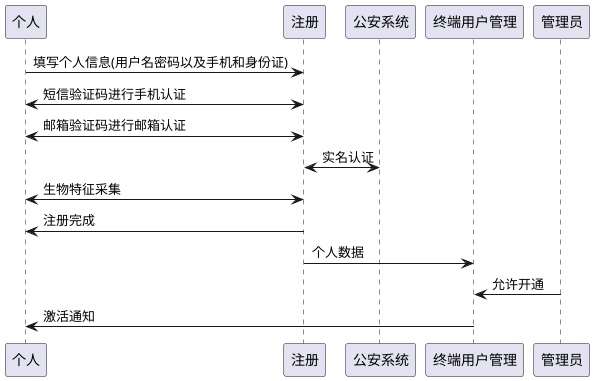
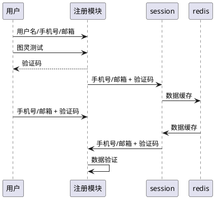
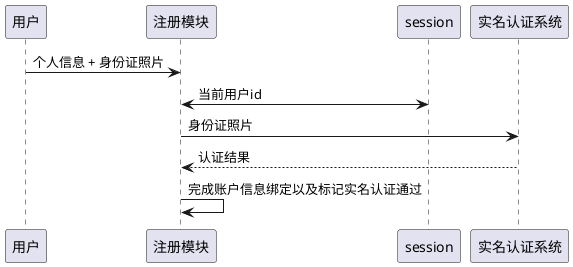
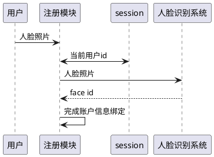

# 整体设计目标

uac作为camellia的子模块，提供了满足BBC业务要求的终端消费者，入驻商家(租户)以及平台方的用户、组织和权限管理，并定义一套规范来使得其它应用程序可以将自己的权限定义接入到系统中

# 消费者、租户与平台用户的账户体系特色

消费者、租户和平台方的用户账户都具有自己的特色

* 消费者(或称个人)的账户形态以扁平化为主，基本不会存在组织关系，其创建过程一般由个人注册完成，偶尔在一些管控较为严格的系统中还需要管理员审核才能激活
* 平台方的账户基本都是要划归到某个确定的组织内部，开通时由组织的管理员或系统的管理员创建/批量导入，而不是注册完成
* 租户的账户在简单场景下是扁平的，但是偶尔也需要支持租户能够创建属于自己的组织结构，将他的员工导入到系统中。租户管理员的账号一般也是由租户自行申请，平台方管理员审批完成的(因为会要求涉及到实名认证、企业认证等流程)

# 消费者的用户数据生成与存储

## 生成

原则上消费者的数据都是自己注册生成的，罕有后台管理员需要给消费者创建账户的行为，其核心流程如下



在传统的注册流程下，用户在一个表单内填写所有信息并通过一个接口去生成账户数据，然而在现在多种登录形式支持的前提以及对个人信息的严谨检查与校验下，会分为2个主要阶段

* 信息收集与校验阶段: 在该阶段，用户的手机号和邮箱在后台完成校验，相关的信息在创建用户时会从系统后台的session或其它存储中读取而不是由前端传入
* 用户数据生成阶段: 向消费者用户数据库进行存储

稍微细化一下注册流程，可以分为以下几个阶段的信息填写与验证

* 用户名、手机号、邮箱收集阶段: 在这个阶段，消费者需要输入自己的一些作为登录名使用的信息，一般来说会要求输入手机号并通过短信验证码的形式验证，被称为登录即注册



到此的交互过程完成后，其实用户信息已经生成，且用户名(可选)、手机号、邮箱相当于都已经收集完毕并进行验证，只是会被标记为未实名认证以及未激活的状态

同时，如果用户当时是使用微信号登录后被检查到在系统中没有注册时，session信息中也会带有用户的wechat openid，于是此时的微信账号也同时绑定

* 实名鉴定

实名鉴定，也就是身份证信息的检验，是建立在用户已有账户的基础上进行的，它的作用是将实名验证的标记从false -> true



* 生物信息采集

生物信息的采集自然也是要基于用户已有账号的基础上进行



<font color=green>总结:</font> 所以可见，消费者的注册其实不再向之前一样由一个表单和一个接口简单粗暴的完成，而是分阶段的进行。第一阶段收集必要的用户信息生成账户，第二阶段基于已有的账户完成信息完善和绑定。
显然，除去第一阶段之外，其它阶段应当检查用户是否有登录(或类似)状态，其接口的调用示意图如下

```plantuml
@startuml
!include https://raw.githubusercontent.com/plantuml-stdlib/C4-PlantUML/v2.0.1/C4.puml
!include https://raw.githubusercontent.com/plantuml-stdlib/C4-PlantUML/v2.0.1/C4_Context.puml
!include https://raw.githubusercontent.com/plantuml-stdlib/C4-PlantUML/v2.0.1/C4_Container.puml
!include https://raw.githubusercontent.com/plantuml-stdlib/C4-PlantUML/v2.0.1/C4_Component.puml

System(注册页面, 注册页面, ui)
System_Ext(短信验证码发送接口, 短信验证码发送接口, api)
System_Ext(邮箱验证码发送接口, 邮箱验证码发送接口, api)
System(用户账号生成接口, 用户账号生成接口, api)
System(用户账号实名认证与变更接口, 用户账号实名认证与变更接口, api)
System(用户账号生物信息认证与变更接口, 用户账号生物信息认证与变更接口, api)

Rel(注册页面, 短信验证码发送接口, '请求验证码')
Rel(注册页面, 邮箱验证码发送接口, '请求验证码')
Rel(注册页面, 用户账号生成接口, ' ')
Rel(注册页面, 用户账号实名认证与变更接口, ' ')
Rel(注册页面, 用户账号生物信息认证与变更接口, ' ')
Rel(用户账号生成接口, 短信验证码发送接口, '验证验证码')
Rel(用户账号生成接口, 邮箱验证码发送接口, '验证验证码')
@enduml
```

## 存储

消费者的数据存储有以下特色

* 往往以消费者的用户编号为依据出发，在数据存储中进行搜索
* 消费者的数据量较大，可能达到千万级或上亿级

因此，显然使用分表的存储方式更符合消费者的特征

进一步，因为用户在查找时并不只是使用id，而是可能会使用到手机号，邮箱等其它关联资源进行查找(比如密码找回的时候会使用邮箱或手机)，因此在用户分表时就需要妥善处理用户分表主key并构建其它列到落地表的索引表。

```plantuml
@startuml
!include https://raw.githubusercontent.com/plantuml-stdlib/C4-PlantUML/v2.0.1/C4.puml
!include https://raw.githubusercontent.com/plantuml-stdlib/C4-PlantUML/v2.0.1/C4_Context.puml
!include https://raw.githubusercontent.com/plantuml-stdlib/C4-PlantUML/v2.0.1/C4_Container.puml
!include https://raw.githubusercontent.com/plantuml-stdlib/C4-PlantUML/v2.0.1/C4_Component.puml

System(手机号索引表, 手机号索引表, 以手机号分表)
System(用户数据主表, 用户数据主表, 以id分表)
System(邮箱索引表, 邮箱索引表, 以邮箱分表)
System(用户名索引表, 用户名索引表, 用户名索引表)
System(微信号分表, 微信号分表, 以微信号分表)
Rel(手机号索引表, 用户数据主表, 主键索引)
Rel(邮箱索引表, 用户数据主表, 主键索引)
Rel(微信号分表, 用户数据主表, 主键索引)
Rel(用户名索引表, 用户数据主表, 主键索引)
@enduml
```

在这种模式下，用户的数据分别依照手机号，邮箱，微信号进行分表(如果对应字段为空，则对应字段的分表数据也是没有的)，并在表内或者至少保存用户的id，或者保存用户的一份冗余数据。 冗余数据的增加加快了搜索的速度，提高了数据维护的成本。

这种方式能够实现已知查询源是手机、邮箱、微信号其中之一时向明确的用户定位的需求，但不能满足输入的是不明确的查询类型，比如只有一个关键词，可能是用户名、手机号、邮箱中的一种时的逻辑查询
此外如果目标是模糊查询或关联条件查询也是无法满足的。所以，面对可能的扩展则应当将用户数据同步到es引擎

```plantuml
@startuml
!include https://raw.githubusercontent.com/plantuml-stdlib/C4-PlantUML/v2.0.1/C4.puml
!include https://raw.githubusercontent.com/plantuml-stdlib/C4-PlantUML/v2.0.1/C4_Context.puml
!include https://raw.githubusercontent.com/plantuml-stdlib/C4-PlantUML/v2.0.1/C4_Container.puml
!include https://raw.githubusercontent.com/plantuml-stdlib/C4-PlantUML/v2.0.1/C4_Component.puml
System(用户数据主表, 用户数据主表, 主数据存储)
System(es, es引擎, 负责查询)
Rel(查询, es, ' ')
Rel(写入与修改, 用户数据主表, ' ')
用户数据主表 -> es: 数据同步
```

在这种设计下，消费者的数据库表就能以id作为分表键进行分表

## 数据安全与隐私

将数据分别存储在es和mysql中实现了读写分离和大数据量的支持，但对于数据的存储和访问安全提出了新的挑战。如果消费者的数据都是存储在mysql中的，那么

* mysql本身就硬性要求必须通过用户名和密码访问数据库，并能授权不同用户对与不同库表的访问
* mysql本身支持整表的加密存储，并在sql语句中支持加密函数

这样，除去运维、应用程序等授权的访问者之外，其它人或者没有办法访问数据库，或者把数据库的文件取走后也无法获得数据的原始明文

## 消费者是否具有角色和权限

原则上来说，消费者使用的都是系统提供给他的功能，这个系统本身就是独立于系统的其它后台的，因此不太会出现需要使用角色和权限来决定消费者能做什么不能做什么的事情。
此外，如果要为消费者分配角色和权限，则，如果消费者的量级为n，系统有k个消费者会被平均分配的权限，则映射关系表的量级为`n * k`。这时，如果消费者是上亿的，而k是10个，则关系映射表就有10亿数据，mysql存储系统肯定是撑不住的。

那么如果消费者没有角色，类似QQ的什么红钻、绿钻、黄钻怎么弄呢？显然应当由业务系统联合会员系统来进行，会员系统提供基于单个消费者查询的接口来获得这个消费者具体是什么会员，而且会员一般都是有时效性的，不是永久有效或需要后台配置和更改，因此更不能是在一个用户数据库中用角色和权限的方式来解决。
因此，原则上消费者不提供对角色和权限的绑定能力。

<font color=green>总结</font>: 会员权益和角色权限不是一回事，虽然感觉很像，但不是一回事