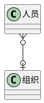
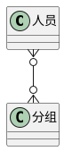

# 引言

一个电子系统以及现实中，人员天然就具有组的概念。人类社会会通过这样那样的规则为人员进行归类，相同类型的会被划为一组。 本文在此就介绍分组这一概念。

# 组的结构模式

人类社会的分组会有2种主要形式

* 以类似部门等模式设立的树形结构
* 以类似群组为模式设立的扁平结构

# 人员与组的对应关系

## 树形结构

树形结构的组中，其结构如下图所示



* 人员只能隶属唯一的1个组织，也可以没有组织
* 组织内可以有0-多个人员

即1对多

## 扁平结构

扁平结构的分组用处可就多了，比如聊天群组，比如随时开始和结束的项目等等。在系统的定义中，主要分为一般群组和应用2种



* 人员隶属于0-多个分组
* 分组内可以有0-多个人员

也就是多对多

# 应用

严格来说应用的表现形式不是以组这种数据结构来表示，但是它符合分组的概念，因此在本文中进行了介绍。 在落地实现时应当将应用作为一种独立表达的数据类型来设计

# 树形组织的空间隔离

## 全局组织树

在系统中，特别是集成型的应用系统中。整个系统具有一棵也是唯一的全局组织树，系统的管理员在这棵组织树下创建账号和下级组织

## 非全局组织树

在应用模块内，特别是使用者为企业租户的应用，难以限定应用不需要自己自定义的组织树，比如

* 从云平台的角度来看，整个云的运营团队使用了一套运维和运营系统，这套系统整体服从全局组织树模型
* 租户登录了云平台的控制台后，需要对自己的员工进行管理，因此需要开放组织树管理的能力给到租户(即一个应用需要自定义组织树，且是多个)
* 显然将所有租户数据存储在全局组织树中是不合理的，这样树的管理员能够看到租户数据
* 需要有一套隔离空间单独存储租户自己的组织树

在这样的诉求下，应当考虑到系统需要支撑的组织树是个'森林'。进一步，为了彻底隔离系统全局数据与租户数据，应当分别用不同的表去存储数据，如下图所示

```plantuml
@startuml
!include https://raw.githubusercontent.com/plantuml-stdlib/C4-PlantUML/v2.0.1/C4.puml
!include https://raw.githubusercontent.com/plantuml-stdlib/C4-PlantUML/v2.0.1/C4_Context.puml
!include https://raw.githubusercontent.com/plantuml-stdlib/C4-PlantUML/v2.0.1/C4_Container.puml
!include https://raw.githubusercontent.com/plantuml-stdlib/C4-PlantUML/v2.0.1/C4_Component.puml

Person(staff, 员工)
Person(tenant, 租户)

System(系统管理后台, 系统管理后台)
System(租户管理后台, 租户管理后台)
System(组织管理接口, 组织管理接口)
System(全局组织树, 全局组织树)
System(租户组织树, 租户组织树)

Rel(staff, 系统管理后台, ' ')
Rel(tenant, 租户管理后台, ' ')
Rel(系统管理后台, 组织管理接口, ' ')
Rel(租户管理后台, 组织管理接口, ' ')
Rel(组织管理接口, 全局组织树, ' ')
Rel(组织管理接口, 租户组织树, ' ')
@enduml
```

通过这种设计，系统的组织树的生命周期管理是统一的


