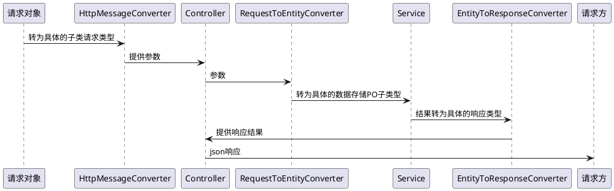

# 引言

在讲解完账号、账户、命名空间的概念后，本文开始讲解基于账户的属性设计，并在sdk提供的属性基础上，如何实现一定程度的扩展

# 账户基准属性

在uac的设计上，账户具有以下基准属性

* 关联的账号清单
* 密码以及过期时间
* 账户过期时间
* 账户的启用，锁定状态
* 账户关联的人员的信息，包括姓名、联系电话、性别、生日等

因此可见在项目的实际落地上，对于账户信息表进行字段扩展是必然会发生的事情

# Dao模板与扩展

由于对账户信息表的访问控制由uac的sdk完成，而开发人员又无法直接修改dao的源代码，因此需要一种手段来支持对基于mybatis的dao对象进行扩展。在此，uac使用了称为<span style="color:red">
Dao模板</span>的技术实现扩展

## Dao模板的定义

下面是一个示例的Dao模板接口定义

```java
public interface AccountDaoTemplate<A extends GenericAccount> {
    /**
     * 读取指定名称空间下的指定账号
     *
     * @param namespace 名称空间
     * @param id        账号id
     * @return 账号
     */
    @SelectProvider(SqlProvider.class)
    @Nullable
    A readAccount(
            @Param(UniformDaoParameterNames.NAMESPACE) String namespace,
            @Param(UniformDaoParameterNames.ACCOUNT_ID) String id
    );

    public static class SqlProvider implements ProviderMethodResolver {

        /**
         * 读取指定名称空间下的指定账号
         *
         * @param namespace 名称空间
         * @param id        账号id
         * @return 语句
         */
        public String readAccount(
                @Param(UniformDaoParameterNames.NAMESPACE) String namespace,
                @Param(UniformDaoParameterNames.ACCOUNT_ID) String id
        ) {
            return OrmUtils.buildSimpleSelectStatementWithCriteria(
                    //读取指定命名空间下的参考类型
                    OrmUtils.scanEntityFields(getTypeByNamespace(namespace)),
                    getAccountTableShardName(namespace, id),
                    false,
                    Collections.singletonList(CommonCriteriaHelper.buildFindByBasicEntityIdCriteria(
                            UniformDaoParameterNames.ACCOUNT_ID
                    ))
            );
        }
    }
}
```

定义中有以上几个要点

* `AccountDaoTemplate<A extends GenericAccount>`
  展示模板是一个范型接口，要求指定使用的范型类型，这个类型是数据定义的基准类`GenericAccount`的子类
* `readAccount`方法返回的类型是`A`，即范型参数，这意味着mybatis可以基于自接口指定的范型来获得真正的数据定义类型
* `SqlProvider`作为sql语句的构造器，`readAccount`使用了`OrmUtils`对接口的范型类进行扫描，而不是`GenericAccount`
  。这样，除去基准类型所表达的账户属性会被扫描到外，具体子类扩展的属性也能被扫描到

## 编写数据类型子类和对应的Dao接口

* 定义扩展的账户数据子类并定义扩展属性

```java

public static class TestAccount extends GenericAccount {
    private String testField;
}
```

* 声明dao与之对应

```java

@NamespaceDao(value = {PredefinedNamespaces.CONSUMER,
        PredefinedNamespaces.ENTERPRISE,
        PredefinedNamespaces.TENANT
})
public interface TestAccountDao extends AccountDaoTemplate<TestAccount> {
}
```

* 指明dao的生成必须包含`NamespaceDao`注解

```java

@MapperScan(
        //指定扫描路径
        basePackageClasses = TestAccountDao.class,
        //要求包含注解
        annotationClass = NamespaceDao.class
)
public class AccountTestConfiguration {
    //...
}
```

以上是从项目中的测试代码里摘抄的，`TestAccount`扩展了基准账户类型，增加了一个叫做`testField`的属性；`TestAccountDao`
扩展`AccountDaoTemplate<TestAccount>`
，并指定`TestAccount`作为使用的账户实体类型。然后通过`MapperScan`注解将dao注册到mybatis中

这样，uac代码模块就能感知到目前开发人员对数据列进行了扩展，并正确的扫描子类的属性来构建sql语句，如下所示

```sql
SELECT `test_field`, -- <-扩展字段
       --这里往下是基准字段
       `account_names`,
       `password`,
       `password_expires_at`,
       `account_expires_at`,
       `enabled`,
       `locked`,
       `surname`,
       `given_name`,
       `date_of_birth`,
       `gender_code`,
       `ethnic_code`,
       `country_code`,
       `email`,
       `phone_number`,
       `creator`,
       `updater`,
       `id`,
       `created_time`,
       `last_update_time`
FROM `consumer_account`
WHERE `id` = ?
```

需要注意的是，`@MapperScan`在使用时，需要指明带有`NamespaceDao`
的dao对象，否则相关的对象都不会被`UacAccountDaoTypeReferenceResolver`正确解析。原因如下

```java
public class UacAccountDaoTypeReferenceResolver implements BeanPostProcessor {

    //...

    @Nullable
    @Override
    public Object postProcessAfterInitialization(Object bean, String beanName) throws BeansException {
        if (bean instanceof AccountDaoTemplate) {
            //看下dao是用来支持哪个名称空间的
            //没有这个注解但生成的mapper可是会报错的
            NamespaceDao annotation = Objects.requireNonNull(
                    AnnotationUtils.findAnnotation(bean.getClass(), NamespaceDao.class)
            );
            //基于名称空间进行类型扫描
            for (String value : annotation.value()) {
                AccountDaoTemplate.SqlProvider.setTypeByNamespace(
                        value, parseTypeReference(bean)
                );
            }
        }
        return bean;
    }
}
```

# Controller/Endpoint层接口参数/返回值类型映射与转换

在dao层面实现了实体子类在开发阶段的可扩展后，一般必然需要实现Controller层的入参扩展

```java
public class GenericCreateAccountRequest implements AccountTrait<GenericCreateAccountRequest.AccountNameParameter>, PasswordTrait, PasswordExpireTimeTrait, AccountStatusTrait {
    @NotEmpty
    @Valid
    @DistinctItem
    private Collection<@NotNull AccountNameParameter> accountNames;

    @Delegate
    @Valid
    @JsonIgnore
    private final PasswordTrait passwordTrait = new PasswordTraitSupport();

    @Delegate
    @Valid
    @JsonIgnore
    private final PersonTrait personTrait = new PersonTraitSupport();
    /**
     * 密码过期时间
     */
    private Date passwordExpiresAt;
    /**
     * 账户过期时间
     */
    private Date accountExpiresAt;
    /**
     * 账户启用
     */
    private boolean enabled;
    /**
     * 账户被锁定
     */
    private boolean locked;

    @Data
    @NoArgsConstructor
    public static class AccountNameParameter implements AccountNameTrait {
        /**
         * 账号
         */
        @NotBlank
        private String name;
        /**
         * 账号类型
         */
        @NotBlank
        private String type;
    }
}
```

上面是用来创建账号的类型定义，其内部的属性基本上只与`GenericAccount`实体对应，没有上文`TestAccount`的扩展属性`testField`。
而现实使用中，扩展的属性必然要求在接口上能够通过参数传入以及验证。
于是，开发人员需要定义这样一个参数类型

```java


public static class TestCreateAccountRequest extends GenericCreateAccountRequest {
    @NotBlank
    private String testField;
}
```

其中有关验证的属性已经加在了扩展属性上，但如果将这个类型告知给sdk是一个需要解决的问题，如下所示

```java
public interface AccountEndpointSkeleton {
    /**
     * 创建账户
     *
     * @param namespace 名称空间
     * @param request   创建请求
     * @return 创建结果
     */
    GenericCreateAccountResponse createAccount(
            @Valid @NotBlank String namespace,
            @Valid GenericCreateAccountRequest request
    );
}
```

可见`AccountEndpointSkeleton`
作为接口的主框架接口，并未使用范型等机制来动态化参数，其原因也很简单: <span style="color:orange;">spring
mvc本身就有办法解决的东西，不需要重复造轮子</span>

## 使用HttpMessageConverter\<T\>接口完成入参类型转换

spring mvc框架在转换接口入参时使用了标准接口`HttpMessageConverter<T>`，并通过责任链模式将一个请求最终由负责的转换器转为目标类型后再进行验证等一系列后续操作。
由此，开发人员自行编写转换类型为`HttpMessageConverter<你的请求类型>`的转换器，并将参数转为实际的子类类型返回即可。下面给出一段代码示例

```java

/**
 * 向spring mvc注册一个配置器
 */
@Configuration
public static class UacAccountTestConfiguration implements WebMvcConfigurer {
    /**
     * 配置转换器接口
     * @param converters 已有的转换器
     */
    @Override
    public void configureMessageConverters(List<HttpMessageConverter<?>> converters) {
        //这里注意，要加载最前面，否则默认转换器会生效
        converters.add(0, new HttpMessageConverter<TestCreateAccountRequest>() {
            @Override
            public boolean canRead(Class<?> clazz, @Nullable MediaType mediaType) {
                //处理所有GenericCreateAccountRequest的子类型，项目中按实际情况编写
                return GenericCreateAccountRequest.class.isAssignableFrom(clazz);
            }

            @Override
            public boolean canWrite(Class<?> clazz, @Nullable MediaType mediaType) {
                //处理入参而已，不需要完成输出的转换，因此固定返回不支持
                return false;
            }

            @Override
            public List<MediaType> getSupportedMediaTypes() {
                //主要支持json
                return Arrays.asList(MediaType.APPLICATION_JSON, MediaType.APPLICATION_JSON_UTF8);
            }

            @Override
            public TestCreateAccountRequest read(Class<? extends TestCreateAccountRequest> clazz, HttpInputMessage inputMessage) throws IOException, HttpMessageNotReadableException {
                //将http输入流转为TestCreateAccountRequest类型返回
                return new ObjectMapper().readValue(inputMessage.getBody(), TestCreateAccountRequest.class);
            }

            @Override
            public void write(TestCreateAccountRequest testCreateAccountRequest, @Nullable MediaType contentType, HttpOutputMessage outputMessage) throws IOException, HttpMessageNotWritableException {
                throw new UnsupportedEncodingException();
            }
        });
    }
}
```

其中几个要点是

* `converters.add(0, ...`规定了自定义转换器最先生效
* `return GenericCreateAccountRequest.class.isAssignableFrom(clazz)`规定了可以接收处理基准参数类型以及子类型
* ` return new ObjectMapper().readValue(inputMessage.getBody(), TestCreateAccountRequest.class);`完成了最终的转换

通过以上几步，接口`createAccount`获得参数类型就是`TestCreateAccountRequest`类型的，因此参数传递的`testField`也会被正确地赋值给参数

## RequestToEntityConverter/EntityToResponseConverter

入参被成功转换后，下一步要解决的问题是DTO/VO与实体PO之间的转换，如下所示

```java
public interface AccountGenericService {
    /**
     * 基于账号和类型读取账户
     * <p>
     * 当不存在时抛出异常
     *
     * @param namespace       命名空间
     * @param accountName     账号名称
     * @param accountNameType 账号类型
     * @param verifiers       读取出来之后的验证
     * @return 账号
     */
    GenericAccount readAccountByName(
            String namespace,
            String accountName,
            String accountNameType,
            Collection<Consumer<GenericAccount>> verifiers
    );

    /**
     * 创建账号
     *
     * @param namespace 名称空间
     * @param account   账号
     * @return 账号id
     */
    String createAccount(
            String namespace,
            GenericAccount account
    );
}
```

可见服务层的创建账号`createAccount`方法使用的是PO作为入参，而不是请求对象。同理`readAccountByName`
返回的也是基础账号类型的PO作为结果，而不是最终需要的VO。因此，需要`RequestToEntityConverter`和`EntityToResponseConverter`
完成类型转换的最后一公里

```java

@Component
@NamespaceConverter(value = {
        PredefinedNamespaces.CONSUMER,
        PredefinedNamespaces.ENTERPRISE,
        PredefinedNamespaces.TENANT})
public static class TestCreateAccountRequestConverter
        implements CreateAccountRequestConverter {
    private final ModelMapper modelMapper = new ModelMapper();

    @Nullable
    @Override
    public GenericAccount convert(GenericCreateAccountRequest source) {
        if (source == null) {
            return null;
        }
        //这里转换为子类类型
        return modelMapper.map(source, TestAccount.class);
    }
}
```

上面是一段代码示例，其中`CreateAccountRequestConverter`是`RequestToEntityConverter`的预定义子类

```java

@FunctionalInterface
public interface CreateAccountRequestConverter extends
        RequestToEntityConverter<GenericCreateAccountRequest, GenericAccount> {
}
```

同样，转换器需要一个`NamespaceConverter`的注解表达为哪个名称空间的类型转换服务，理由是不同名称空间对应着不同的使用场景，不同使用场景的属性扩展不同，因此子类型不同

## 小结

最后稍微再串一下

