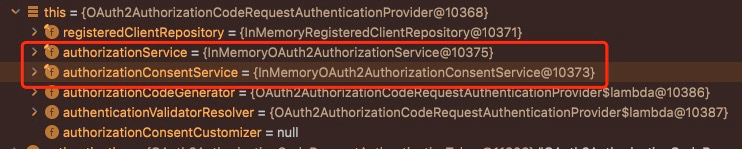
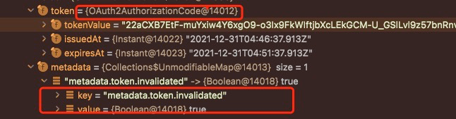
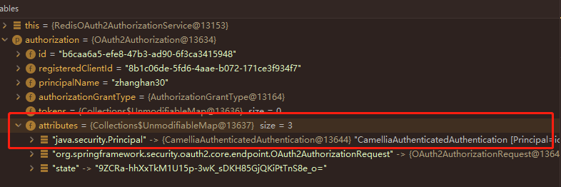
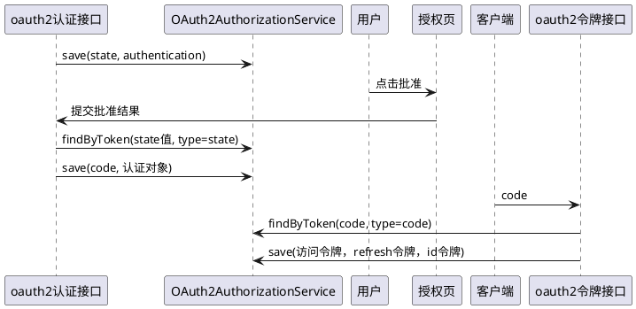
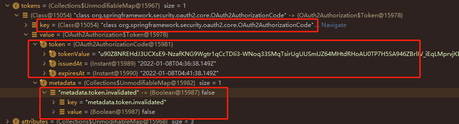
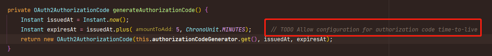
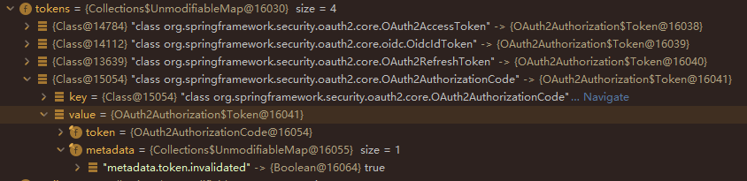
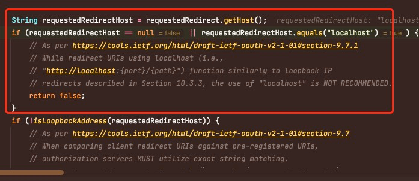

# CSRF

spring security默认是开启csrf保护的，csrf是一种针对糟糕接口的攻击，大致的过程是

* 假设源网站有一个糟糕的接口使用get请求完成一些向指定人的操作，比如向一个目标地点转移数据或甚至是给指定的账号转账
* 源站已经被受害者登录，于是在session/cookie中保存了受害者的身份信息
* 攻击方给受害者发一个链接，包装成可点击的图片，比如领红包
* 受害者点击了链接，该链接正好调用了糟糕的接口，接口参数中包含了攻击者的银行账号或数据服务器
* 由于受害者已经登录，因此浏览器和服务器之间的通信被源站误以为是受害者有意发起的操作，于是就按照逻辑完成了攻击者的攻击

这样的攻击就叫csrf，即跨站请求伪造

在大量的使用spring security的代码中，跨站请求都被无脑的关闭，然而需要注意的是，crsf保护是必要的，不要随意关闭

spring security 默认使用`LazyCsrfTokenRepository`
存储token并验证，这个类其实是个代理，它代理的是`HttpSessionCsrfTokenRepository`，所以实际上csrf
token默认存session里

# Spring Security OAuth2 Authorization Server

从spring boot 2开始，原spring oauth2认证服务器的开发由spring security团队接管，他们遵守oidc的标准对oauth2认证服务器进行重构和改造

## 标准化端点

新版本的认证服务器提供oidc所需的标准化端点，每一种端点在内部是一个`Filter`

### OAuth2AuthorizationEndpointFilter

这个端点负责`/oauth2/authorize`，它核心是将http请求转为`OAuth2AuthorizationCodeRequestAuthenticationToken`(
由`OAuth2AuthorizationCodeRequestAuthenticationConverter`完成)
类，由`OAuth2AuthorizationCodeRequestAuthenticationProvider`完成认证

首先先看
`OAuth2AuthorizationCodeRequestAuthenticationConverter`，它会基于当前`SecurityContext`
获取当前的登录用户，如果登录用户为空，则会将转会完的认证请求中的当前用户设置为匿名用户，否则设置为当前登录用户

有没有当前登录用户对于`OAuth2AuthorizationCodeRequestAuthenticationProvider`是不一样的

* 有登录用户检查是否需要导向授权确认页，需要就跳转，不需要则直接返回授权码(
  并由`OAuth2AuthorizationEndpointFilter.sendAuthorizationResponse`
  去回调目标页面)
* 没有登录用户重新发起认证授权申请，有继续执行过滤器链，并希望后面的过滤器检查当前用户没有登录而跳向登录页

在确认是否需要用户确认授权时，`OAuth2AuthorizationCodeRequestAuthenticationProvider`的逻辑是

* 检查当前访问的client是否要求客户必须批准(由客户端`RegisteredClient`以及`ClientSetting`)来设置
* 在必须批准的前提下，检查当前授权申请是否包含了除了openid之外的scope(在scope请求参数重用空格分开多个请求范围)
  ，详细的逻辑代码参考如下

```java
class OAuth2AuthorizationCodeRequestAuthenticationProvider {
    private static boolean requireAuthorizationConsent(
            RegisteredClient registeredClient,
            OAuth2AuthorizationRequest authorizationRequest,
            OAuth2AuthorizationConsent authorizationConsent
    ) {
        //要求必须批准
        if (!registeredClient.getClientSettings().isRequireAuthorizationConsent()) {
            return false;
        }
        // 'openid' scope does not require consent
        if (authorizationRequest.getScopes().contains(OidcScopes.OPENID) &&
                authorizationRequest.getScopes().size() == 1) {
            return false;
        }

        //当前申请已经批准且批准的范围包含申请的范围
        if (authorizationConsent != null &&
                authorizationConsent.getScopes().containsAll(authorizationRequest.getScopes())) {
            return false;
        }

        return true;
    }
}
```

在确认需要批准后，`OAuth2AuthorizationCodeRequestAuthenticationProvider`返回的认证结果会设置`consentRequired`为`true`
，于是下一步就会将浏览器跳向授权批准的页面，要求用户查看应用程序所需的权限范围并决定是否授权

用户批准后，向`/oauth2/authorize`使用`POST`方法回传批准的client id以及授权范围，认证服务器验证通过后跳向应用程序的redirect
uri

在默认实现下有1个非常核心的问题需要引起注意，那就是<font color=red>整个认证服务器都不是高可用的</font>
，这意味着授权码、授权批准请求以及授权本身的生成和保存是在当前服务器的内存中的(这部分需要改造)



如上图所示，`OAuth2AuthorizationCodeRequestAuthenticationProvider`
默认使用基于内存的实现来保存授权申请和批准结果，并同时提供了基于数据库的实现`JdbcOAuth2AuthorizationService`
和`JdbcOAuth2AuthorizationConsentService`
，在登录流量不大的时候可以直接使用

在配置上，本项目也是默认使用了基于内存的实现，并基于实际项目需要，可以通过生成bean的方式换成基于redis或数据库的实现

### OAuth2TokenEndpointFilter

这个端点负责`/oauth2/token`请求的处理，它基于不同的grant type调用不同的`AuthenticationConverter`

* 对授权码模式，调用`OAuth2AuthorizationCodeAuthenticationConverter`
* 对于客户端模式，调用`OAuth2ClientCredentialsAuthenticationConverter`
* 对于刷新token的请求，调用`OAuth2RefreshTokenAuthenticationConverter`

来转换认证请求，并由各个对应的认证请求的provider去处理，包含

* OAuth2AuthorizationCodeAuthenticationProvider
* OAuth2RefreshTokenAuthenticationProvider
* OAuth2ClientCredentialsAuthenticationProvider

本文在此主要介绍授权码模式

授权码模式的逻辑在`OAuth2AuthorizationCodeAuthenticationProvider`中大致就是

* 调`OAuth2AuthorizationService`去拿token读已经通过的认证信息
* 然后进行一系列验证，包含授权的client id是否匹配，授权码是否过期等等，出现问题就中断了
* 使用jwt(`JwtEncoder`)进行token编码
* 使用`authorizationService`去保存授权信息(授权信息中标记了授权码已经非法，所以授权码下次不能再使用)



* 返回令牌

和之前(spring的第一个版本)
的oauth2认证服务器不同的是，现在的版本强制使用jwt进行token的发放，这部分是写在`OAuth2AuthorizationCodeAuthenticationProvider`
的实现中，所以程序启动前需要生成jwt的加密密钥

于是，需要保证<font color=red>jwt的加解密密钥是稳定的，不是每次服务启动时随机生成的</font>，因此或者有kms管理这对密钥，要不就是给授权服务器颁发证书

### OAuth2TokenIntrospectionEndpointFilter

这个端点负责`/oauth2/introspect`，它主要就是拿着请求方提交的token检查token是否有效，请求方需要提交自己的client
id和secret以及要检查的token(可以是第三方其它人的token)，
它也是由`OAuth2TokenIntrospectionAuthenticationProvider`
完成整个检查过程，检查过程并不是解密传入的token，而是拿着token去`authorizationService`
里找有没有对应的授权信息，将信息返回给请求者

有人拿这个当作获取用户信息的接口，在此本文想要强调，这明显是<font color=red>错误</font>的

### OidcUserInfoEndpointFilter

书接上文，这才是获取用户信息的正统端点，它负责响应`/userinfo`。按照oidc的标准而言，client拿着access
token来这个接口按照申请和批准的scope读取用户信息。
不过在目前认证服务器的实现中，过滤器位于`FilterSecurityInterceptor`
后面，且bearer类型的token在认证服务器中没有提供相应的处理器处理，造成整个端点默认总是返回401(因为被认为没有授权访问)。
因此首先需要解决提交的`Authorization Bearer`不被读取和认证的问题

查阅spring security的源代码不难发现，在`FilterSecurityInterceptor`的安全过滤链前，没有一个filter负责解析bearer
token，这个负责解析的filter叫做`BearerTokenAuthenticationFilter`，它被认为是resource
server的一部分，而不是认证服务器的一部分，因此需要在配置中增加`.oauth2ResourceServer().jwt()`来加入这个过滤器

# OAuth2AuthorizationConsentService

```java

/**
 * Implementations of this interface are responsible for the management
 * of {@link OAuth2AuthorizationConsent OAuth 2.0 Authorization Consent(s)}.
 *
 * @author Daniel Garnier-Moiroux
 * @since 0.1.2
 * @see OAuth2AuthorizationConsent
 */
public interface OAuth2AuthorizationConsentService {

    /**
     * Saves the {@link OAuth2AuthorizationConsent}.
     *
     * @param authorizationConsent the {@link OAuth2AuthorizationConsent}
     */
    void save(OAuth2AuthorizationConsent authorizationConsent);

    /**
     * Removes the {@link OAuth2AuthorizationConsent}.
     *
     * @param authorizationConsent the {@link OAuth2AuthorizationConsent}
     */
    void remove(OAuth2AuthorizationConsent authorizationConsent);

    /**
     * Returns the {@link OAuth2AuthorizationConsent} identified by the provided
     * {@code registeredClientId} and {@code principalName}, or {@code null} if not found.
     *
     * @param registeredClientId the identifier for the {@link RegisteredClient}
     * @param principalName the name of the {@link Principal}
     * @return the {@link OAuth2AuthorizationConsent} if found, otherwise {@code null}
     */
    @Nullable
    OAuth2AuthorizationConsent findById(String registeredClientId, String principalName);

}
```

这个接口主要是用来保存和查询用户对客户端的授权批准的，默认实现是存内存里(上面已经看到了，是InMemory的实现)
，并且还提供了一个jdbc的实现，在本项目中，额外做了一个redis的实现。

这个接口的主要逻辑也很清晰

* 用客户端的记录id(注意不是client_id) + 登录用户的principal名称作为key，查询用户的登录授权
* 在用户授权后去保存实际的批准(在保存前就已经完成了批准的范围是否和请求的范围一致等校验)
* 在下一次相同的客户端对相同的用户进行请求前读取一下保存的批准，保存的授权范围包含了请求的范围，则不再导向授权页，否则调remove删除批准并重新保存

可见，这个服务适合放在缓存中，因为批准丢了就丢了，大不了再批准一次，此外实际的应用中也应当对批准有个有效期，超过之后就是需要重新批准

# OAuth2AuthorizationService

```java

/**
 * Implementations of this interface are responsible for the management
 * of {@link OAuth2Authorization OAuth 2.0 Authorization(s)}.
 *
 * @author Joe Grandja
 * @since 0.0.1
 * @see OAuth2Authorization
 * @see OAuth2TokenType
 */
public interface OAuth2AuthorizationService {

    /**
     * Saves the {@link OAuth2Authorization}.
     *
     * @param authorization the {@link OAuth2Authorization}
     */
    void save(OAuth2Authorization authorization);

    /**
     * Removes the {@link OAuth2Authorization}.
     *
     * @param authorization the {@link OAuth2Authorization}
     */
    void remove(OAuth2Authorization authorization);

    /**
     * Returns the {@link OAuth2Authorization} identified by the provided {@code id},
     * or {@code null} if not found.
     *
     * @param id the authorization identifier
     * @return the {@link OAuth2Authorization} if found, otherwise {@code null}
     */
    @Nullable
    OAuth2Authorization findById(String id);

    /**
     * Returns the {@link OAuth2Authorization} containing the provided {@code token},
     * or {@code null} if not found.
     *
     * @param token the token credential
     * @param tokenType the {@link OAuth2TokenType token type}
     * @return the {@link OAuth2Authorization} if found, otherwise {@code null}
     */
    @Nullable
    OAuth2Authorization findByToken(String token, @Nullable OAuth2TokenType tokenType);

}
```

这个接口主要和oauth2认证流程中的授权码，授权批准页面中的state，以及access token，refresh token以及id token等颁发的token进行保存和管理

其中，批准了oauth2登录的用户的principal在`OAuth2Authorization`的`attributes`字段中，如下图所示



然后再构建存储的token key(无论是授权码，还是最后换来的oauth2的token)，与这个存储数据间的关系，如下图所示

```plantuml
@startuml
!include https://raw.githubusercontent.com/plantuml-stdlib/C4-PlantUML/v2.0.1/C4.puml
!include https://raw.githubusercontent.com/plantuml-stdlib/C4-PlantUML/v2.0.1/C4_Context.puml
!include https://raw.githubusercontent.com/plantuml-stdlib/C4-PlantUML/v2.0.1/C4_Container.puml
!include https://raw.githubusercontent.com/plantuml-stdlib/C4-PlantUML/v2.0.1/C4_Component.puml

System(authorizationCode, 授权码)
System(idToken, idToken)
System(accessToken, accessToken)
authorizationCode-->OAuth2Authorization
idToken-->OAuth2Authorization
accessToken-->OAuth2Authorization
@enduml
```

## 核心逻辑

oauth2的认证流程是通过一系列token串起来的，用户登录后

* 需要跳到授权页面进行授权确认
* 确认后发授权码
* 授权码来换访问token

这一系列流程中，需要有一个统一的数据来支持用户身份信息的存储，批准的存储，以及与身份信息相关的访问令牌、刷新令牌等数据的存储，它就是`OAuth2Authorization`

```java
public class OAuth2Authorization implements Serializable {
    private String id;
    private String registeredClientId;
    private String principalName;
    private AuthorizationGrantType authorizationGrantType;
    private Map<Class<? extends OAuth2Token>, Token<?>> tokens;
    private Map<String, Object> attributes;
}
```

上面是它的主要的属性

* id用来唯一识别这个对象，有点类似于数据库的主键
* registeredClientId和principalName是说明这个对象与哪个客户端以及登录用户有关
* tokens是整个流程内使用的令牌，包含与本次认证流程有关的
    * 批准页面的state
    * 授权码
    * 访问令牌
    * 刷新令牌
    * oidc的id令牌

那么，既然数据对象有了，则`OAuth2AuthorizationService`就是对它的存取类，它对外提供按照令牌的类型和值去获取这个对象的方法，也提供了存储这个对象以及删除这个对象的方法



上面大致讲解了一个常见的授权登录流程下对这个服务类的调用，可见整个认证服务器都依赖于这个服务类能够基于令牌的类型和值正确地找到授权对象，并对对象完成操作后再保存回去

## 不同种类的令牌: OAuth2Token

在oauth2中，令牌被高度抽象，可以认为凡是颁发给你个字符串的玩意都叫做令牌，包含了

* AuthorizationCodeToken
* AccessToken
* RefreshToken
* IdToken

他们都是下面接口的一个实现

```java

/**
 * Core interface representing an OAuth 2.0 Token.
 *
 * @author Joe Grandja
 * @since 5.5
 * @see AbstractOAuth2Token
 */
public interface OAuth2Token {

    /**
     * Returns the token value.
     * @return the token value
     */
    String getTokenValue();

    /**
     * Returns the time at which the token was issued.
     * @return the time the token was issued or {@code null}
     */
    @Nullable
    default Instant getIssuedAt() {
        return null;
    }

    /**
     * Returns the expiration time on or after which the token MUST NOT be accepted.
     * @return the token expiration time or {@code null}
     */
    @Nullable
    default Instant getExpiresAt() {
        return null;
    }
}
```

以授权码为例



在要求存储时，提交给`OAuth2AuthorizationService`的是一个叫做`OAuth2AuthorizationCode`
类型的OAuth2Token，值就是授权码，并且有什么颁发的，什么时候过期

从上图可见授权码的和有效期是5分钟，为啥是5分钟呢，因为下图



可见在代码中写死了5分钟的有效期，并且spring还给你画了个饼，说未来可能支持

在这之外，额外在metadata中写了说当前授权码还没有失效(也就是还没用过)

在拿着授权码换完token时，可见授权服务器会一口气向原授权中颁发4个token，如下图



其中`OAuth2AuthorizationCode`中的metadata也标记为了授权码已经失效

##                              

# 注意事项

## 永远在本机调不过去的oauth2 resource server



如上图所示，禁止跳向本机(域名不得为localhost)