# 引言

本文档主要介绍认证服务器引擎(authorization-server-engine)使用的底层框架的工作原理

# Spring Security 核心概念简介

首先，认证服务器是基于spring security的技术进行的二次开发，因此先来简要介绍一些核心概念

## Security Filter Chain

熟悉Servlet开发的都清楚，Servlet是一系列过滤器链，如下图所示

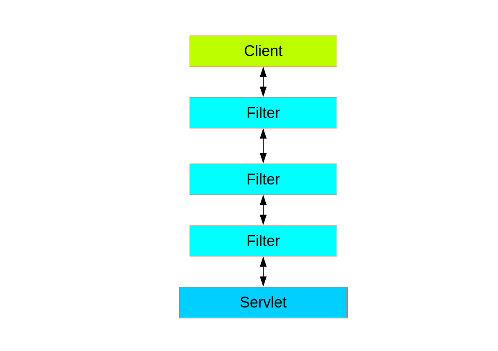

客户端的请求是经过一层层的过滤器最终才到达Controller。

在这条过滤器链上，Spring Security诸如了一个内嵌链，一般成为"security filter chain"

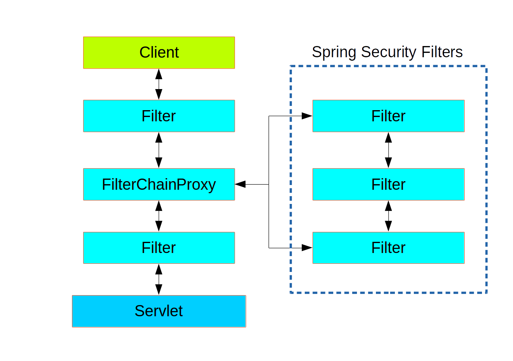

它在从客户端请求到Controller的路上构成了大坝，将请求的认证，鉴权等逻辑都做在了这里

## Authentication

在安全过滤器的逻辑中，所有内容都是围绕着Authentication这个词展开的，它的定义如下

```java
public interface Authentication extends Principal, Serializable {

    Collection<? extends GrantedAuthority> getAuthorities();


    Object getCredentials();


    Object getDetails();


    Object getPrincipal();

    boolean isAuthenticated();

    void setAuthenticated(boolean isAuthenticated) throws IllegalArgumentException;

}
```

稍微拆解一下和翻译一下内部的术语:

* GrantedAuthority: 被授予的权限
* Credentials: 登录凭据，比如密码，比如短信验证码
* Principal: 认证主体，也就是要求登录的用户或应用程序
* isAuthenticated: 是否通过了认证

这个类将登录的请求和认证结果融为一体，具体怎么融为一体的，下文开始讲解

## AuthenticationConverter

AuthenticationConverter是Spring Security的核心接口，它的意思是将服务器收到的http请求，转为用户的登录请求`Authentication`。
由于是登录请求，因此`isAuthenticated = false`，而要认证的用户主体，也就位于`Principal`属性中，`Credentials`
是用户提交的登录凭据，至于被授予的权限，应当是个空的集合(认证没有完成哪来的权限)。
其接口定义如下所示

```java
public interface AuthenticationConverter {

    Authentication convert(HttpServletRequest request);

}
```

在此，`Authentication`代表用户的登录请求(`isAuthenticated = false`)

## AuthenticationProvider

那么登录的用户具体怎么认证呢，Spring Security设计上将工作交给`AuthenticationProvider`来完成，其接口定义如下所示

```java
public interface AuthenticationProvider {

    Authentication authenticate(Authentication authentication) throws AuthenticationException;

    boolean supports(Class<?> authentication);
}
```

它有2个方法，一个是`supports`，一个是`authenticate`，其逻辑也不难看出

* spring会询问当前AuthenticationProvider能否支持对应的登录请求，能支持的情况下交给它去进行处理
* 处理完成，被认证成功的`Authentication`将被返回。至于这个`Authentication`和认证请求是不是一个对象，spring没有明确的要求，而且实际过程中也很少是同一个对象
* 其中的`isAuthenticated = true`

在此`Authentication`承担了认证，因此这个类将请求和结果融为了一体

## AuthenticationManager

从`AuthenticationProvider`
的行为上可见，它一般只专门负责一种或几种类型的认证请求，比如用户名密码的请求，比如短信验证码的请求，也就是一个一个的独立的个体。那么这些个体显然需要一个'经理'
来整体管理他们，为安全过滤器提供服务。这个'经理'就叫做`AuthenticationManager`，主要使用的实现叫做`ProviderManager`

## ProviderManager

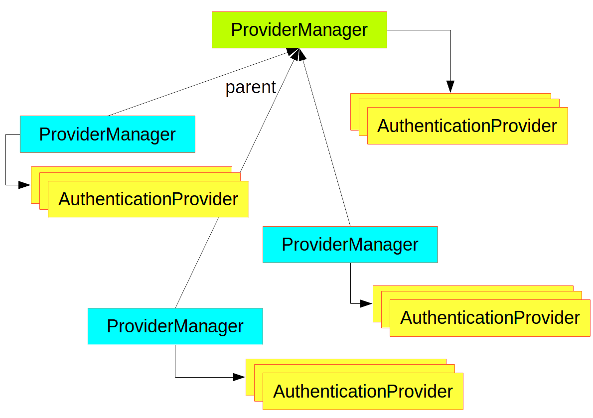

这张图很好的解释了`ProviderManager`在spring中的使用

* 它具有层级结构
* 每一层都管理了若干的`AuthenticationProvider`
* 本层无法完成的认证请求交给上层去认证
* 都没有办法认证则就认为无法认证了

# Spring Security OAuth2 基础简介

在上文理解了Spring Security的基础上，现在开始讲解Spring Security如何实现OAuth2h以及一些核心的逻辑与流程

## 过滤器

```text
2022-04-29 18:16:38.495  INFO 4941 --- [           main] o.s.s.w.DefaultSecurityFilterChain       : 
Will secure any request with [
org.springframework.security.oauth2.server.authorization.web.OAuth2AuthorizationEndpointFilter@35bf6dba, 
org.springframework.security.oauth2.server.authorization.oidc.web.OidcProviderConfigurationEndpointFilter@662b199,
org.springframework.security.oauth2.server.authorization.web.NimbusJwkSetEndpointFilter@1259b2a5, 
org.springframework.security.oauth2.server.authorization.web.OAuth2AuthorizationServerMetadataEndpointFilter@2ffaa711,
org.springframework.security.oauth2.server.authorization.web.OAuth2ClientAuthenticationFilter@16a14076,
org.springframework.security.oauth2.server.authorization.web.OAuth2TokenEndpointFilter@b8c6406,
org.springframework.security.oauth2.server.authorization.oidc.web.OidcUserInfoEndpointFilter@cf0bc92, 
org.springframework.security.oauth2.server.authorization.web.OAuth2TokenIntrospectionEndpointFilter@28effa3f,
org.springframework.security.oauth2.server.authorization.web.OAuth2TokenRevocationEndpointFilter@55a29589]
```

上面截了一段服务器启动时的日志，去掉了一些无关信息后中留下的部分展示了Spring Security实现OAuth2也是加入了一堆安全过滤器，每个过滤器负责一项具体的工作

## 授权码认证流

比起枯燥地讲解一堆概念，本文认为按照实际的认证流程随用随讲的方式可能更好理解。因此首先介绍最长使用的授权码认证流。

授权码认证流由`OAuth2AuthorizationEndpointFilter`完成，它按照Spring
Security的设计，使用`OAuth2AuthorizationCodeRequestAuthenticationConverter`
转换登录请求，由`OAuth2AuthorizationCodeRequestAuthenticationProvider`完成认证

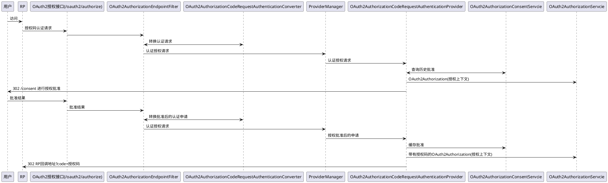

上图是整个流程的概述，下面详细展开部分核心内容

### OAuth2AuthorizationCodeRequestAuthenticationConverter取得用户信息

登录的请求转换需要准备即将被`OAuth2AuthorizationCodeRequestAuthenticationProvider`
认证的信息，其中一个比较重要的就是当前的登录用户，因为授权码是当前登录用户颁发的，因此后续授权码与访问令牌都需要和当前用户去关联。在流程上

* 授权码是基于web的认证流
* /oauth2/authorize接口的访问是浏览器
* 所以能够从浏览器获得session id
* 从而从session中读取用户信息

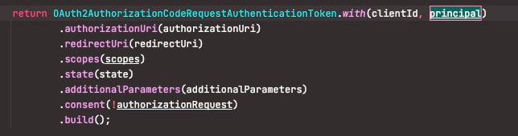

这张图显示了转换器最终返回的认证请求，其中的`principal`就是认证主体，就是当前的登录用户

如果当前用户没有登录，那么转换器就会使用一个匿名用户

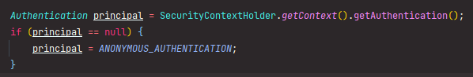

### OAuth2AuthorizationCodeRequestAuthenticationProvider检查登录用户

这个认证器的一项工作之一就是检查用户有没有登录，没有的话就把请求原封不动的返回给过滤器

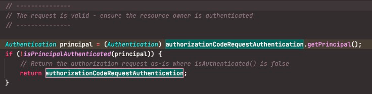

注意这里，无论是转换器，还是认证器，都没有向SecurityContext保存任何认证信息，原因也很简单: 因为用户没有登录

### OAuth2AuthorizationEndpointFilter继续向下传递

OAuth2AuthorizationEndpointFilter看到用户没有被认证，那就向过滤器链继续传递

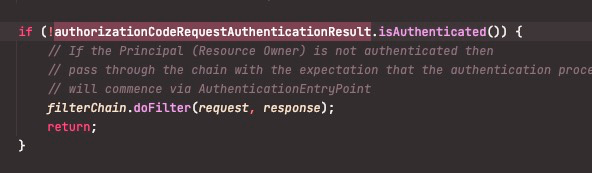

### AnonymousAuthenticationFilter生成匿名用户

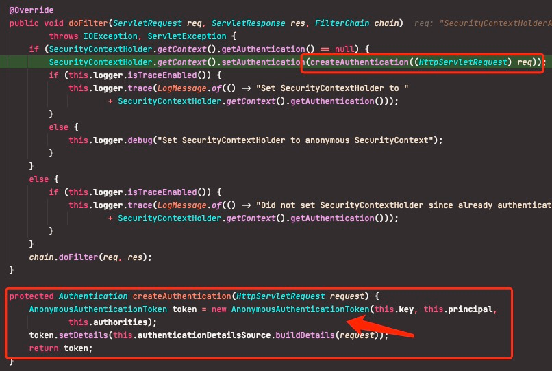

往下执行的时候，因为安全上下文内没有任何认证用户，因此`AnonymousAuthenticationFilter`生成了一个兜底的匿名用户

这个用户在后续的逻辑中，由于/oauth/authorize要求不允许匿名用户访问，从而被后续执行的其它filter抛出AccessDenyException，使得错误处理流程将页面转向了登录页

### 小结

上面这些主要介绍了`OAuth2AuthorizationEndpointFilter`如何检查到用户没有登录转向登录页的原理，下面开始讲解用户登录后的流程

### OAuth2AuthorizationCodeRequestAuthenticationProvider给出授权码

当用户登录后，转换器提供的认证请求中就包含了用户信息，此时的核心流程如下图所示

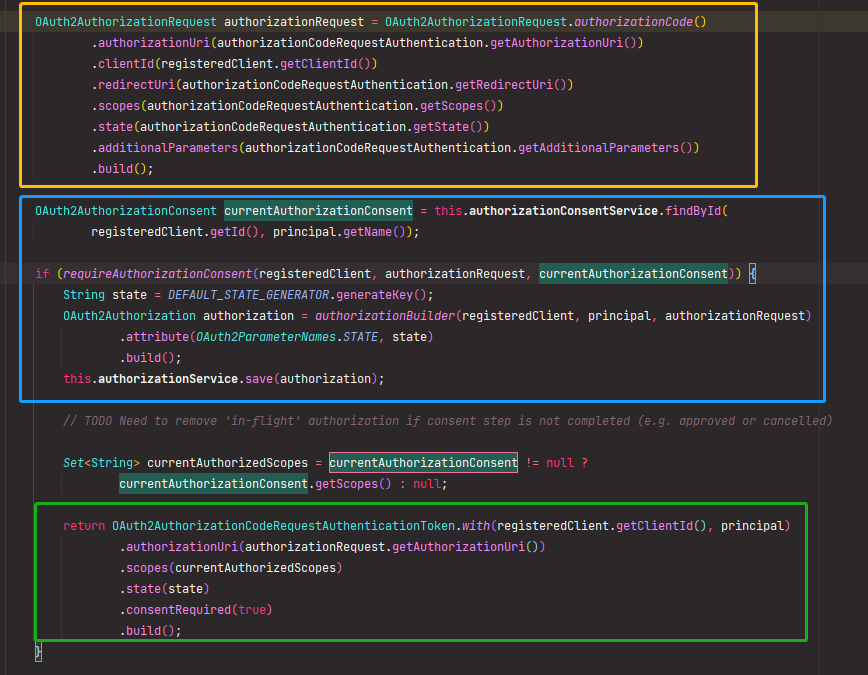

* <font color=yellow>黄色方框</font>的部分是生成授权申请
* <font color=yellow>蓝色方框</font>的部分是
    * 查找当前登录的用户是否对当前访问的第三方应用(RP)已经有过授权批准
    * 检查授权批准是否对这次授权有效(
      或者第三方应用本身就不需要用户授权可直接获取授权码；或者用户当时批准访问的范围与本次授权一致)
    * 如果需要进行批准，则生成`OAuth2Authorization`来保存当前认证的客户端，用户以及授权请求(
      主要是保存需要读取的用户信息范围)，并使用`state`作为当前信息的id进行存储
    * 注意`OAuth2Authorization`是贯穿授权码和访问令牌等多个认证流程的黄金对象，后续会多次用到
* <font color=yellow>绿色方框</font>的部分是本次授权依然要用户去批准，因此返回授权码认证请求

### OAuth2AuthorizationEndpointFilter转向授权申请批准页

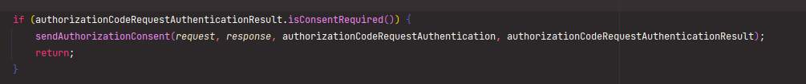

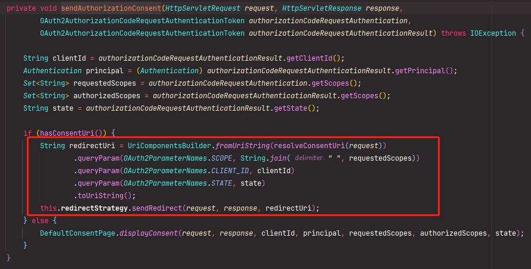

### 小结

上面这些主要介绍了`OAuth2AuthorizationEndpointFilter`如何使得登录用户调向授权批准页，下面开始讲解用户授权批准后的流程

### OAuth2AuthorizationCodeRequestAuthenticationProvider认证授权批准申请并生成授权码

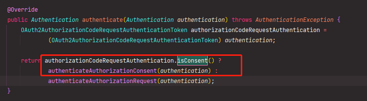

这次，认证器检查到转换器转换的登录请求中要求认证的是批准内容，因此转向批准认证逻辑

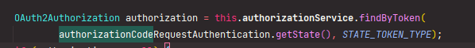

第一步是用state参数查找之前保存的认证信息，然后对信息进行校验，包含查看登录用户是否已经变化，要求访问的客户端是否已经变化，要求的范围是否已经变化等

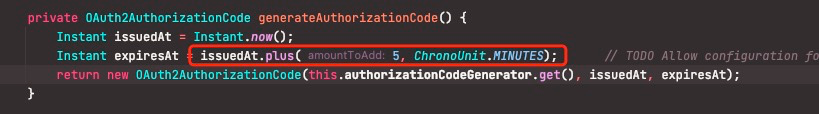

都折腾完了之后就会生成授权码，可以看到spring这里将授权码的有效期写死成了5分钟

### 增强学习: 授权码随机id生成

在生成授权码的算法上，spring使用了`SecureRandomBytesKeyGenerator`来生成随机key。在此本文进行一些与主流程无关的增强讲解。

在Java语言中，随机数的生成一般都是用`Random`
类，它的随机数生产采用的是[线性同余生成器(Linear Congruential Generator (LCG))](https://en.wikipedia.org/wiki/Linear_congruential_generator)

这种算法比较古老且有迹可循，这使得可以通过暴力破解等方式进行枚举，因此作为安全以及认证所需的随机数来说不太够，因此在安全场景，需要使用[密码学安全伪随机数生成器(Cryptographically Strong Pseudo-random Number Generator(CSPRNG))](https://en.wikipedia.org/wiki/Cryptographically-secure_pseudorandom_number_generator)


如上图所示，左边是LCG算法生成的一个随机图片，可以看到图标还是很有规律的，右边那个是CSPRNG生成的，如电视的雪花屏一样的玩意

因此，如果要生成一个较为安全的，一次性生效的随机的东西(比如手机验证码、安全访问令牌什么的)，显然还是要用`SecureRandom`
或`SecureRandomBytesKeyGenerator`

`UUID`类在生成随机ID的时候用的也是`SecureRandom`，可放心'食用'

### OAuth2AuthorizationCodeRequestAuthenticationProvider绑定认证信息和授权码

认证器在原有保存的`OAuth2Authorization`认证信息的基础上把授权码塞进去并进行更新。此时可以认为认证信息开始由授权码进行索引

```plantuml
@startuml
!include https://raw.githubusercontent.com/plantuml-stdlib/C4-PlantUML/v2.0.1/C4.puml
!include https://raw.githubusercontent.com/plantuml-stdlib/C4-PlantUML/v2.0.1/C4_Context.puml
!include https://raw.githubusercontent.com/plantuml-stdlib/C4-PlantUML/v2.0.1/C4_Container.puml
!include https://raw.githubusercontent.com/plantuml-stdlib/C4-PlantUML/v2.0.1/C4_Component.puml

System(state, state) #grey
System(授权码, 授权码)
System(认证信息, 认证信息)
授权码-r->认证信息: 有效的关联关系
state-[dashed]d->认证信息: 关联关系已作废
@enduml
```

### 小结

到此，授权码已经生成，`OAuth2AuthorizationEndpointFilter`会将授权码按照RP设置的回调地址将授权码发送给RP使用。下面开始介绍RP如何使用授权码获得访问令牌并读取最终用户

## 使用授权码、客户端凭据等获得访问令牌

当授权码生成后，OAuth2将获取令牌的逻辑统一到了"/oauth2/token"接口，其处理器是`OAuth2TokenEndpointFilter`，它里面自带3个认证请求的转换器

* `OAuth2AuthorizationCodeAuthenticationConverter`，即授权码转换器
* `OAuth2RefreshTokenAuthenticationConverter`，refresh token转换器
* `OAuth2ClientCredentialsAuthenticationConverter`，客户端凭据转换器

```plantuml
@startuml
!include https://raw.githubusercontent.com/plantuml-stdlib/C4-PlantUML/v2.0.1/C4.puml
!include https://raw.githubusercontent.com/plantuml-stdlib/C4-PlantUML/v2.0.1/C4_Context.puml
!include https://raw.githubusercontent.com/plantuml-stdlib/C4-PlantUML/v2.0.1/C4_Container.puml
!include https://raw.githubusercontent.com/plantuml-stdlib/C4-PlantUML/v2.0.1/C4_Component.puml

System(RP, RP, RP)
System(OAuth2AuthorizationEndpointFilter, OAuth2AuthorizationEndpointFilter, "/oauth2/token")
System(OAuth2AuthorizationCodeAuthenticationConverter, OAuth2AuthorizationCodeAuthenticationConverter, "authorization_code") #orange
System(OAuth2RefreshTokenAuthenticationConverter, OAuth2RefreshTokenAuthenticationConverter, "refresh_token") #red
System(OAuth2ClientCredentialsAuthenticationConverter, OAuth2ClientCredentialsAuthenticationConverter, "client_credentials") #green
System(ProviderManager, ProviderManager, ProviderManager)
System(OAuth2AuthorizationCodeAuthenticationProvider, OAuth2AuthorizationCodeAuthenticationProvider, "authorization_code") #orange
System(OAuth2RefreshTokenAuthenticationProvider, OAuth2RefreshTokenAuthenticationProvider, "refresh_token") #red
System(OAuth2ClientCredentialsAuthenticationProvider, OAuth2ClientCredentialsAuthenticationProvider, "client_credentials") #green
System(OAuth2AuthorizationService, OAuth2AuthorizationService, "授权上下文服务")
RP <-r-> OAuth2AuthorizationEndpointFilter: 认证请求/access token
OAuth2AuthorizationEndpointFilter <-d-> OAuth2AuthorizationCodeAuthenticationConverter: grant_type=authorization_code
OAuth2AuthorizationEndpointFilter <-d-> OAuth2RefreshTokenAuthenticationConverter: grant_type=refresh_token
OAuth2AuthorizationEndpointFilter <-d-> OAuth2ClientCredentialsAuthenticationConverter: grant_type=client_credentials
OAuth2AuthorizationEndpointFilter <-d-> ProviderManager: 认证请求/access token
ProviderManager -d-> OAuth2AuthorizationCodeAuthenticationProvider: 授权码认证请求
ProviderManager -d-> OAuth2RefreshTokenAuthenticationProvider: refresh token 认证请求
ProviderManager -d-> OAuth2ClientCredentialsAuthenticationProvider: client credentials认证请求
OAuth2AuthorizationCodeAuthenticationProvider <-[dashed]- OAuth2AuthorizationService: OAuth2Authorization(使用授权码查询)
OAuth2AuthorizationCodeAuthenticationProvider -[thickness=3]d-> OAuth2AuthorizationService: access token
OAuth2RefreshTokenAuthenticationProvider <-[dashed]- OAuth2AuthorizationService: OAuth2Authorization(使用 refresh token查询)
OAuth2RefreshTokenAuthenticationProvider -[thickness=3]d-> OAuth2AuthorizationService: access token
OAuth2ClientCredentialsAuthenticationProvider -[thickness=3]d-> OAuth2AuthorizationService: access token
@enduml
```

上图也给出了工作原理的基本示意，展开来说

* 不同grant_type类型的认证由不同的`AuthenticationConverter`执行，给出不同类型的`Authentation`
  对象，图中带有红、黄、绿颜色的部分可见，授权码、客户端凭据、刷新令牌对应着不同的转换器
* 转换器给出的`Authentication`经过`ProviderManager`，会由正确的`AuthenticationProvider`处理。在图中，对应的处理器和转换器之间的颜色相同
* 这些处理器都需要调用`OAuth2AuthorizationService`来读取和存储认证的上下文信息，图中的虚线表示使用不同类型的key来查询之前保存的上下文，比如
    * 使用授权码来检查授权码是否已经完成批准
    * 使用refresh token来检查之前的access token是否还有效
* 这个步骤通过后，各个处理器会生成新的access token并要求上下文服务进行存储，也就是图中的粗实线，同时会被access
  token作为结果，通过`ProviderManager`
  返回给`OAuth2AuthorizationEndpointFilter`，然后输出给RP

## 使用访问令牌获得用户信息

获得访问令牌(access token)后，RP向"/userinfo"接口传入令牌获取用户信息，这个接口的处理器是`OidcUserInfoEndpointFilter`
，它同样遵守spring security的基本原理，使用

* `OidcUserInfoAuthenticationProvider`完成访问令牌的认证，并读取保存在`OAuth2Authorization`中的登录用户信息
* 调用`Function<OidcUserInfoAuthenticationContext, OidcUserInfo>`来完成用户信息对外输出的转换

## OAuth2Authorization

上文多次提到了`OAuth2Authorization`，它就是贯穿整个OAuth2认证过程内的上下文对象，由`OAuth2AuthorizationService`负责存取。

```plantuml
@startuml
!include https://raw.githubusercontent.com/plantuml-stdlib/C4-PlantUML/v2.0.1/C4.puml
!include https://raw.githubusercontent.com/plantuml-stdlib/C4-PlantUML/v2.0.1/C4_Context.puml
!include https://raw.githubusercontent.com/plantuml-stdlib/C4-PlantUML/v2.0.1/C4_Container.puml
!include https://raw.githubusercontent.com/plantuml-stdlib/C4-PlantUML/v2.0.1/C4_Component.puml

System(授权批准状态码, 授权批准状态码)
System(授权码, 授权码)
System(访问令牌, 访问令牌)
System(刷新令牌, 刷新令牌)
System(id令牌, id令牌)
System(OAuth2Authorization, OAuth2Authorization)
授权批准状态码 --> OAuth2Authorization
授权码 --> OAuth2Authorization
访问令牌 --> OAuth2Authorization
刷新令牌 --> OAuth2Authorization
id令牌 --> OAuth2Authorization
@enduml
```

上图给出这个上下文与OAuth2中常用的不同类型的令牌以及id之间的关联关系。其中，授权批准状态码和授权码是一次性生效的，因此在使用过之后会断开与上下文之间的关系。`OAuth2Authorization`
的属性字段中，会以`Principal`类的类名为key，存储当前访问系统的用户。有了这个机制，才使得多种认证方式以及多个请求之间传递登录用户信息

# 总结

本文介绍了spring security的基本原理以及oauth2在spring security实现中的要点，其中一个核心对象就是`OAuth2Authorization`
，它是贯穿了认证过程的上下文对象