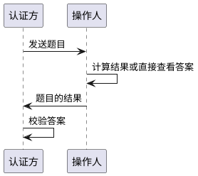
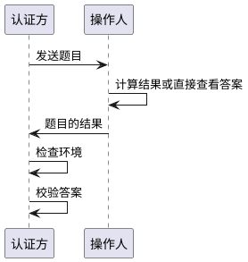

# 引言

挑战与应答(Challenge-Response)
是一种安全界常用的，对操作发起者进行认证的手段。认证方对操作者发起一个挑战，比如常见的有短信验证码，邮箱验证码，动态令牌等。 这个挑战的答案或者操作人基于已知能够计算得出，或者由认证方事先发送给正确的操作人。
通过正确地回答挑战，认证方认定当前的操作人正确无误。

这样的方法在现在的系统中非常多，比如登录时的多因子认证，比如找回密码时要求输入手机号和短信验证码，甚至部分认证系统直接不使用静态密码这种陈旧的认证方式，只使用挑战-应答的模式来每次动态生成和验证登录凭据。 下图是挑战-应答的一个黄金流程



# 发送题目

认证方会基于自己的业务以及对操作人识别的需求，选择多种形式生成题目，包括

* 短信
* 邮箱
* 各种动态令牌的OTP(One-time Password)
* 其它只有真实操作人能够解答的问题或生物特征，比如指纹、虹膜、面容、声音等等

选定了问题后，认证方一般需要为这次问答生成一个一次性生效且唯一的id，通过这个id来追踪挑战。此外，一次挑战就像一次真实的考试，其作答时间是有限的，因此还会有本次作答的过期时间。最后，为了避免操作人频繁地申请"考试"
，一般再会附加一个申请的间隔时间，也就是下次什么时候才能开始重试

<font color=orange>提示</font>: 挑战的过期时间非常重要，例如当重置密码时，在填写正确的短信验证码后弹出了重置密码提示框却一直没有输入(比如肚子突然疼)
，那么长时间界面就怎么开着，别人过来输入了一个错误的密码该怎么处理？这时显然应当检查挑战是否已经过期，如果过期则需要重新发送验证码

# 发送应答

题目送达操作人后，需要对题目的内容进行回答。一般来说回答的形式都是一个字符串。在此将它称为`response`

# 验证应答

## 答案校验

当收到应答后，常规的逻辑是进行答案的校验，这部分就是将`response`部分的值和预期的答案进行判等，相同即通过，不同即失败

## 环境检验

其实在验证应答之前，还需要对"考场环境"进行检查。思考这样一个场景：

* 操作人在网站端发起短信验证登录，验证码被发送到他的手机
* 恰好有个讨厌的人看到了这个短信，然后手疾眼快地要在app端登录
* 这时app端是否应当对这个验证码进行检查？

如果不执行检查，那么操作人就在不知情的情况下账号被他人登录使用

因此，黄金流程需要改成下图的样子



环境在此代表了一种抽象概念，包含且不限于

* 当前进行回答的客户端和请求挑战时的是不是同一个
* 当前回答挑战的人是否真的是之前的用户
* 当前执行操作的人是否ip发生变更

# 挑战的重放

上文给出的黄金流程都是正向流程，然而实际使用过程中不能保证挑战发出后，操作人总是能够按照要求回答挑战，在回答之前有各种各样的异常发生，如不小心关闭了浏览器 、不小心关闭了计算机 、系统崩溃 、突然断电 等等
这时操作人会回到最开始的步骤要求发送挑战。基于挑战的间隔机制，一般来说操作人都需要等到挑战间隔过后才能重新获得下一次挑战机会。不过为了用户体验友好，本文建议并挑战可被重放。

重放的定义是指:

* 基于操作人当前的访问参数和环境(如Http头部信息)，可以得知操作人上一次挑战的id
* 该挑战必然应当是没有被回答的状态且没有过期
* 认证方将该挑战重新发送给操作人，这样前端页面能够获得挑战对应的id和其它上下文信息，转向回答挑战的页面

<font color=orange>注意</font>: 挑战的重放是一种为了提高体验和容错的机制，并不要求强制去实现。由于目前一般的挑战的重试周期躲在一个可接受的范围内，因此使用方也并不会因为需要额外等待一段时间而觉得不可接受。
当然，<font color=red>新年抢票回家</font>、<font color=red>1元秒杀</font>等极限操作场景下，这种等待是不是可接受就是另外一回事了。

# 统一框架实现

既然挑战和应答机制有流程和概念可抽象，那么本项目就使用一套较为统一的框架来进行定义，并将具体的业务操作交由现场团队执行

## ChallengeResponseService

挑战被抽象为一个服务类，叫做`ChallengeResponseService`，其基本定义如下所示

```java
public interface ChallengeResponseService<R extends ChallengeRequest, C extends Challenge> {
    /**
     * 给出当前挑战的cd计算key
     * <p>
     * 冷却时间可以按用户，或者按用户+应用组等自由决定
     * <p>
     * 冷却时间key的管理是由引擎负责的，在key存在时会不允许发送挑战
     * <p>
     * 如果基于请求的一些信息，觉得不需要进行冷却时间的检查，则可以选择生成空的key，这丫NG引擎就不会再检查
     *
     * @param request 挑战请求
     * @return cooldown 上线文，如果认为当前请求与冷却无关，不需要检查冷却逻辑，则返回null
     */
    @Nullable
    default String getCooldownKey(R request) {
        return null;
    }

    /**
     * 给出cd时间
     * <p>
     * 一般来说，挑战的cd都是固定的，比如什么短信验证码一分钟之类的
     * <p>
     * cd时间内不重新发送
     *
     * @return cd时间
     */
    default long getCooldown() {
        return 0;
    }

    /**
     * 发送挑战
     * <p>
     * 再次说明，单个个人或者客户端可能一直都在要求发送挑战
     * <p>
     * 因此需要思考什么时候重新生成挑战，什么时候发送之前未完成的
     *
     * @param request 请求对象
     * @return 挑战令牌.
     * 当认为不需要发送挑战时，可以为空，
     * 比如当前情况下不需要mfa认证，则可以发送一个空的挑战令牌表达放行请求
     */
    @Nullable
    @UsingContextFactory(DefaultChallengeContextFactory.class)
    C sendChallenge(R request);

    /**
     * 验证应答
     * <p>
     * 并且要求验证挑战环境
     *
     * @param id       挑战id
     * @param response 应答
     * @return 是否合法(只要不是合法都返回 false)
     * @throws InvalidChallengeException 当前挑战不合法，比如id不存在，比如ttl过期
     */
    @ValidateChallengeEnvironment
    boolean validateResponse(@ChallengeId String id, String response) throws InvalidChallengeException;

    /**
     * 关闭挑战，意味着回收与挑战相关的资源
     *
     * @param id 挑战id
     */
    void closeChallenge(@ChallengeId String id);
}
```

它是一个范型类型，要求的模板参数是挑战请求的类型和挑战的类型

## ChallengeRequest

```java
public class ChallengeRequest {
    /**
     * http请求头
     * <p>
     * 其中Authorization头已经被去掉，因为其中包含了access token或认证信息
     * <p>
     * http头用于给实现类一些基本的
     */
    private final MultiValueMap<String, String> headers;
    /**
     * 挑战相关的应用组
     */
    private final String clientGroup;
    /**
     * 挑战相关的请求客户端
     */
    @Nullable
    private final Client client;
    /**
     * 挑战相关的用户
     */
    @Nullable
    private final User user;
}
```

挑战请求包含了发送挑战时的常用参数

* header是当前请求的所有http头，其中有关认证，用户名密码等敏感信息已经被去掉
* clientGroup是应用组
* client是应用组内的客户端，也就是哪个应用用了什么AK/SK在请求
* user是当前的登录用户

## Challenge

```java
public class Challenge {
    /**
     * 挑战id
     */
    private final String id;
    /**
     * 挑战的验证形式
     */
    private final String authenticator;
    /**
     * 挑战的过期时间，超过这个时间即认为挑战无效
     */
    private final Date expiresAt;
    /**
     * 其它额外参数，提示给客户端的
     */
    private Map<String, String> parameters;
}
```

挑战被发送时，需要给出一个Challenge类型的返回值，其中

* id就是挑战的识别符号，后续挑战的应答，以及基于被应答的挑战的操作都需要这个id
* authenticator是挑战使用的认证方法，比如google动态令牌
* expiresAt是挑战的过期时间
* parameters是挑战的一些额外参数

## 挑战的生命周期

```plantuml
@startuml
!include https://raw.githubusercontent.com/plantuml-stdlib/C4-PlantUML/v2.0.1/C4.puml
!include https://raw.githubusercontent.com/plantuml-stdlib/C4-PlantUML/v2.0.1/C4_Context.puml
!include https://raw.githubusercontent.com/plantuml-stdlib/C4-PlantUML/v2.0.1/C4_Container.puml
!include https://raw.githubusercontent.com/plantuml-stdlib/C4-PlantUML/v2.0.1/C4_Component.puml

Person(用户, 用户)
System(sendChallenge, sendChallenge, 发送挑战)
System(validateResponse, validateResponse, 检验应答)
System(closeChallenge, closeChallenge, 回收挑战资源)

sendChallenge -r-> validateResponse: 验证响应
validateResponse -r-> closeChallenge: 关闭挑战，释放相关资源

用户 -d-> sendChallenge: 进行挑战申请
用户 -d-> validateResponse: 应答
用户 -d-> closeChallenge: 完成业务操作(如登录/重置密码)

@enduml
```

上图展示了`ChallengeResponseService`主要方法的调用顺序和逻辑，其中closeChallenge的发生一般是在用户完成了业务操作后的一瞬间。例如mfa多因子验证下，短信验证码验证成功后(
validateResponse)后会启动登录过程，并调用closeChallenge来表达挑战已经结束，相关资源需要释放

## 冷却时间管理

上文曾经提及，任何挑战都应当有一个重试的周期，周期内不会发送新的挑战，`ChallengeResponseService`的`getCooldownKey`和`getCooldown`负责告诉引擎如何管理冷却时间。

### CooldownKey

冷却主键是一种不同于挑战id的识别符号，它基于挑战请求来查看当前挑战应当按照什么维度来进行冷却，比如1个客户端，每1个用户，1分钟内只能发送1条短信，则冷却时间就应当按照应用组和用户进行冷却，冷却时间为1分钟

### 调用时机

`getCooldownKey`总是在`sendChallenge`
之前被调用，如果开发人员基于挑战请求认为发送一条新的挑战而不是重放，那么就可以给出冷却时间的识别符号，如果识别符号还在冷却中，则引擎自动会报错而不会调用`sendChallenge`去发送挑战

<font color=orange>注意</font>: 冷却时间的管理是由引擎负责的，开发人员只需要告诉引擎冷却的维度以及时间即可，不需要自己开发冷却时间的缓存和生命周期管理等功能

## ChallengeContext

挑战上下文是一种由引擎托管的资源，通常来说开发人员不需要关心

```java
public class ChallengeContext implements Serializable {
    private static final long serialVersionUID = Version.current;
    /**
     * 当时申请挑战时的环境信息
     */
    private ChallengeEnvironment request;
    /**
     * 过期时间
     */
    private Date expiresAt;
    /**
     * 是否通过了验证
     */
    private boolean verified = false;
}
```

从定义不难看出

* 它将挑战发生时的环境信息保存了下来
* 记录了挑战的失效时间
* 记录了挑战是否已经被成功应答

引擎通过使用aop技术拦截了所有`ChallengeResponseService`实现类的方法执行，在发送挑战时保存上下文，在检查应答时更新上下文(主要是verified标识位)

这样，无论是挑战的生命周期管理，还是挑战的状态管理就都由引擎负责，开发人员节省了时间和精力在这种重复劳动上

## @ValidateChallengeEnvironment & @ValidateChallenge

上文曾经提及，当挑战被回答，或者基于已经回答的挑战进行业务操作时，应当在逻辑上检查环境的差异。这种差异是业务相关的，且有可能出现在任何业务方法上。因此在`ChallengeResponseService`
的实现类上，如果有一个方法要求在执行前检查挑战的环境或者挑战是否已经被成功应答，它就可以使用

* ValidateChallengeEnvironment注解来检查环境
* ValidateChallenge注解来检查挑战是否已经被回答

例如

```java
public interface PasswordRecoveryService extends ChallengeResponseService<ChallengeRequest, Challenge> {
    /**
     * 执行密码重置
     *
     * @param challengeId 应答成功的挑战id
     * @param password    新密码
     */
    @ValidateChallenge
    @ValidateChallengeEnvironment
    void resetPassword(@ChallengeId String challengeId, String password);
}
```

在密码找回服务上，重置密码的方法上就标记了要求检查环境，并且要求检查给定的挑战id是否已经被应答。 配合上面的注解，相关的方法还需要标记@ChallengeId来告诉引擎哪个参数是挑战id

## ChallengeContextAccessor

这是一种平时使用不到的接口，主要用来访问挑战的上下文

```java

@FunctionalInterface
public interface ChallengeContextAccessor {
    /**
     * 指定挑战类，加载与这个挑战类有关的上下文
     *
     * @param clazz       挑战类
     * @param challengeId 挑战id
     * @return 挑战上下文，如果挑战上下文已失效则返回null
     */
    @Nullable
    ChallengeContext getContext(Class<? extends ChallengeResponseService<? extends ChallengeRequest, ? extends Challenge>> clazz, String challengeId);

    /**
     * 基于服务类获得挑战上下文
     *
     * @param service     服务类
     * @param challengeId 挑战上下文
     * @return 挑战上下文，如果挑战上下文已失效则返回null
     */
    @SuppressWarnings("unchecked")
    @Nullable
    default ChallengeContext getContext(ChallengeResponseService<? extends ChallengeRequest, ? extends Challenge> service, String challengeId) {
        return getContext((Class<ChallengeResponseService<? extends ChallengeRequest, ? extends Challenge>>) ClassUtils.getUserClass(service), challengeId);
    }
}
```

通常只有引擎内部使用，但是如果有需要获取上下文的，可以注入这个bean来使用

# 落地实例

## MfaAuthenticationChallengeResponseService

```java
public interface MfaAuthenticationChallengeResponseService extends ChallengeResponseService<MfaAuthenticationChallengeRequest, Challenge> {
    @Nullable
    @Override
    @UsingContextFactory(MfaAuthenticationChallengeContextFactory.class)
    Challenge sendChallenge(MfaAuthenticationChallengeRequest request);
}
```

mfa多因子验证就是挑战应答机制的一个落地范例，引擎使用该挑战应答服务发送mfa挑战，并验证相关的验证码是否正确

## PasswordRecoveryService

```java
public interface PasswordRecoveryService extends ChallengeResponseService<ChallengeRequest, Challenge> {
    /**
     * 执行密码重置
     *
     * @param challengeId 应答成功的挑战id
     * @param password    新密码
     */
    @ValidateChallenge
    @ValidateChallengeEnvironment
    void resetPassword(@ChallengeId String challengeId, String password);
}
```

密码找回服务也是挑战应答机制，并且重置时需要持有效的挑战id

## SmsAuthenticationCodeChallengeResponseService

```java
public interface SmsAuthenticationCodeChallengeResponseService extends ChallengeResponseService<SmsAuthenticationCodeChallengeRequest, Challenge> {
}
```

验证验证码登录同样是典型的挑战应答机制

# 按需扩展

当引擎提供的类型和用例无法满足业务需要时，开发人员可自行扩展`ChallengeResponseService`的子接口类型
