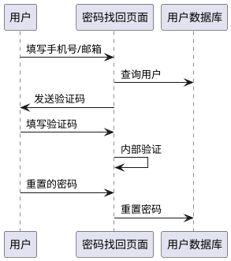

# 引言

在使用用户名密码登录的场景下，一个常见的功能需求就是为用户提供密码找回的能力，使用的方式和方法主流上就是向用户验证过的邮箱或手机发送一个验证码要求用户回填，并在验证成功的基础上允许用户重置密码，如下图所示



这个流程具有高度的抽象性和普适性，因此认证服务器考虑将它作为一种插件化的组件来定义

# 引入依赖

```groovy
dependencies {
    api "com.jdcloud.gardener.camellia:authorization-server-login-plugin-username:${version}"
}
```

可见这个插件是用户名密码登录插件的扩展功能

# 核心接口

## PasswordRetrievePrincipalConverter & PasswordRetrievePrincipalType

```java
/**
 * @author zhanghan30
 * @date 2022/1/10 1:23 下午
 */
@LogTarget("密码找回登录名转换器")
@PasswordRetrievePrincipalType("支持的找回类型")
public interface PasswordRetrievePrincipalConverter {
    /**
     * 将http请求转为登录凭据识别符号
     *
     * @param principalName 请求找回的账户名称，如密码，如邮箱
     * @return 转化的基本登录类型
     */
    PolymorphicPrincipal convertNameToPrincipal(String principalName);
}
```

两个核心接口一个是注解，一个是转换器

`PasswordRetrievePrincipalType`注解向主逻辑注册一个找回类型，如邮件、手机号，这个找回类型是密码找回时需要提交的参数

`PasswordRetrievePrincipalConverter`是实际的登录凭据转换器，它是将用户输入的登录名转为具有实际类型特征的多态登录对象，这个对象可以表达这个名称是个手机号还是个邮箱，还是个别的什么东西

## PasswordRetrieveSecretProcessor

```java
/**
 * @author zhanghan30
 * @date 2022/1/10 12:08 下午
 */
@LogTarget("验证码处理器")
public interface PasswordRetrieveSecretProcessor {

    /**
     * 发送验证码
     *
     * @param principalName 找回的账户名称
     * @param principal     上面方法转换的登录凭据
     * @return 与发送验证码有关的token，这个token用于下面的校验方法
     */
    String sendSecret(String principalName, PolymorphicPrincipal principal);

    /**
     * 验证刚才发送的验证码
     *
     * @param token  验证凭据token
     * @param secret 验证码
     */
    void verifySecret(String token, String secret);
}
```

`PasswordRetrieveSecretProcessor` 负责向用户发验证码。在发之前，主逻辑已经调用`CamelliaUserService.loadByPrincipal`
查询了用户是否存在，因此插件可以放心的向用户发送验证码。发送完成之后返回一个token作为本次验证码的校验凭据，凭据由主流程保持，并作为验证上下文的识别符号来使用，并交给客户端作为验证码的验证凭据之一使用

<font color=yellow>注意: </font> 因为密码找回并不是一个高并发的场景，因此像类似于使用`UUID.randomUuid()`去生成token是可以接受的。
之所以将这个字符串交由插件去处理，还有一种考虑是插件所需的验证码服务可能调用了外部系统，它会返回一个验证用的票据，因此插件需要向主逻辑表达说:
这是我要用的票据，你帮我保存一下

用户填写了验证码后，主逻辑会调用`verifySecret`，将token和验证码交给插件进行验证。 通过后，内部将验证上下文的状态标记为`通过`
，随后接受用户重新设置的密码，并调用`CamelliaUserService.resetPassword`接口去重置密码

## PasswordRetrieveContextService

用于保存密码找回操作的上下文，默认提供了基于redis的实现

```java
public class PasswordRetrieveContext {
    private String token;
    private String principalName;
    private String principalType;
    private RequestState state;
}

/**
 * @author zhanghan30
 * @date 2022/1/10 1:51 下午
 */
public interface PasswordRetrieveContextService {
    /**
     * 存储上下文
     *
     * @param context 上下文
     */
    void save(PasswordRetrieveContext context);

    /**
     * 删除指定的context
     *
     * @param context 上下文
     */
    void remove(PasswordRetrieveContext context);

    /**
     * 从token查找上下文
     *
     * @param token 上下文凭据token
     * @return 上下文
     */
    @Nullable
    PasswordRetrieveContext findByToken(String token);
}
```

非常好理解，生成密码找回的上下文后去保存，然后用token去读取，验证成功后擦除。上下文中包括了token、用户名和取回类型(
用于再次调用一下converter生成principal)，以及找回的状态

* START: 开始找回(等待输入验证码)，然后调save保存上下文
* VERIFIED: 验证通过，等待重置

重置了之后上下文调remove擦除

整个流程中，通过token来读取上下文