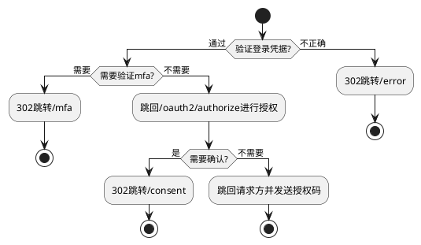

# 概览

```plantuml
@startuml
!include https://raw.githubusercontent.com/plantuml-stdlib/C4-PlantUML/v2.0.1/C4.puml
!include https://raw.githubusercontent.com/plantuml-stdlib/C4-PlantUML/v2.0.1/C4_Context.puml
!include https://raw.githubusercontent.com/plantuml-stdlib/C4-PlantUML/v2.0.1/C4_Container.puml
!include https://raw.githubusercontent.com/plantuml-stdlib/C4-PlantUML/v2.0.1/C4_Component.puml

Person(user, 用户)
Boundary(uac, 认证服务器) {
    System(web, 认证服务器页面, nginx)
    System(ae, 认证服务器后台, oidc)
}
System(redis, redis缓存, redis)
System(uds, 用户数据存储, databse)

Rel(user, web, 登录凭据, https)
Rel(web, ae, 登录凭据, tcp)
Rel(ae, uds, 登录凭据, tcp)
Rel(ae, redis, session/qrcode, tcp)
@enduml
```

* 认证服务器分为网页和后台2部分
* 后台需要对接用户存储和redis缓存
* 缓存存session数据和生成的二维码
* 用户存储则是用来存用户数据

# web网页

用户通过域名和https协议访问认证服务器，其中的标准化路径有

* "/"是登录网页的首页，按后台`/api/options`的返回绘制登录控件，提交登录请求
* "/error"是登录网页的统一报错页，如果用户的登录出现问题，认证服务器统一转向"/error"，并携带以下query参数
    * status: http 状态码
    * phrase: http 状态码对应的解释
    * message: 错误信息
* "/qrcode/landing"是二维码的落地页
* "/mfa"是多因子认证页面，当需要多因子认证时，认证服务器会将页面跳转到此，并携带以下query参数
    * authenticator: 需要使用的认证器
* "/consent"是用户对oauth2进行访问授权的地方，当用户登录成功，需要对访问授权时，由认证服务器后台跳转页面至此，并且携带以下query参数
    * scope: 需要请求的范围，以空格为分割
    * client_id: 请求的应用客户端id
    * state: 防重复提交的一次性状态码

# 主要流程

认证中心后台登录的逻辑是



从流程图中不难看出，前后台通信并不都是使用ajax异步完成，其中有几个关键步骤是通过表单提交的形式完成

# 前后台通信

## 登录页

* 登录页面使用表单提交`POST /login`去发起认证请求，请求的参数结构是:

```http request
POST /login

type=登录请求类型&登录参数1=值&登录参数2=值
```

type是由`/api/options`接口返回的认证类型中的一种，对于不同的登录类型，进一步参考下面提交请求参数

* username类型
    * username = 用户名
    * password = 密码
* qrcode类型(二维码)
    * token: 登录生成的二维码请求token

## mfa

登录通过后，可能进一步需要验证mfa。在mfa页面，主要是通过ajax请求和后台的api接口进行通信，在mfa验证通过后，ajax响应内容中会说明验证通过应该回到那个页面(
一般都是/oauth2/authorize页面)

接口内容为

```http request
POST /api/mfa:validate

{
    "token": "用户填入的mfa验证内容"
}
```

在通过的前提下，获得如下响应:

```json
{
  "targetUrl": "应当跳转的页面地址"
}
```

此时前端页面自己执行http 302跳转

## consent

用户点下授权按钮，使用表单提交`POST /oauth2/authorize`，请求参数为

```http request
POST /oauth2/authorize

client_id=客户端id&scope=范围1&scope=授权范围2&state=页面query上的state值
```

## /qrcode/landing

参考[二维码登录](二维码登录.md)文档

# 附录

有关ajax接口的统一报错格式，参考[统一报错.md](统一报错.md)文档的约定