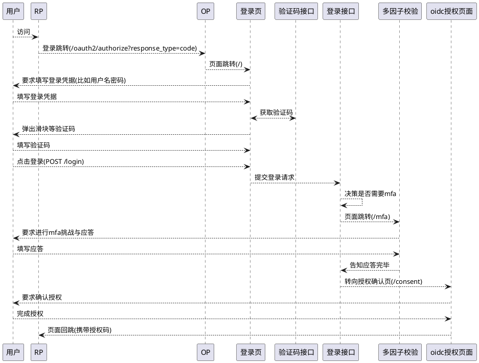
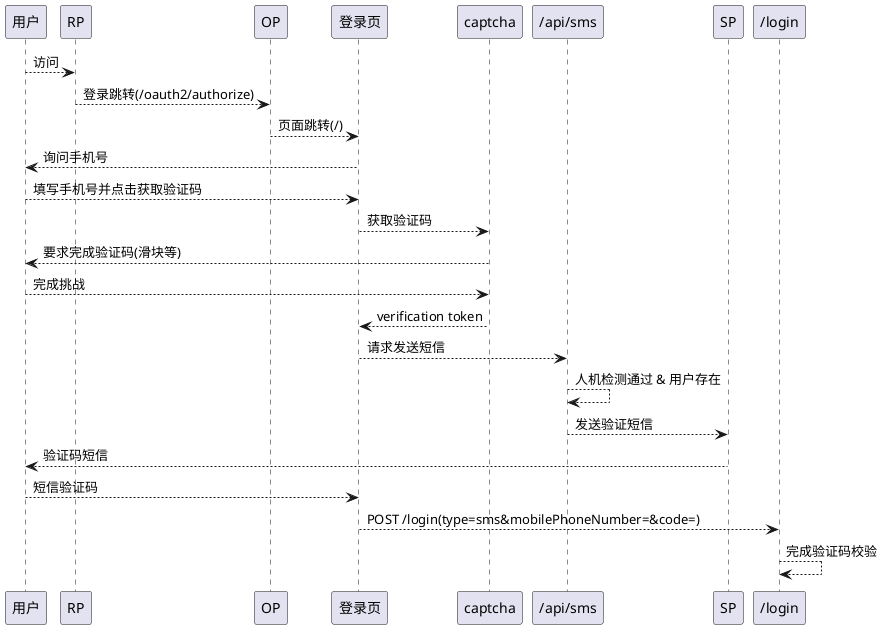
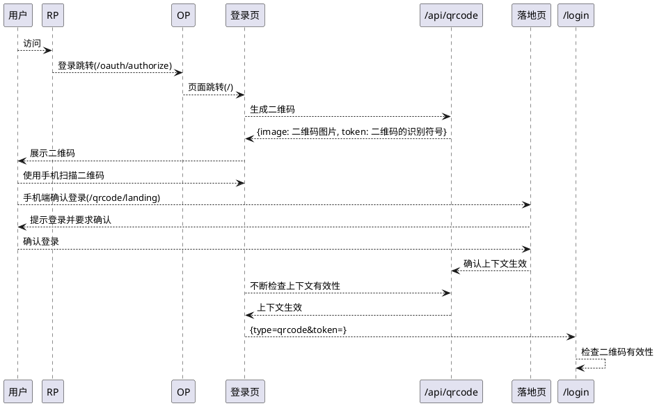
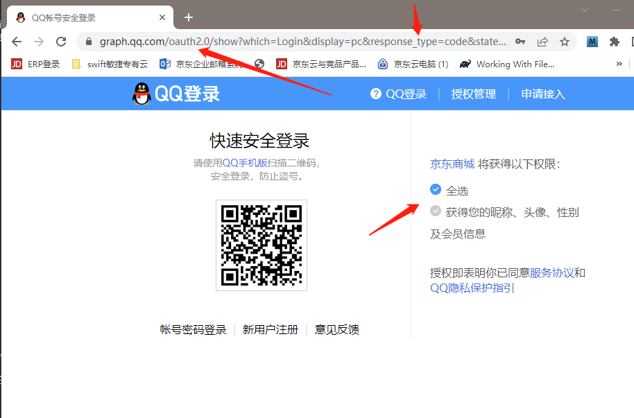
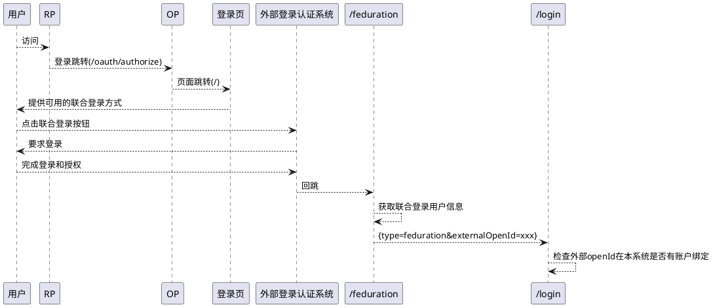
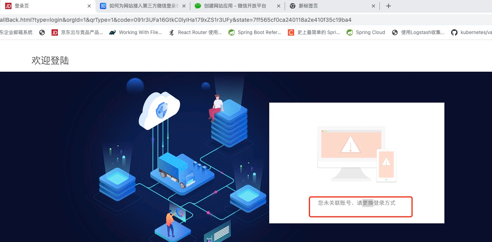
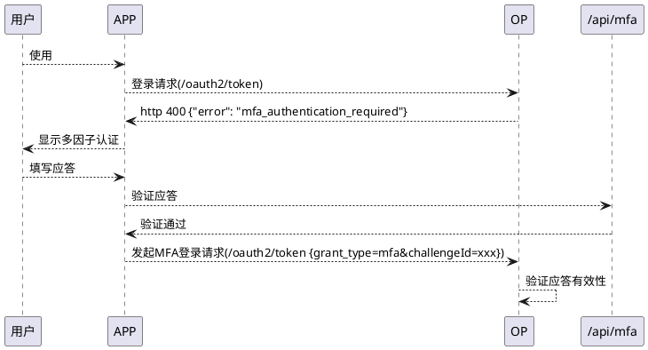

# 引言

本项目的认证服务器组件提供基于oauth2和oidc标准的身份认证能力，其主要的设计目标包括

* 身份认证与登录
    * 可支持多种不同的身份验证方式
    * 可支持多种不同的MFA登录验证方式
* 安全保护
    * 登录失败次数过多自动锁定账号
    * 由登录风险决策是否启动MFA
    * 对用户的登录态进行管理
* 标准化
    * 支持基于OAuth2的openID用户数据交换标准
    * 支持与其它基于OIDC标准的SSO认证系统进行联邦

# 传统认证服务器的设计

```plantuml
@startuml
!include https://raw.githubusercontent.com/plantuml-stdlib/C4-PlantUML/v2.0.1/C4.puml
!include https://raw.githubusercontent.com/plantuml-stdlib/C4-PlantUML/v2.0.1/C4_Context.puml
!include https://raw.githubusercontent.com/plantuml-stdlib/C4-PlantUML/v2.0.1/C4_Container.puml
!include https://raw.githubusercontent.com/plantuml-stdlib/C4-PlantUML/v2.0.1/C4_Component.puml

Person(user, 用户)
System(ae, 认证服务器, oidc)
Boundary(ds, 数据存储系统) {
  System(uds, 用户数据存储, databse)
}
System(session, session)
System(业务页面, 业务页面)
user-->ae: 登录凭据
ae<-->uds: 登录凭据/用户信息
ae-r->session: 用户信息
业务页面-l->session: 用户信息
user-->业务页面: 访问
@enduml
```

最为传统的认证服务器提供的功能大致就是包含用户名密码的登录接口，并使用数据库作为用户存储。用户提交登录凭据，认证中心从数据读取用户信息(
包含密码)
，在内存中比较凭据与存储值是否一致。除此之外，会附加一些类似于图形验证码等图灵测试手段来确保来访者是人而不是程序代码。

在认证成功后，认证服务器将用户的信息保存在session中，当用户访问其它业务页面时，该页面从session中读取用户信息

这样的设计有以下几个弊端

*

要求用户的密码必须是可读的，因为密码的校验是从数据库中读出来后，在认证服务器的内存中将用户的输入值和当时的设定值进行比对，如果读不出密码就无法完成登录凭证的比对。然而随着系统的发展(
或是企业对登录系统统一化的要求)
，认证服务器会要求对接很多用户存储，包括不限于域控服务器以及其它的陈旧登录系统等等。 这些系统很多或者无法提供密码(比如域控)
，或者已经没有手段得知当时的加密算法(比如陈旧的，已经无人维护的系统)
，使得用户输入的密码无法映射为从系统中读取的密码

* 用户的信息时存储在session中的，使得其它系统想要知道用户是否登录时，无法从当前系统的session中读取用户信息，从而不得不自己也编写一套认证页面，导致了用户每登录一个系统就要输入一次用户名密码，如下图所示

```plantuml
@startuml
!include https://raw.githubusercontent.com/plantuml-stdlib/C4-PlantUML/v2.0.1/C4.puml
!include https://raw.githubusercontent.com/plantuml-stdlib/C4-PlantUML/v2.0.1/C4_Context.puml
!include https://raw.githubusercontent.com/plantuml-stdlib/C4-PlantUML/v2.0.1/C4_Container.puml
!include https://raw.githubusercontent.com/plantuml-stdlib/C4-PlantUML/v2.0.1/C4_Component.puml

Person(user, 用户)
Boundary(系统边界1, 系统边界1) {
  System(业务系统1,业务系统1)
  System(session1,session1)
  业务系统1<-->session1: 用户信息存取
}
Boundary(系统边界2, 系统边界2) {
  System(业务系统2,业务系统2)
  System(session2,session2)
  业务系统2<-->session2: 用户信息存取
}
user-->业务系统1: 登录
user-->业务系统2: 登录
@enduml
```

# 进化轨迹: 单点登录

随着企业内业务系统的增多，业务人员在多个系统之间频繁切换的场景也随之增加，这使得每一次切换都需要登录一次显得麻烦无比。于是产生了需要在单一系统中完成认证，其它系统就不需要在重复认证的需求。
应对这样的需求，基于token交换用户信息的sso单点登录系统如雨后春笋般出现。它的主要技术如下图所示

```plantuml
@startuml
!include https://raw.githubusercontent.com/plantuml-stdlib/C4-PlantUML/v2.0.1/C4.puml
!include https://raw.githubusercontent.com/plantuml-stdlib/C4-PlantUML/v2.0.1/C4_Context.puml
!include https://raw.githubusercontent.com/plantuml-stdlib/C4-PlantUML/v2.0.1/C4_Container.puml
!include https://raw.githubusercontent.com/plantuml-stdlib/C4-PlantUML/v2.0.1/C4_Component.puml

Person(user, 用户)
Boundary(sso, 单点登录系统) {
  System(登录认证,登录认证)
  System(token存储,token存储)
  System(用户信息交换接口,用户信息交换接口)
  登录认证<-->token存储: 用户信息存取
  用户信息交换接口<-->token存储: 用户信息存取
}
Boundary(系统边界1, 系统边界1) {
  System(业务系统1,业务系统1)
}
Boundary(系统边界2, 系统边界2) {
  System(业务系统2,业务系统2)
}
user-d->登录认证: 登录
业务系统1<-l->用户信息交换接口: token/用户信息
业务系统2<-d->用户信息交换接口: token/用户信息
@enduml
```

* 当业务系统需要认证用户信息时，它负责将用户引导到单点登录系统
* 用户在单点系统完成登录和认证，单点系统将用户的访问转化为一个叫做token的访问令牌，并将令牌和用户信息存储
* 单点登录系统将令牌告诉业务系统，业务系统后续基于令牌来访问用户信息

这种技术主要解决的就是session共享的难题。业界广泛使用的，基于OAuth2标准的oidc，就使用的这种技术。

# 进化轨迹: 多用户存储的对接和使用

无论是新建的单点登录系统，还是将过去的基于各个业务系统的登录系统迁移为单点登录，都往往会面对将过去零散的，不统一的用户数据存储进行统一的问题。
这些散落在各个业务系统中的用户数据，现在需要统一由单点登录系统进行管理和认证。
面对这样的挑战，单点登录系统有2种解决方案：

## 方案一: 对接多个用户存储

```plantuml
@startuml
!include https://raw.githubusercontent.com/plantuml-stdlib/C4-PlantUML/v2.0.1/C4.puml
!include https://raw.githubusercontent.com/plantuml-stdlib/C4-PlantUML/v2.0.1/C4_Context.puml
!include https://raw.githubusercontent.com/plantuml-stdlib/C4-PlantUML/v2.0.1/C4_Container.puml
!include https://raw.githubusercontent.com/plantuml-stdlib/C4-PlantUML/v2.0.1/C4_Component.puml

Person(user, 用户)
Boundary(ae, 认证服务器, oidc){
  System(adc, ldap认证器, authentication provider)
  System(dbc, jdbc认证器, authentication provider)
}
Boundary(ds, 数据存储系统) {
  System(uds, 用户数据存储, databse)
  System(ad, 用户数据存储, ldap)
}

Rel(user, adc, 登录凭据, https)
Rel(user, dbc, 登录凭据, https)
Rel(dbc, uds, 登录凭据, tcp)
Rel(adc, ad, 登录凭据, tcp)
@enduml
```

如上图所示，认证服务器对接了2个用户存储，一个为ldap，一个为数据库。不妨假设其中ldap是企业刚开始的员工数据库，数据库则是某个业务系统自建的存储。
不难预见，这两个用户存储有显著的区别和问题:

* 数据库可以将用户的密码从表中读出来，但ldap不支持将用户的密码读出，只能将用户的密码传入进行校验，因此用户的登录密码到底在不在认证服务器中校验是不不统一的，有时需要，有时不需要
* 没有人会保证ldap中存储的用户信息和数据库中的是不存在交叉的情况，比如ldap中有一个'张三'，无法保证数据库中没有'张三'
  的存在，这时如果认证服务器收到了张三的登录请求，应当将它传入ldap进行验证，还是从数据库中读取就是个问题。从而导致了什么账号去ldap认证，什么账号去数据库认证会形成较为复杂，分支多样的逻辑。而且这些逻辑都需要在认证服务器内完成，使得认证服务器内的逻辑变得臃肿且难以维护和扩展

# 方案二: 认证服务器与用户存储的拆分

在领域驱动设计的思想下，每一个业务系统都应当闭环自己的功能职责，也就是说，如果认证中心应当去对比用户名和密码，那么它总是应当进行对比，而不是一会这个对比在它内部进行，一会儿这个对比在其它系统中进行。此外，认证服务器应当只对接单独的，唯一的用户信息存储系统，至于用户信息存储系统怎么管理来自多个数据源的用户，由这个系统自行梳理和进行逻辑实现

```plantuml
@startuml
!include https://raw.githubusercontent.com/plantuml-stdlib/C4-PlantUML/v2.0.1/C4.puml
!include https://raw.githubusercontent.com/plantuml-stdlib/C4-PlantUML/v2.0.1/C4_Context.puml
!include https://raw.githubusercontent.com/plantuml-stdlib/C4-PlantUML/v2.0.1/C4_Container.puml
!include https://raw.githubusercontent.com/plantuml-stdlib/C4-PlantUML/v2.0.1/C4_Component.puml

Person(user, 用户)
System(ae, 认证服务器, oidc)
System(ud, 统一用户数据访问接口, identity api)
Boundary(ds, 数据存储系统) {
  System(uds, 用户数据存储, databse)
  System(uad, 域控服务器, ldap)
  System_Ext(lagacy, 陈旧用户存储, 遗留系统)
  System_Ext(others, ..., 遗留系统)
}

Rel(user, ae, 登录凭据, ssl)
Rel(ae, ud, 登录凭据, ssl)
Rel(ud, uds, 数据记录读取, tcp)
Rel(ud, uad, 登录凭据校验, tcp)
Rel(ud, lagacy, 登录凭据校验, ?)
Rel(ud, others, 登录凭据校验, ?)
@enduml
```

上图给出了一个拆分后的用户访问与授权的简要结构图

* 用户向认证服务器提交登录凭据，提交的形式会有多种，包含
    * 以用户名和密码的形式
    * 以手机号和短信验证码的形式
    * 以二维码扫描的形式
    * 以其它生物特征的形式，如人脸，指纹
    * 基于https双向认证的形式，如警员key或其它usb key
* 认证服务器将收到的用户访问请求中，有关用户身份识别的部分统一交给用户数据访问接口去查询，检查用户是否真实存在，并读取用户的账号信息
* 类似短信验证码，二维码这种校验凭证在认证服务器内部产生的，由认证服务器完成校验，而密码等校验凭证不在认证服务器内产生，不由认证服务器进行校验
* 统一接口负责对接底层多种的用户数据源，减轻认证服务器的逻辑压力

这样，认证中心的工作边界就相对清晰

* 提供多种多样的认证登录方式以及登录界面
* 提供对接短信网关，动态令牌并能生成二维码，实现非用户名密码登录权限的校验闭环
* 识别登录风险，必要时启动多因子认证
* 对认证的结果建立统一流程并进行处理

用户存储的工作边界也是清晰的

* 存储和管理用户以及相关的组织、角色、权限数据并提供接口进行查询
* 提供用户名密码的凭据校验接口，并对接其它用户存储，使得用户名密码的校验整体在用户存储内部完成

这样，对用户校验的逻辑表述也是清晰的，即: 校验凭据在哪里产生和存储，就在哪里校验

# OAuth2标准页面流程简述

在认证服务器，用户存储以及其它领域中心拆分后，需要明确认证中心和其它业务中心之间如何进行用户身份信息的读取和交换，在此本项目使用的认证服务器选择使用基于oauth2的标准流程

# 页面登录主逻辑概述

一般的页面登录流程为



上图给出了一个按照OAuth2的授权码(authorization code)模式进行的标准流程，其中RP的含义是"relying party"
，即客户端，也就是用户系统；OP的含义是"oidc provider"
，即认证服务器。其中的关键环节有

* RP需要向OP发起认证请求，使用的流程是"response_type=code"，即授权码。授权码流程是OAuth2唯一支持Web页面跳转的标准化流程，其它授权模式都不是为了浏览器准备的
* OP自己内部会有若干次页面跳转，核心是: 登录页面 -> MFA挑战与应答页面(可选) ->
  授权确认页面，其中授权的确认是OAuth2认证码模式的标准流程，它要求用户确认当前RP对自己信息读取的范围，比如你的家庭住址，你的头像等
*

登录和授权流程完毕后，OP会将一个叫做授权码的东西通过页面回跳的方式交给RP，RP的业务系统通过这个授权码进一步换取用户的访问令牌(
access token)
，这个令牌就是上文说的，现在主流单点登录系统中使用的，用于读取用户信息的token

## 主页面拆解

本文现在将流程中的几个主要页面和相关元素进行拆解，分别是登录页、验证码元素以及多因子认证页

### 登录页

* 登录页是一个业务系统自由定制的页面，常见的有
    * 基于用户名，密码的登录页
    * 基于手机号与短信动态(也称短信验证码)的登录页
    * 基于手机app的二维码扫码登录页

它的诉求是能够基于企业的发展需要进行定制和不停优化

### 验证码元素

验证码一般用于确认访问者是活体而不是计算机程序(参考[captcha](../../captcha.md))，常用的手段有

* 图片验证码后续要求输入的验证码
* 带有文字(物体)然后要求点击的验证码，比如google要求在图片中寻找XXX的那种或者图片中有文字，要求按顺序点击
* 滑块验证码

综上，现代化的验证码都是由一个独立的服务进行承载并提供一系列可对接的前端代码进行对接，而不再是由认证服务器去实现一个简单的图文验证码

### 多因子认证页

当登录页输入的用户凭据被确认后，部分系统将导向一个多因子认证的页面进一步认证用户的身份信息，包括

* 要求使用短信验证码进行验证(要求用户必须输入了手机号)
* 要求使用邮箱激活码的方式进行认证(要求用户必须留了有效的邮箱)
* 要求用户输入otp或其它动态令牌进行验证

多因子验证完成前，不认为用户成功登录

## 非用户名密码的校验凭据登录流程简述

### 基于短信验证码的登录流程



上图展示了基于短信验证码码的标准流程，其中"/login"是登录接口，"captcha"是人机检测服务，即验证码服务，"/api/sms"是短信验证码发送接口

这里的核心逻辑有

*

发送短信前必须检查人机检测结果以及用户的存在性，否则短信发送接口将不受控地给任意手机号发送短信，这导致可能成为短信轰炸平台的"
肉机"

* 短信验证码的生成和校验在认证服务器内完成

对于验证码的生成和校验部分，有些短信验证码服务收取手机号发送验证码，并要求提交手机号和验证码代服务端进行验证；有些则只提供发短信的功能，验证码由认证服务器校验。
对于后者，认证服务器需要自行生成验证码，将验证码和待校验的手机进行绑定后存储在缓存中，待登录认证请求发起后，通过手机号从缓存中读取出验证码进行比对。

### 基于二维码的登录流程



二维码的生成、绘制和验证一般在认证服务器内部完成，"/api/qrcode" 就是指的二维码的管理接口，这部分的核心逻辑是

* 用户登录时，认证服务器告诉二维码管理接口去生成二维码和串连后续流程所需的token(其实就是二维码的识别符号)
* 用户使用手机app扫码登录
* 手机app基于二维码给出的地址跳转到落地页
* 落地页将token对应的二维码设置为有效
* 登录页使用同样的token看到二维码有效后，向登录接口发起登录请求，登录接口检查token的有效性，并基于token从二维码的上下文读取出对应的用户

### 基于外部账号的联合登录流程(<font color=orange>计划内</font>)

在相当多的系统中允许使用微信账号、支付宝账号、微博账号等SNS账号登录系统，在此将其称为联合登录。如下图所示


图中可见，京东支持使用微信，QQ账号登录，当点开这样的登录按钮时，弹出如下图所示的页面



图中可见，QQ使用了OAuth2的同样技术来支持京东作为"RP"
，获取自己的登录信息，在QQ的登录认证完成后，它也会按照流程将页面引导到京东作为RP约定的回跳地址: [https://qq.jd.com/new/qq/callback.action](https://qq.jd.com/new/qq/callback.action)

在此，RP获得了授权码，将用户的信息与用户的登录行为进行绑定，实现用户的联合登录。在此，本项目将使用以下的流程进行实现



联合登录成功的前提是，当前用户已经将外部账号与系统内的一个用户(可以是自动生成的)进行了绑定。
这非常合理，因为大部分联合登录的页面，如果用户并没有实际注册的话，登录完毕后还是要求用户注册当前系统的账号。如果未关联账号，则可能看到下面的一个报错



# OAuth2非Web客户端标登录流程简述

面对现在越来越多的移动端和智能家电应用的开发需求，认证中心势必要求能够支持手机app，智能家用电器等非浏览器的应用进行用户的身份认证，理由有

* 小型智能设备对能耗等都有严格要求，其操作系统也经过了裁剪，无法安装浏览器等标准化的重型应用程序
* 浏览器对本地设备的访问和权限是受控的，仅凭JS脚本无法访问设备的所有接口和硬件

从而，这些设备上或者没有浏览器，或者部分也无需求也无法通过浏览器实现。

对此，认证中心由于选型了OAuth2作为协议标准，因此能够支持非Web客户端进行登录。

## 扩展OAuth2的授权类型

OAuth2的标准制定了授权码、客户端凭据(client_credentials)，用户名密码(password)以及隐式(implicit)
4种标准化流程。同时，标准委员会提及了可以基于业务需要扩展自己所需的授权类型(
grant_type)，并自己定义相关的守全流程。

因此，本项目就按照标准委员会的推荐，扩展了OAuth2的令牌接口(/oauth2/token)中可以授权的类型，使得客户端能够基于已经实现的(
grant_type)来获得访问令牌(access_token)，并将它和网页端的登录认证方式进行了打通，意味着网页端能够支持的用户名密码，短信验证码等方式，在令牌授权接口都能使用，具体地对接和实现细节可参照后续的文档。

## 支持多因子验证



在网页端，MFA多因子验证的流程是由认证服务器通过http跳转完成的。而作为非web端，令牌接口(/oauth2/token)
会在要求用户进行mfa多因子验证时通过返回错误的形式告知客户端当前登录需要进行mfa验证，客户端自行组织mfa的认证页面，并向"
/api/mfa"
发起挑战应答。应答被认证后，APP重新向令牌接口发起登录请求，这次登录请求使用的形式是mfa，并提交mfa对应的挑战id。
OP验证挑战是否真实被应答，并将挑战对应的用户信息进行存取，实现用户的登录