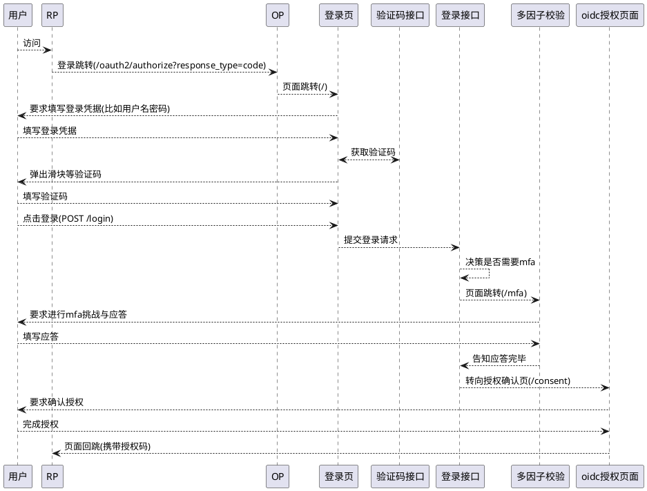
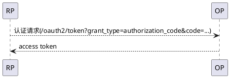
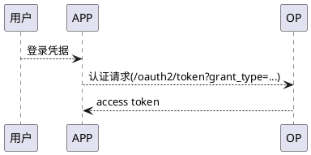
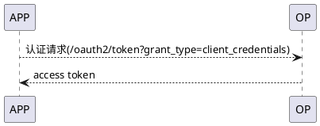
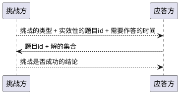
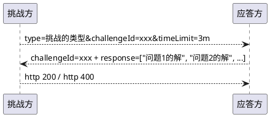

# 简介

本项目主要实现了可定制、可扩展的、基于oauth2和spring
security的认证服务器引擎，并基于这个引擎开发若干与登录验证过程相关的、可定制化、可扩展的组件，目前该引擎已经在国航(面向C端)
、海航(面向B端)落地。
全文主要内容包括

* 讲解oauth2的基本概念
* 讲解如何将多样性的认证过程进行统一抽象
* 讲解如何将多样性的多因子认证过程进行统一抽象

以上内容，是本项目的基础标准以及核心设计思路。

# OAuth2

在阅读本文前，应当具备一定程度的oauth2基础知识，推荐阅读[《理解OAuth 2.0》](https://www.ruanyifeng.com/blog/2014/05/oauth_2_0.html)
，也是本项目遵守的开源标准。

总的来说，OAuth2定义若干认证来访者的流程，并在认证通过后颁发称为"access token"
的访问令牌，第三方应用通过访问令牌可以从服务器上读取来访者的身份信息。来访者在此不仅仅被限制为人，OAuth2同时包含并且也支持应用代码(
或称机器人)的认证。 在概念上，请求身份信息的第三方应用被称为`RP`
，提供第三方信息的OAuth2认证服务器被称为`OP`或`IDP`或`IAM`

## 人的认证过程

OAuth2认证服务器在来访者为人类时使用的认证流程主要有2种

* 来访人员使用OAuth2认证服务器提供的网页(而非第三方应用自己开发的网页)进行认证
* 来访人员使用OAuth2认证服务器许可的，非网页形式的应用程序进行认证

### 网页认证流程



* 用户打开RP的网站，网站发现用户没有登录，于是需要发起用户认证请求
* RP需要向OP发起认证请求，使用的流程是"response_type=code"，即授权码。授权码流程是OAuth2唯一支持Web页面跳转的标准化流程，其它授权模式都不是为了浏览器准备的
* OP自己内部会有若干次页面跳转，核心是: 登录页面 -> MFA挑战与应答页面(可选) ->
  授权确认页面，其中授权的确认是OAuth2认证码模式的标准流程，它要求用户确认当前RP对自己信息读取的范围，比如你的家庭住址，你的头像等
*
登录和授权流程完毕后，OP会将一个叫做授权码的东西通过页面回跳的方式交给RP，RP的业务系统通过这个授权码进一步换取用户的访问令牌(
access token)
，这个令牌就是上文说的用于读取用户信息的token，兑换过程如下所示



网页认证流有2个核心的接口

* RP使用的认证接口"/oauth2/authorize": 这个接口用于告诉认证服务器目前是那个RP正在发起认证请求
* 认证服务器(OP)自己使用的"/login"接口: 这个接口就可以被理解为是用户的登录接口，用于校验用户的登录凭据，比如用户名和密码，或者手机号和验证码，或者是人脸等

从认证服务器的角度触发，用户的个人数据是属于认证服务器的资产。 当第三方取用时，用户必须清晰地了解第三方将要读取自己的什么属性。
对于用户数据访问的范围，往往被定义在授权申请的`scope`参数内，并在授权批准页面要求用户进行批准。

只有在用户批准后，RP才能拿到用于兑换访问令牌的授权码

### 应用程序认证流

当一个用户使用一个应用程序(比如手机app)
输入了登录凭据，需要认证服务器进行认证时，认证服务器就变成了一个纯后台的接口服务。此时它必然就不能再像定义自己的网络跳转流程一样规定应用程序的使用体验。于是应用程序不再调用授权("
/oauth2/authorize")接口再去获取授权码，而是调用访问令牌的获取接口直接使用用户的登录凭据兑换访问令牌



整合网页流程和应用程序流程不难发现，从OAuth2认证服务器的角度出发，最终都是要到"/oauth2/token"
接口来使用一些凭据来换取访问令牌，无非网页认证流的凭据是授权码，而应用认证流则需要直接获取用户的登录凭据兑换

## 客户端的认证流程

大量的应用场景可能都不需要人员的登录来执行操作，比如某个后台启动的定时任务。这时，OAuth2认证服务器天然支持"
client_credentials"的认证方式



因此可见，"/oauth2/token"总的来说使用不同的grant_type来支持不种类访问令牌兑换场景

# 认证流程的抽象

从顶层的角度思考认证的内部逻辑，可以认为其核心逻辑就是校验登录凭据，在校验登录凭据之前和之后，额外需要附加一系列分支逻辑，包括不限于

* 校验前
    * 验证码是否填写正确
* 校验后(相当于已经获得账户信息后)
    * 是否账户早已被锁定(无论临时还是永久)
    * 是否处于风控黑名单
    * 是否异地登录，还需要mfa多因子校验

再深入一点查看登录凭据校验的流程也会发现，登录凭据早已脱出了用户名密码的传统范畴，扩展成了手机+验证码、二维码、人脸、指纹等多种多样的形式。

这些逻辑看似繁复又多样，然而实际上不难用以下的模型来统一描述

```plantuml
@startuml

!include https://s3.cn-south-1.jdcloud-oss.com/c4-plantuml/C4_Container.puml

System(BeforeLoadingUserEvent, BeforeLoadingUserEvent, 基于登录凭据加载用户前) #skyblue
System(UserService, UserService, 用户读取服务) #red
System(UserLoadedEvent, UserLoadedEvent, 用户加载完成事件) #skyblue
System(UserAuthenticationService, UserAuthenticationService, 用户认证服务) #red
System(UserAuthenticatedEvent, UserAuthenticatedEvent, 用户认证完成事件) #skyblue
System(AuthenticationSuccessEvent, AuthenticationSuccessEvent, 认证成功事件) #skyblue

BeforeLoadingUserEvent -r-> UserService
UserService -r-> UserLoadedEvent
UserLoadedEvent -d-> UserAuthenticationService
UserAuthenticationService -d-> UserAuthenticatedEvent
UserAuthenticatedEvent -d-> AuthenticationSuccessEvent
@enduml
```

上图蓝色的部分代表事件，红色的部分代表认证逻辑。

* 当一个用户提交登录凭据后，首先迎来的是用户加载前的事件，这里其实监听器可以执行任意的检查逻辑或在一个全局上下文中设置一些数据用于下面的流程。如若经过检查发现就不应当继续执行认证过程，则可以通过抛出异常来中断后续执行
* 用户服务则基于用户提交的登录凭据(用户名、手机号、邮箱、人脸id、指纹id等)来向后台的用户数据库发起查询请求，其最终目标是找到这个人
* 人找到后发送UserLoadedEvent，这时就可以再执行一些与人有关的逻辑，比如看看是不是风控黑名单中的人
* 觉得这个人没问题，那么认证服务就根据提交的密码，验证码等对用户来访者进行认证
* 认证完成了再通过事件告诉所有监听器第一轮校验完成，于是如果监听器觉得当前用户的登录环境有问题的话(比如异地登录)
  ，则可以抛出一种能够被认证服务器识别为需要进行mfa多因子验证的特殊异常，触发认证服务器的多因子检验流程
* 如果所有检查流程都通过了，则自然要发送认证成功事件代表当前访问者登录成功

于是，引擎的核心功能初步成型。在面向不同的场景时，通过扩展`UserService`、`UserAuthenticationService`
完成特定业务需求的开发。多种事件也为监听器判断是否应当继续流程提供了合适的切入点。

# 多因子认证流程抽象

这里需要明确，多因子认证指的是登录过程中的额外校验，而不是泛指任何业务流程中的多因子认证(
比如下单支付时需要刷脸或者再次输入短信验证码这种不在本文的讨论范围之内)

纵览现在的多因子认证的手段，虽然花样繁多(包含手机验证码，动态令牌等等)，但都不难用一个早已在业界闻名的模型抽象: 挑战和应答(
Challenge & Response)

挑战与应答以一种古老但很好理解的验证方式，挑战者发起一个或多个问题，并为这个挑战分配一个具有时效性的id，并假定应答方早已知道这个答案(
或将答案通过可信地渠道送到应答方手里)
，应答方负责回到一系列问题，挑战方则负责验证一系列问题的结果，并且给出挑战是否成功的结论。这种做法包括不限于

* 要求回答密保问题(假定应答方知道正确的答案)
* 要求填写短信验证码或邮箱验证码(通过安全可信的手段送达)
* 要求家长代替未成年回答一系列认为未成年不能回答的问题，比如某个定积分方程的解 + 历史上伟人说过的话 + 你私房钱藏匿的位置

最终，这一系列问题的答案由应答方通过接口提交给验证方，验证发针对题目的id以及回答决定挑战是否成功。在此，看似花样繁多的验证过程都可以用以下流程抽象



从程序代码的角度出发，上图转为



挑战的类型就等价于挑战的流程合法，比如type=sms代表短信验证码, type=google为使用google认证器等。基于这些type，应用端展示给用户不同的验证流程体验。

# 总结

通过本文的介绍，开发人员应当大体理解了oauth2的标准认证流程。并理解了有关认证过程，多因子认证流程的高度统一抽象。
理解这些标准流程并建立抽象的业务模型，有利于开发人员理解项目接下来有关开发流程和详细设计内容的内容。

# 继续阅读

[登录请求处理的java接口和功能作用](登录请求处理的java接口和功能作用.md)