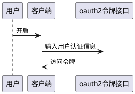
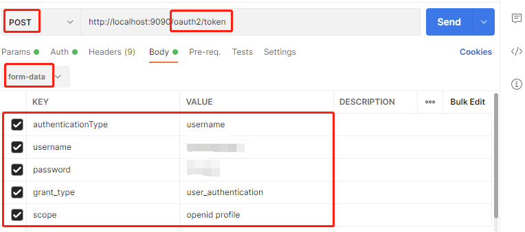

# 引言

支持第三方应用程序以客户端的形式进行接入

# 基础知识准备

第三方应用的开发人员需要具备oauth2与oidc的基础知识，本文不负责讲解

# 主要业务流程

## 向授权接口发起申请获得访问令牌



请求的发送格式如下图所示



其中

* 使用form表单提交的方式发送请求
* grant_type固定为'user_authentication'
* authenticationType为需要使用的认证方式，示例中为"username"，即用户名密码登录
* 在用户名密码登录的方式下，提交"username"和"password"参数
* scope至少包含openid，一般应用程序接入时也会被分配profile访问权限
* 请求方可额外提交"token_ttl"参数用于指示本次认证成功后的访问令牌有效期，该有效期不超过分配给接入应用的最大有效期

此外，需要使用Http Basic认证的方式提交client id和client secret

一切顺利的话，应用程序会得到形如下面的相应

```json
{
  "access_token": "eyJraWQiOiI4ODE4YWM4OS02ODVlLTRkZDctYjkw...",
  "refresh_token": "JCyckaVpiQDYQedrrC7NxP72kphfF7fxZCcazZPHG...",
  "scope": "openid profile",
  "id_token": "eyJraWQiOiI4ODE...",
  "token_type": "Bearer",
  "expires_in": 172799
}
```

* access_token是访问令牌
* expires_in: 令牌的过期时间，以秒为单位
* refresh_token: 是访问令牌的刷新用令牌
* token_type: 授权令牌在读取用户信息时，在`Authorization`头中的类型
* id_token: 基于oidc标准，交给客户端的简易版用户信息，可以通过`oauth2/introspect`去解码后，由客户端验证信息的真实性，以防遭受中间人攻击

## 使用访问令牌获得用户的数据

应用程序不再使用client id和secret，而是使用访问令牌来进一步获取用户信息

* 使用http get方法访问'/userinfo'
* 在`Authorization`头中，按照访问令牌响应内的token_type字段提交访问令牌，如上例为`Bearer`
  ，则头信息为`Authorization Bearer xxx`
* 获得类似如下的响应

```json
{
  "sub": "root",
  "email": "root@some.com"
}
```

其中sub是客户端关心的，用户的识别符号，email是邮箱


