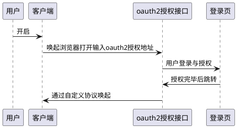

# 引言

支持第三方应用程序以浏览器SSO形式进行接入

# 基础知识准备

第三方应用的开发人员需要具备oauth2与oidc的基础知识，并清楚如何向windows操作系统注册自定义协议的处理程序，本文不负责讲解

# 主要业务流程

## 向授权接口发起申请并获得授权码



* 在客户端打开的时候`应当`判断当前启动是由浏览器的url跳转还是全新启动。对于全新启动，跳转到线上的oauth2认证请求地址
* 对于在线web应用，可应当是在用户进入应用时判断是否登录，如果没有，则应该跳向oauth2的认证请求地址
* 发送的http请求`必须`符合下面的形式

```http request
GET /oauth2/authorize?response_type=code&client_id={接入应用程序使用的id}
&redirect_uri={应用程序的回跳地址}&scope=openid%20profile
```

其中

* client_id由我方负责分配
* 回跳地址由应用程序决策，支持配置自定义协议头，例如`your-application://uri`。有关如何协同windows操作系统实现自定义url对应用程序的唤起，不在本文的讲解范围内，请开发人员阅读相关文档或查询搜索引擎
* response_type必须为`code`，暂不接受其它形式的认证授权类型
* scope至少包含openid，一般应用程序接入时也会被分配profile访问权限

接入完毕后，浏览器会跳转到登录界面由用户登录和确认授权，确认完毕后，我方认证服务器会按照接入应用程序约定的回跳url将授权码传递给应用程序，例如

```http request
302 Reidrect
Location: your-application://url?code={本次登录的授权码}
```

对于web应用，浏览器会跳转到回调地址，对于其它应用，浏览器会启动应用程序

## 使用授权码获取访问令牌

应用程序获得授权码后，向认证服务器的`/oauth2/token`请求令牌授权，发送的请求格式`必须`符合以下格式

* 使用http post方法
* 使用http basic方式进行client_id和client_secret的认证
* 使用form表单提交的方式提交以下参数
    * grant_type: authorization_code
    * redirect_uri: 与发起认证请求时保持一致
    * scope: 与发起申请时保持一致，如果申请时发起多个scope，在此需要发送多个scope参数，如scope=openid&scope=profile
    * code: 得到的授权码

一切顺利的话，应用程序会得到形如下面的相应

```json
 {
  "access_token": "eyJmnsV9umNygAulqEQg025w0fY3xVFzkNrQ",
  "refresh_token": "ACwOnTfKpb6MFPxay7EDACWtclRIyXL-D7WOADteZ25X2eA327pYnUQ",
  "scope": "openid profile",
  "id_token": "E0rQ1_Sl6Q",
  "token_type": "Bearer",
  "expires_in": 172800
}
```

* access_token是访问令牌
* expires_in: 令牌的过期时间，以秒为单位
* refresh_token: 是访问令牌的刷新用令牌
* token_type: 授权令牌在读取用户信息时，在`Authorization`头中的类型
* id_token: 基于oidc标准，交给客户端的简易版用户信息，可以通过`oauth2/introspect`去解码后，由客户端验证信息的真实性，以防遭受中间人攻击

## 使用访问令牌获得用户的数据

应用程序不再使用client id和secret，而是使用访问令牌来进一步获取用户信息

* 使用http get方法访问'/userinfo'
* 在`Authorization`头中，按照访问令牌响应内的token_type字段提交访问令牌，如上例为`Bearer`，则头信息为`Authorization Bearer xxx`
* 获得类似如下的响应

```json
{
  "sub": "root",
  "email": "root@some.com"
}
```

其中sub是客户端关心的，用户的识别符号，email是邮箱

# 图例

## 认证申请


例子中，使用的client_id为test，要求的scope为openid和profile，回调地址为http://127.0.0.1:8080/authorized

## 认证通过后回调


例子中，用户登录成功并确认授权后回调http://127.0.0.1:8080/authorized

## 使用授权码获取登录令牌


上图使用了form表单的形式提交了授权码以及其它参数，并使用Basic Auth提交了用户名的密码

## 使用访问令牌获得用户信息


上图使用访问令牌获取了用户信息

# 唤起应用的特殊性

在回调的url为一个自定义应用的url时(即非http协议)，页面是不会发生跳转的，也就是可能会

* 留在授权页面
* 留在mfa的认证页面

等位置，这时开发人员不要被假象蒙蔽，以为系统出现问题。

面对这样的开发场景

始终打开浏览器的开发者模式，选择'网络'，最终以浏览器是否收到了服务端的302重定向结果为准，如下图所示


