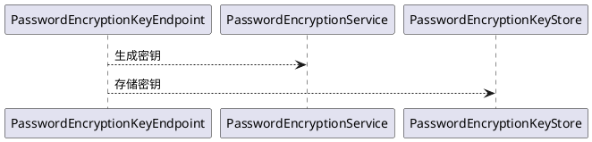
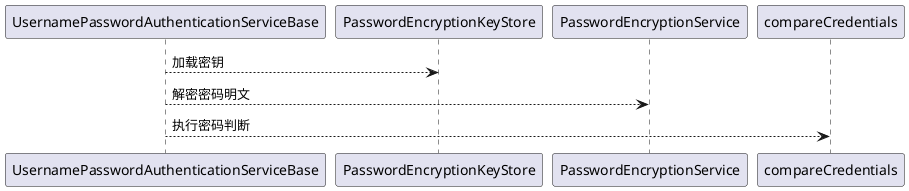
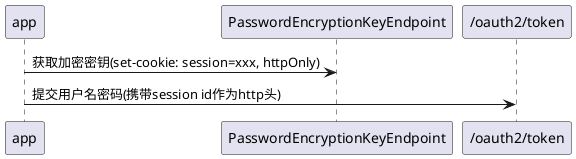

# 简介

用户名密码认证是传统到不能再传统的登录认证方式，其常见流程如下

```plantuml
用户 --> 登录页
登录页 <--> 验证码接口: 获取验证码
登录页 <--> 动态密钥接口: 请求用户密码加密的动态密钥
用户 --> 登录页: 输入用户名 + 密码 + 验证码
登录页 --> 登录接口: 用户名 + 密码(执行加密) + 验证码
登录接口 --> 欢迎页: 登录成功后重定向
```

其中动态密钥是为了用户的密码提交时前端使用该密钥执行给定的加密算法

# UsernamePasswordAuthenticationServiceBase

在认证引擎中的，用于支持用户名密码类型登录的组件为`UsernamePasswordAuthenticationServiceBase`，其位于"
authorization-server-authentication-engine-username"中

```java

@AuthenticationType("username")
public abstract class UsernamePasswordAuthenticationServiceBase implements UserAuthenticationService {
    private final UsernameResolver resolver;
    private final Validator validator;

    @Override
    public UserAuthenticationRequestToken convert(HttpServletRequest httpServletRequest) throws AuthenticationException {
        UsernamePasswordParameter parameter = new UsernamePasswordParameter(
                httpServletRequest
        );
        Set<ConstraintViolation<Object>> violations = validator.validate(parameter);
        if (!CollectionUtils.isEmpty(violations)) {
            throw new BadAuthenticationRequestParameterException(violations);
        }
        return new UserAuthenticationRequestToken(
                resolver.resolve(parameter.getUsername(), parameter.getPrincipalType()),
                //明确使用密码类型的凭据，要求走authenticate方法
                new PasswordCredential(parameter.getPassword())
        );
    }

    /**
     * 进行密码之间的比较
     *
     * @param authenticationRequest 认证请求
     * @param user                  认证用户
     * @throws AuthenticationException 认证有问题
     */
    @Override
    public void authenticate(UserAuthenticationRequestToken authenticationRequest, User user) throws AuthenticationException {
        if (!compareCredentials(authenticationRequest.getCredentials(), user.getCredentials())) {
            throw new BadCredentialsException(user.getId());
        }
    }

    /**
     * 比较密码是不是一样
     *
     * @param request   请求中的密码
     * @param authority 用户存储的密码
     * @return 如果用户读取服务完成了认证，这个方法是可以直接返回true
     */
    protected abstract boolean compareCredentials(BasicCredential request, BasicCredential authority);
}
```

它是一个抽象类，要求使用者根据实际场景实现"compareCredentials"方法

## UsernamePasswordParameter

```java
public class UsernamePasswordParameter extends AbstractAuthenticationRequestParameter {
    @NotBlank
    private final String username;
    @NotBlank
    private final String password;
    /**
     * 登录名类型
     */
    @Nullable
    private final String principalType;

    /**
     * 验证码(滑块什么得)
     */
    @Nullable
    private final String captchaToken;
}
```

用户名密码登录关注的参数包含了

* username: 用户名
* password: 密码
* principalType: 登录名称的类型
* captchaToken: 验证码后其它验证码模块的校验token

<font color=green>提示</font>: 当用户提交了自己的登录名(可能是用户名，可能是个手机号)时，认证服务如何和后台的用户数据库进行交互是个问题

* 开发工程师接收到的只是一个字符串，需要知道这个字符串到底要查询用户数据的什么字段，此时"principalType"
  就可以帮助开发工程师得知当前登录名是什么类型
* 当然，引擎提供了`UsernameResolver`作为没有显示提供"principalType"参数时的选择，开发工程师可以在此通过规则匹配登录名的类型

## UsernameResolver

```java
public interface UsernameResolver {
    /**
     * 执行登录名转换
     *
     * @param username      输入的用户名
     * @param principalType 登录名类型
     * @return 转换好的
     * @throws AuthenticationException 如果觉得无法执行转换，抛出异常中断认证过程
     */
    BasicPrincipal resolve(String username, @Nullable String principalType)
            throws AuthenticationException;
}
```

当代的登录系统一般使用多种形式的用户名，比如手机号、邮箱等等。为了能够精确地告诉下游`UserService`
如何和用户数据库进行用户检索，认证引擎通过java类型来表示不同种类的登录名。
因此，用户名密码登录组件额外需要`UsernameResolver`，基于登录请求提交的用户名的格式以及一个可选的，辅助分析的`principalType`
类型参数来返回一个确定类型的登录名

比方说

```java
public class EmailUsernameResolver implements UsernameResolver {
    @Override
    public BasicPrincipal resolve(String username, @Nullable String principalType)
            throws AuthenticationException {
        if (username.contains("@")) {
            return new EMailPrincipal(username);
        } else {
            return new UsernamePrincipal(username);
        }
    }
} 
```

其中比较简单粗暴的查看用户名是否包含一些email的特征。如果包含则认为是email类型的登录名，否则就是传统的用户名类型的登录名

## PasswordCredential

既然是用户名密码验证，则登录凭据的类型自然是密码类型

## compareCredentials

最后，密码是否正确的比较交给了"compareCredentials"
执行，它对比请求中的密码和从用户数据库中读取出来的密码，如果一致则返回`true`

<font color=green>提示</font>:
有时底层对接的用户数据库要求提交密码才能检索用户，且返回的用户数据中并没有密码。面对这种场景，实际上的认证过程已经由`UserService`
的"authenticate"
方法执行，因此"compareCredentials"可以直接返回`true`

# 加入验证码

用户名密码的登录方式中一般都会有验证码参与其中，其或者是认证服务器自己产生后保存在session内(比如大量使用的图形验证码)
，或者需要对接一些专门的验证码服务(比如滑块，选择，成语等等)。 当用户进行自己的信息校验前应当首先检查验证码是否正确以防机器人通过暴力破解等方式展开安全攻击。

面对这样的场景，后台的实现路径是可如下所示

## 使用内置的参数

`UsernamePasswordParameter`中提供了"captchaToken"
属性作为验证码，并且提供了`UsernamePasswordAuthenticationParameterPostProcessor`
来对已经获取到的用户名密码认证参数进行处理

```java

@Component
public class CaptchaTokenUsernamePasswordAuthenticationParameterPostProcessor implements UsernamePasswordAuthenticationParameterPostProcessor {
    @Override
    public void afterParameterValidated(UsernamePasswordAuthenticationParameter parameter) throws AuthenticationException {
        String captchaToken = parameter.getCaptchaToken();
        //执行验证逻辑
        //完事后执行基类的逻辑
    }
}
```

## 使用自定义属性

当内置的属性不满足要求或者需要扩展时，可以如下做

```java

@Component
public class CaptchaUsernamePasswordAuthenticationService extends UsernamePasswordAuthenticationServiceBase {
    @Override
    public UserAuthenticationRequestToken convert(HttpServletRequest httpServletRequest) throws AuthenticationException {
        String captchaToken = httpServletRequest.getParameter("验证码");
        //执行验证逻辑
        //完事后执行基类的逻辑
        return super.convert(httpServletRequest);
    }
}
```

也就是通过"httpServletRequest"自己愿意怎么获取就怎么获取

# 密码安全传输

大部分场景下，要求前端向后台提交的密码不能使用明文传输，需要执行加密算法

## 独立的组件包

密码安全传输的实现依赖于"authorization-server-authentication-engine-username-security-engine"
组件，它提供了密码加密会话密钥的接口和基本功能，并需要进一步组合"
authorization-server-authentication-engine-username-encryptor-X"和"
authorization-server-authentication-engine-username-key-store-X"一起使用

目前主要提供的是des的加密算法和redis的密钥存储

## PasswordEncryptionKeyEndpoint

该接口为密码加密提供对称会话密钥，默认情况下，其监听的地址为"/api/authentication/username/key"

## PasswordEncryptionService

接口返回的密钥是由`PasswordEncryptionService`产生并提供

```java
public interface PasswordEncryptionService {
    /**
     * 生成一个动态的对称加密秘钥
     *
     * @return 加密key
     * @throws Exception 生成过程中遇到了问题
     */
    String generateKey() throws Exception;

    /**
     * 执行解密
     *
     * @param key key
     * @return 解密结果
     * @throws Exception 加密过程中的问题
     */
    String decrypt(String key, String password) throws Exception;
}
```

该接口有2个方法，一个产生加密密钥，一个则负责解密

## PasswordEncryptionKeyStore

由`PasswordEncryptionService`生成的密钥由`PasswordEncryptionKeyStore`负责存储

```java
public interface PasswordEncryptionKeyStore {
    /**
     * 存储密钥
     * @param id 密钥id
     * @param key 密钥
     * @param ttl 存储周期
     */
    void save(String id, String key, Duration ttl);

    /**
     * 加载密钥
     * @param id 密钥id
     * @return 密钥，如果已经过期，则返回null
     */
    @Nullable
    String load(String id);

    /**
     * 获取还剩下的时间
     *
     * @param id key id
     * @return 剩余时间(以秒为单位)，为空就是已经过期了
     */
    @Nullable
    Long getTtl(String id);
}
```

默认的实现使用redis缓存

## 生成并存储密钥



## 认证过程中解密



## 密钥id

目前的实现中，使用<font color=red>session id</font>作为加密密钥的id使用。对此，当应用app，如手机app，想要使用加密的密码进行登录时，必须自己保持和服务端的会话，即



# 密码找回

密码找回是作为用户名密码登录方式的必备组合。大量用户在不常使用的系统登录时都面临着忘记密码的窘境。 较为通用的密码找回步骤是

* 提供一个邮箱或者手机号或干脆就是用户名
* 后台基于这个输入找到对应的用户，发送一个验证码(手机短信、邮箱验证码等)，或者要求用户点击一个密码重置连接，或者要求用户编辑短信发送到指定号码等，总之就是完成一个应答和挑战
* 要求当前找回密码的人完成操作后输入新的密码

这是一种显而易见的挑战-应答模型

## 所在jar包

"authorization-server-authentication-engine-username-password-recovery"，如果不需要密码找回，则不需要加载这个包

## 发起挑战

认证服务内置了一个密码找回的接口，找回人通过"POST /api/me/password:recovery"触发挑战

### RecoverPasswordRequest

```java
public class RecoverPasswordRequest {
    /**
     * 找回的凭据名称
     * <p>
     * 如邮箱、手机号等
     * <p>
     * 密码保护这种东西现在没人用了
     */
    @NotBlank
    private String username;
    /**
     * 找回的凭据类型，如邮箱、手机号等
     * <p>
     * 提交的类型必须在后台有个转换器与之对应
     */
    @Nullable
    private String principalType;
    /**
     * 给前端的一个提示，用的什么玩意验证，比如邮箱，还是短信
     */
    private String authenticator;
    /**
     * 验证码(滑块什么的)
     */
    @Nullable
    private String captchaToken;
}
```

以上类型是发起挑战者输入的用户名以及可选的用户类型。通过上文的阅读不难发现，这个参数显然准备交给`UsernameResolver`
来转化成`UserService`可用的登录名。

由于是密码找回过程，因此`UserService`在此必然使用"load"方法来读取用户信息。因此，如果对接的用户存储在不提交密码进行验证的情况无法读取用户信息的话就需要仔细考虑一下怎么实现密码找回功能了


请自行将上图的对白替换为: "我要重置密码" 和 "那你需要输入密码"

### PasswordRecoveryService

```java
public interface PasswordRecoveryService extends ChallengeResponseService<ChallengeRequest, Challenge> {
    /**
     * 执行密码重置
     *
     * @param challengeId 应答成功的挑战id
     * @param password    新密码
     */
    @ValidateChallenge
    @ValidateChallengeEnvironment
    void resetPassword(@ChallengeId String challengeId, String password);
}
```

密码找回服务类是`ChallengeResponseService`，并额外要求实现"resetPassword"的功能。

"POST /api/me/password:recovery"接口地址使用这个接口发起一个找回密码的挑战，挑战可以是短信验证码，可以是邮箱验证码等等。具体怎么实现取决于现场要求的逻辑。

该接口的响应格式为

```java
public class PasswordRecoveryChallengeResponse {
    /**
     * 挑战id
     */
    private String challengeId;
    /**
     * 给前端的一个提示，用的什么玩意验证，比如邮箱，还是短信
     */
    private String authenticator;
    /**
     * 冷却时间
     * <p>
     * 一般来说只有短信验证码有用
     * <p>
     * 0 = 没有cd
     */
    private long cooldown;
    /**
     * 其它所需的额外参数
     */
    private Map<String, String> parameters;
}

```

其中:

* "cooldown"是指多长时间只能不能再次发送挑战

## 重置密码

"PUT /api/me/password"接口来重置密码，接口参数格式如下

```java
public class ResetPasswordRequest {
    /**
     * 密码找回时给定的token
     */
    @NotBlank
    private String challengeId;
    /**
     * 验证码
     */
    @NotBlank
    private String response;
    /**
     * 新的密码
     * <p>
     * 为什么没有密码校验
     * <p>
     * 因为调接口的程序需要把同样的字符串传2次吗？
     * <p>
     * 校验密码是否相同再提交是前端的责任
     */
    @Password
    private String password;
}
```

此外，为了确保重置的密码符合下游用户数据库规定的密码复杂度，开发人员额外需要实现`AbstractPasswordValidator`来校验密码的复杂度

## <font color=red>规避轰炸</font>

当能够发送短信验证码/邮箱验证码时，为了防止恶意用户将系统的接口作为轰炸平台使用，可有以下具体措施

* 要求发送前首先完成滑块等验证码
* 按照下面的例子编写一个轰炸防护层

```java

@Component
public class PasswordRecoveryEndpointAntiBombardmentLayer
        extends EndpointHandlerMethodBeforeAdviceAdapter
        implements PasswordRecoveryEndpointSkeleton {
    @Override
    public PasswordRecoveryChallengeResponse startRecovery(
            HttpServletRequest httpServletRequest,
            @Valid RecoverPasswordRequest request
    ) {
        request.getCaptchaToken();
        //执行逻辑检查验证码是否通过，没有通过则抛出访问异常
        //throw BadRequestException("");
        return null;
    }
}
```

其中`EndpointHandlerMethodBeforeAdviceAdapter`是"api-advice-engine"
的组件，在认证引擎中已经默认引入。这样，如果发送前没有完成验证码则根本就不会触发挑战发送逻辑从而规避了接口称为短信轰炸平台的可能

## 基于动态令牌等验证码逻辑的密码找回

基于动态令牌的密码找回其实找回服务就不需要发送验证码到指定的手机或者邮箱，而是直接要求用户在给定挑战id后填写动态令牌，由后台直接校验令牌的结果。

同理应用于密保问题(当前已经很少出现)，前端获得挑战id后直接弹出预置的密保问题，用户直接填写答案后校验

## 基于重置链接和发送短信等非验证码逻辑的

* 对于重置链接，可以在链接的"query string"直接拼接好挑战id和随机数，随机数就是挑战的结果并展示密码重置页面，直接将密码重置(
  需要用户确保链接不被人复制或拦截)
* 对于要求用户编辑短信，可以在获取挑战id后，使用任意应答数字来向后台的密码重置接口发起请求，后台更主要的是验证挑战是否被短信渠道安全调用并置为完成，而不是关注重置接口发起的应答

## 找回方法协商

找回密码的请求和响应中都包含了"authenticator"属性，该属性的作用是

* 前端可以显式的指明要使用的找回方法，比如使用邮箱找回"authenticator='email'"，则发送邮箱验证码，或者"
  authenticator='reset-link'"，则发送重置链接等
*
前端也可以不显式的指明要使用的找回方法，这时后端可以自由决策，比如当前用户没有手机号，但由邮箱，则自动发送邮箱验证码而不是短信，此时回给前端的是"
authenticator='email'"

具体怎么发送找回信息，可以在项目现场使用以上方法进行开发

# 总结

本文讲解了预置的用户名密码认证服务，并说明了如何分析用户名的格式以返回正确的登录名类型。此外，给出了一个如何与验证码进行结合的示例。
最后，文中讲解了如何配合挑战应答机制实现重置密码，并且说明了该项功能如何规避被短信轰炸平台利用