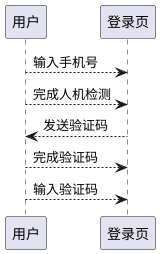

# 简介

短信验证码登录是现在流行的一种快捷登录模式，其主要流程如下所示



# 人及检测

"authorization-server-authentication-engine-sms"是预置的短信验证码认证服务。 首先请求端需要"POST
/api/authentication/sms"(默认情况下)
来发送一个验证码。发送之前一般会要求用户完成人机检测(如滑块)的操作，并在后台验证操作是否完成。

```java
public class SendSmsAuthenticationCodeRequest implements SecurityTraits.TuringTraits.CaptchaToken {
    /**
     * 手机号
     */
    @NotBlank
    private String mobilePhoneNumber;

    /**
     * 验证码(滑块什么的)
     */
    @Nullable
    private String captchaToken;
}
```

从上面的代可见，发送验证码的请求中带有了"captchaToken"作为人机检测的token使用，从而这部分预检查逻辑的实现可如下所示:

```java
public class SmsAuthenticationCodeEndpointPreChecker
        extends EndpointHandlerMethodBeforeAdviceAdapter
        implements SmsAuthenticationCodeEndpointSkeleton {
    @Override
    public SendSmsAuthenticationCodeResponse sendCode(
            HttpServletRequest httpServletRequest,
            @Valid SendSmsAuthenticationCodeRequest request
    ) {
        request.getCaptchaToken();
        //严查验证码是否完毕
        //否则 throw new BadRequestException("");
        return null;
    }
}
```

这一步检查是很有必要的，能够有效防止短信接口作为轰炸平台使用

# 发送验证码

短信验证码属于挑战应答的范畴，因此 接口调用`SmsAuthenticationCodeChallengeResponseService`
来发送。引擎内置了一个写完了大部分逻辑的基类`SmsAuthenticationCodeChallengeResponseServiceBase`，开发人员需要实现这个类。

```java
public abstract class SmsAuthenticationCodeChallengeResponseServiceBase
        implements SmsAuthenticationCodeChallengeResponseService {
    private final SmsAuthenticationCodeEncoder smsAuthenticationCodeEncoder;
    private final SmsAuthenticationCodeStore smsAuthenticationCodeStore;
    private final SmsAuthenticationCodeClient smsAuthenticationCodeClient;
    private final ClientGroupProvider clientGroupProvider;

    /**
     * 生成验证码 - 子类有需要的话重写这个方法
     *
     * @param request 生成请求
     * @return 验证码
     */
    protected String generateCode(SmsAuthenticationCodeChallengeRequest request) {
        return String.format("%06d", new SecureRandom().nextInt(999999 + 1));
    }

    @Nullable
    @Override
    public Challenge sendChallenge(SmsAuthenticationCodeChallengeRequest request) {
        //经典6位验证码
        String code = generateCode(request);
        doSendChallenge(request, code);
        //保存验证码
        smsAuthenticationCodeStore.saveCode(
                request.getClientGroup(),
                request.getMobilePhoneNumber(),
                smsAuthenticationCodeEncoder.encode(
                        request.getClientGroup(),
                        code, SmsAuthenticationPredefinedScenario.LOGIN_AUTHENTICATION
                ),
                SmsAuthenticationPredefinedScenario.LOGIN_AUTHENTICATION,
                Duration.ofSeconds(getTtl())
        );
        return new Challenge(
                request.getMobilePhoneNumber(),
                WellKnownChallengeType.SMS,
                Date.from(Instant.now().plus(Duration.ofSeconds(getTtl()))),
                null
        );
    }

    /**
     * 把生成的验证码发出去
     *
     * @param code 验证码
     */
    protected void doSendChallenge(SmsAuthenticationCodeChallengeRequest request, String code) {
        smsAuthenticationCodeClient.sendCode(request.getHeaders(), request.getClientGroup(),
                request.getMobilePhoneNumber(), code, SmsAuthenticationPredefinedScenario.LOGIN_AUTHENTICATION);
    }

    /**
     * 验证码的有效期和重新发送时间
     * <p>
     * 留给子类用的，谁知道项目现场要多长时间有效
     *
     * @return 时间(秒)
     */
    protected abstract long getTtl();

    @Override
    public boolean validateResponse(String id, String response) throws InvalidChallengeException {
        String clientGroup = clientGroupProvider.getClientGroup(getRegisteredClientFromSecurityContext());
        String code = smsAuthenticationCodeStore.getCode(clientGroup, id,
                SmsAuthenticationPredefinedScenario.LOGIN_AUTHENTICATION);
        return Objects.equals(code, smsAuthenticationCodeEncoder.encode(clientGroup, response,
                SmsAuthenticationPredefinedScenario.LOGIN_AUTHENTICATION));
    }

    @Override
    public void closeChallenge(String id) {
        String clientGroup = clientGroupProvider.getClientGroup(getRegisteredClientFromSecurityContext());
        smsAuthenticationCodeStore.removeCode(clientGroup, id,
                SmsAuthenticationPredefinedScenario.LOGIN_AUTHENTICATION);
    }

    private RegisteredClient getRegisteredClientFromSecurityContext() {
        //从登录接口获取安全上下文
        Authentication authentication = SecurityContextHolder.getContext().getAuthentication();
        if (authentication instanceof OAuth2ClientAuthenticationToken) {
            return ((OAuth2ClientAuthenticationToken) authentication).getRegisteredClient();
        } else {
            return null;
        }
    }
}
```

### generateCode

这个方法实现了验证码的生成，如果现场需要生成非6位数字的验证码，则可以重新这个方法

### sendChallenge

"sendChallenge"实现了基本的发送逻辑，其首先调用generateCode(默认生成一个6位数的验证码)，并调用`smsAuthenticationCodeStore`
将验证码以手机号为key进行存储。存储时，为了防止验证码的明文被泄露，进一步调用了`SmsAuthenticationCodeEncoder`进行编码处理。
完成存储后，调用`SmsAuthenticationCodeClient`
进行验证码发送。 在以上逻辑中还有几个额外的因素"clientGroup"以及"scenario"
。这两个额外的因素其实是为了区别给同一手机号发送的不同验证码的。否则的话验证码的存储只能用手机号作为key，这时如果有其它场景也在发送验证码(
比如密码找回)，那么不同场景之间的验证码就会彼此覆盖从而造成bug。

发送完毕后，返回如下的响应给调用方

```java
public class SendSmsAuthenticationCodeResponse {
    private long cooldown;
}
```

"cooldown"代表了多长时间内不能重新发送，推荐为下文的"getTtl"的值

同时，将使用请求中的<font color=red>手机号</font>直接作为<font color=red>挑战的id</font>

### getTtl

短信验证码发送后一般会有多长时间不能再发送的显示，"getTtl"就是给出这个间隔时间。这个间隔时间也是挑战的有效期，超过这个时间输入的验证码将无效。

### validateResponse

"validateResponse"执行的是验证码校验，其从`smsAuthenticationCodeStore`
中取出存储的验证码，并要求`SmsAuthenticationCodeEncoder`
对用户输入的验证码执行相同的编码逻辑。最终两个验证码的值一致则认为验证通过

## 预置的短信发送客户端

"sms-authentication-client-jdcloud"已经完成了对接京东短信云的功能，按需自取

# 转换登录请求和验证

验证码发送后，`SmsAuthenticationCodeAuthenticationService`负责实现认证逻辑

```java

@AuthenticationType("sms")
@AllArgsConstructor
public class SmsAuthenticationCodeAuthenticationService implements UserAuthenticationService {
    private final Validator validator;
    private final SmsAuthenticationCodeChallengeResponseService smsAuthenticationCodeChallengeResponseService;

    @Override
    public UserAuthenticationRequestToken convert(HttpServletRequest request) throws AuthenticationException {
        SmsAuthenticationCodeParameter parameter = new SmsAuthenticationCodeParameter(request);
        Set<ConstraintViolation<Object>> violations = validator.validate(parameter);
        if (!CollectionUtils.isEmpty(violations)) {
            throw new BadAuthenticationRequestParameterException(violations);
        }
        return new UserAuthenticationRequestToken(
                new MobilePhoneNumberPrincipal(parameter.getMobilePhoneNumber()),
                new SmsAuthenticationCodeCredential(parameter.getCode())
        );
    }

    @Override
    public void authenticate(UserAuthenticationRequestToken authenticationRequest, User user) throws AuthenticationException {
        MobilePhoneNumberPrincipal principal = (MobilePhoneNumberPrincipal) authenticationRequest.getPrincipal();
        SmsAuthenticationCodeCredential credentials = (SmsAuthenticationCodeCredential) authenticationRequest.getCredentials();
        try {
            if (!smsAuthenticationCodeChallengeResponseService.validateResponse(principal.getName(), credentials.getCode())) {
                throw new BadResponseException(principal.getName());
            }
        } catch (ChallengeException exception) {
            throw new NestedAuthenticationException(exception);
        }
        //关闭挑战
        smsAuthenticationCodeChallengeResponseService.closeChallenge(principal.getName());
    }
}
```

这个认证服务注册的类型是"sms"，`SmsAuthenticationCodeParameter`是请求参数

```java
public class SmsAuthenticationCodeParameter extends AbstractAuthenticationRequestParameter {
    @NotBlank
    private final String mobilePhoneNumber;
    @NotBlank
    private final String code;

    public SmsAuthenticationCodeParameter(HttpServletRequest request) {
        super(request);
        this.mobilePhoneNumber = request.getParameter("mobilePhoneNumber");
        this.code = request.getParameter("code");
    }
}
```

其包含了手机号和验证码。由于手机号在发送时就用作了验证码的key的组成部分，因此在得到验证后，如果故意输入其他人的手机也会因为无法检索到对应的验证码而失败。
验证也是用手机号直接调用挑战应答服务的验证接口进行。如果开发人员认为应当校验一下手机号是否相同，则自行通过aop切面的方式拦截"
authenticate"方法的执行后加入验证逻辑

# 总结

本文主要讲解短信验证码登录的逻辑，包含怎么发送，怎么避免称为短信轰炸平台的帮手以及怎么验证
