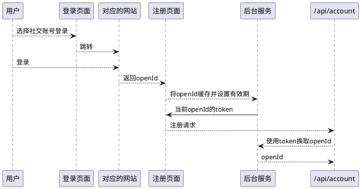

# 管理后台界面接口

## 创建账户

管理员创建账户的动作通常用于企业管理的系统，对于面向消费者的系统，一般不需要管理员来创建账户

```http request
POST /management/account
```

在参数上有以下注意点

### 验证手机、邮箱归属

```java
public class MobilePhoneNumberProperty implements
        SecurityTraits.ChallengeResponseTrait.ChallengeToken,
        SecurityTraits.ChallengeResponseTrait.Response {
    /**
     * 新的手机号码
     */
    @NotBlank
    private String value;
    /**
     * 更改时使用的挑战token(或者id)
     * <p>
     * 当更新时，无论是后台管理人员更新，还是用户自己更新，都应当见检查更新操作是否符合预期
     * <p>
     * 比如验证邮箱是否归当前用户所有
     * <p>
     * 比如验证后台人员是否获得了某个审批流的结果
     * <p>
     * 这个参数就泛指执行操作前应当检查的某个挑战
     */
    @NotBlank
    private String challengeToken;
    /**
     * 挑战的应答，比如发送的验证码
     */
    @NotBlank
    private String response;
}

public class EmailParameterProperty implements
        SecurityTraits.ChallengeResponseTrait.ChallengeToken,
        SecurityTraits.ChallengeResponseTrait.Response {

    /**
     * 邮箱
     */
    @NotBlank
    @Email
    private String value;
    /**
     * 更改时使用的挑战token(或者id)
     * <p>
     * 当更新时，无论是后台管理人员更新，还是用户自己更新，都应当见检查更新操作是否符合预期
     * <p>
     * 比如验证邮箱是否归当前用户所有
     * <p>
     * 比如验证后台人员是否获得了某个审批流的结果
     * <p>
     * 这个参数就泛指执行操作前应当检查的某个挑战
     */
    @NotBlank
    private String challengeToken;
    /**
     * 挑战的应答，比如发送的验证码
     */
    @NotBlank
    private String response;
}
```

以上两个类是输入用户手机号时使用的参数元素，由于创建参数除了用于后台管理员创建账户外，还用于用户自己注册账号使用，因此原则上手机号、邮箱需要验证归属。
于是，"challengeToken"和"response"
用于检查手机验证码、邮箱验证码等。默认情况下后台接口并没有对这两个额外的参数属性进行校验。如果需要，则参考以下的示例代码

```java
public class SampleVerifier extends EndpointHandlerMethodBeforeAdviceAdapter
        implements AccountSkeletons.ManagementSkeleton {
    @Override
    public CreateAccountResponse createAccount(
            @Valid CreateAccountParameterTemplate createAccountParameter
    ) {
        MobilePhoneNumberProperty property = createAccountParameter.getMobilePhoneNumberProperty().getValue();
        //执行对验证码和token的校验操作
        //不正确则抛出异常中断后续执行
    }
}
```

### 密码自动生成

当创建参数中没有填写密码时，接口将为被创建的账户自动生成一个密码，生成的密码通过

```java
public class AccountCreatedEvent implements CreatedEvent<AccountEntityTemplate> {
    /**
     * 创建的账户
     * <p>
     * 密码已经被隐藏
     */
    private AccountEntityTemplate object;
    /**
     * 指示密码是否是生成的而不是用户自己输入的
     */
    private boolean passwordGenerated;
    /**
     * 生成的密码
     * <p>
     * 这个因为不是用户输入的，可能要通过各种各样的手段发送给用户
     */
    @Nullable
    private String generatedPassword;
}

```

进行发送。这样，现场开发就有办法监听事件并将默认密码通过手机短信、邮箱等方法告知给账户的主人

## 更新账户信息

管理员一般允许更新账户的信息，在更改前可能要求账户的所有者去授权或完成相关的审批流(
原则上除非系统规模很小，否则不应当允许管理员随便就修改用户数据)

```http request
PUT /management/account/{accoundId}
```

更新接口原则上允许更新一系列用户属性，如果这些属性在传入时被设置为null(属性名空缺也被视作null)
，则对应的属性就被清除了。此外，更新参数中具有挑战应答以及人机检测的若干参数属性，开发人员可以自行安全需要进行校验(
默认是不校验)
，方法推荐在`Converter<U, T> updateAccountParameterToPoConverter`内完成

这种机制可以用来实现一些如下的场景

* 更改用户信息前要求发送给用户一个授权码，该授权码在后台和一个id绑定，修改时向后台传入这个id(challengeToken)
  以及由用户转交给操作人员的授权码
* 修改用户信息时发送一个站内信或审批流要求组长审批，组长点击确定后将审批流的id(challengeToken)以及修改内容传入

## 读取账户信息

```http request
GET /management/account/{accoundId}
```

本文认为不需要讲解什么，读取出来的用户信息没有密码，也没有openId什么的，就是最基本的描述，如果需要对读取出来的结果进行过滤(
比如手机号需要脱敏，邮箱不显示等)，请开发人员自行使用aop技术构筑切面，拦截
`AccountEndpointTemplates.ManagementApiEndpointTemplate+.readAccount(..)`方法的执行，拦截器能够获取到即将返回的接口响应，在切面中完成过滤等操作

## 修改/重置密码

```http request
PUT /management/account/{accoundId}/password
```

管理员可以重置给定账户的密码，当参数中"password"
属性为空时，默认则是有后台生成一个密码，生成的密码会伴随`AccountPasswordChangedEvent`发出。请求参数重包含了挑战应答与人机检测的内容，按需校验

## 换绑定手机

```http request
PUT /management/account/{accoundId}/mobilePhoneNumber
```

如果不是管理员想换就换，参数中支持通过挑战应答方法进行验证。此外，更换后的手机支持为空，也就是支持删除绑定手机，如果不为空，则要求手机号不能在系统中存在

## 换绑定邮箱

```http request
PUT /management/account/{accoundId}/email
```

如果不是管理员想换就换，参数中支持通过挑战应答方法进行验证。此外，更换后的邮箱支持为空，也就是支持删除绑定邮箱，如果不为空，则要求邮箱不能在系统中存在

## 更改账户状态

```http request
POST /management/account/{accoundId}:enable
```

```http request
POST /management/account/{accoundId}:disable
```

```http request
POST /management/account/{accoundId}:lock
```

```http request
POST /management/account/{accoundId}:unlock
```

以上接口调用会发送`AccountStatusChangedEvent`事件

## 搜索账户

```http request
GET /management/account
```

在搜索时，提交的参数比起常见的搜索请求有以下变化

* `SearchAccountCriteriaParameterTemplate`约定了能够搜索的字段
* "must"和"should"至少必须有一个出现，其内容是要求"必须"渡符合询条件或者"可以"符合查询条件的搜索请求参数字段

举例:

```http request
GET /management/account?username=张三&mobilePhoneNumber=1381838888&should=username,mobilePhoneNumber
```

其含义就是找用户名是"张三"或者手机号是"1381838888"的账户，如果两个字段写在了"must"，则逻辑就变成了并且，当"must"和"should"
都有字段时，逻辑是"(must) and (should)"

# 开放接口

## 注册账户

注册账户是一个较为通用的场景，无论是企业管理后台还是面向最终用户的系统都理论上允许账户注册

```http request
POST /api/account
```

在注册账户时，用户依然可以不指定密码。这种情况下和管理接口一样，可以监听事件来获得一个自动生成的密码发给用户。同时，验证手机、邮箱的归属的任务统一交给现场开发来完成。默认是不验证

### 验证sns账号归属

社会用户注册时一般允许绑定已有的sns账号。创建参数提供了一系列"xxxOpenIdToken"的模式来代表用户即将绑定的社交账号，如下图所示



使用这套机制的原因是不应当直接使用openId作为请求，而应当使用一个不能被别人识别的，且具有有效期的，一次性的token来代表要绑定的社交账号

将社交账号的token转化为社交账号并写入数据的操作，由`AccountServiceTemplate`
中的`Converter<C, T> createAccountParameterToPoConverter`
完成。开人员在这个转换器中将创建参数中的sns账号token转为openId，写入到将要落库的对象中

### 图灵人机测试

当注册接口开放对外界使用时，为了防止被恶意注册用户，接口需要图形验证码，滑块等进行人机交互检测。在此，创建参数支持"
captchaToken"属性用于这一场景。有关人机交互检测的过程，可以使用上文类似的方法，在转换器中完成。

### 额外挑战与应答

部分场景下，用户的注册需要执行挑战与应答机制，比如某航空公司的未成年会员注册要求必须绑定一个已有成年会员的账号作为监护人。
这种要求监护人输入自己的登录凭据的方法就被称为挑战，挑战通过后，注册请求使用"challengeToken"
表达这次挑战，在转换器中可以对挑战进行检查。

## 读取账户信息

```http request
GET /api/account/{accoundId}
```

## 认证指定用户

```http request
POST /api/account:authenticate
```

参数重支持输入用户名、手机号、邮箱 + 密码

## 重置/变更密码

在一定情况下，用户自己忘记密码后按照指定流程完成了身份职别，需要进行密码重置或变更。作为业务系统，第一步自然是要求用户提供一个已有的登录凭据，比如手机号、邮箱，或者使用微信扫一扫等获得社交账号。第二步则是将成功完成的挑战与识别到的用户id绑定到一起后向如下接口发起重置请求

```http request
PUT /api/account/{accountId}
```

同样，"password"属性可以为空，这代表是要生成一个密码

<font color=red>安全警告</font>: 重置密码的接口很可能直接对外暴露，<font color=red>必须</font>验证调用方提交的挑战是否完成，且人机交互检查通过

# 用户自服务接口

## 更新自己的信息

更新用户信息时也一样会有进行mfa多因子验证以及人机检测的内容，这部分内容的实现和用例不再赘述

```http request
PUT /me/account
```

## 读取账户信息

```http request
GET /me/account
```

原则上应当不需要过滤什么，因此其它读取账户信息接口切面编码的时候注意切入的类型和方法，不要影响自服务的

## 修改/重置密码

```http request
PUT /me/account/password
```

参数重包含了人机检测，挑战应答等机制，按现场业务需要进行校验

## 换绑定手机

```http request
PUT /me/account/mobilePhoneNumber
```

原则上需要校验手机归属，参数中包含了对这种操作的支持

## 换绑定邮箱

```http request
PUT /me/account/email
```

原则上需要校验邮箱归属，参数中包含了对这种操作的支持